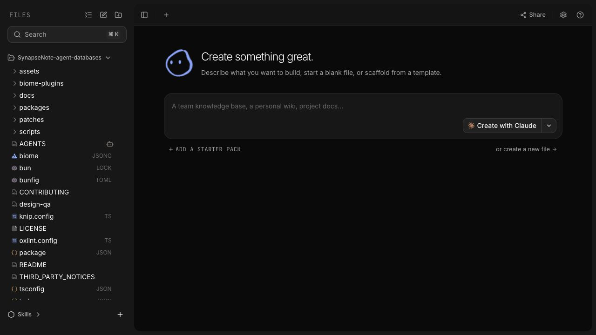
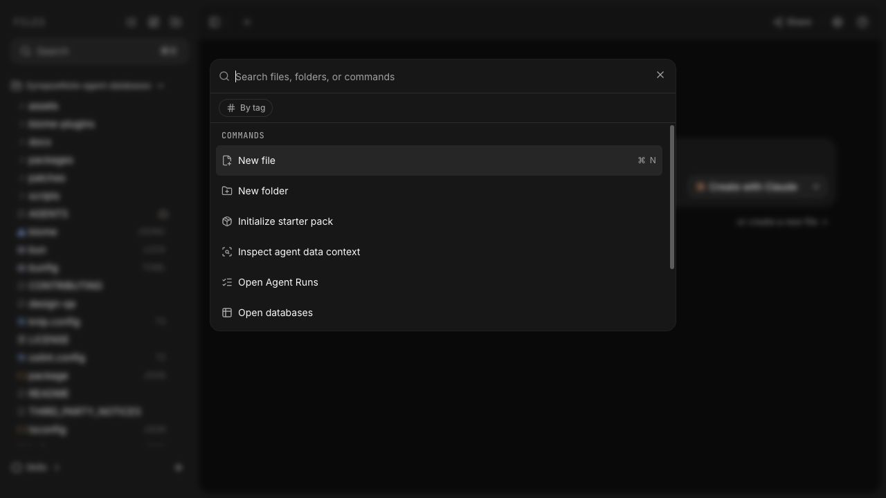
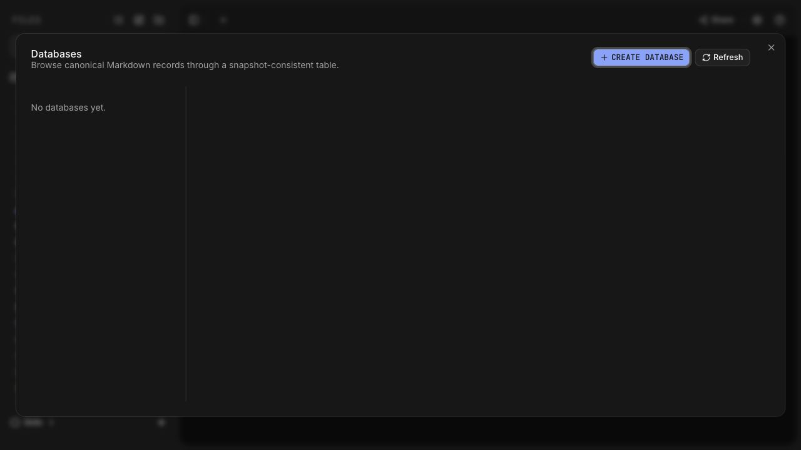
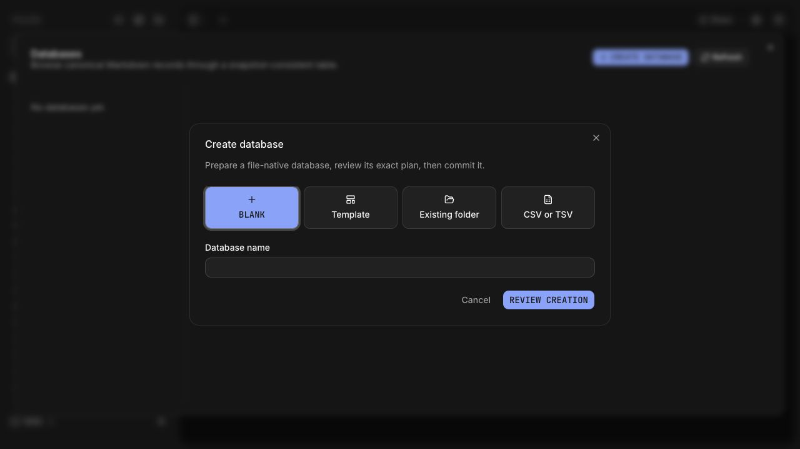
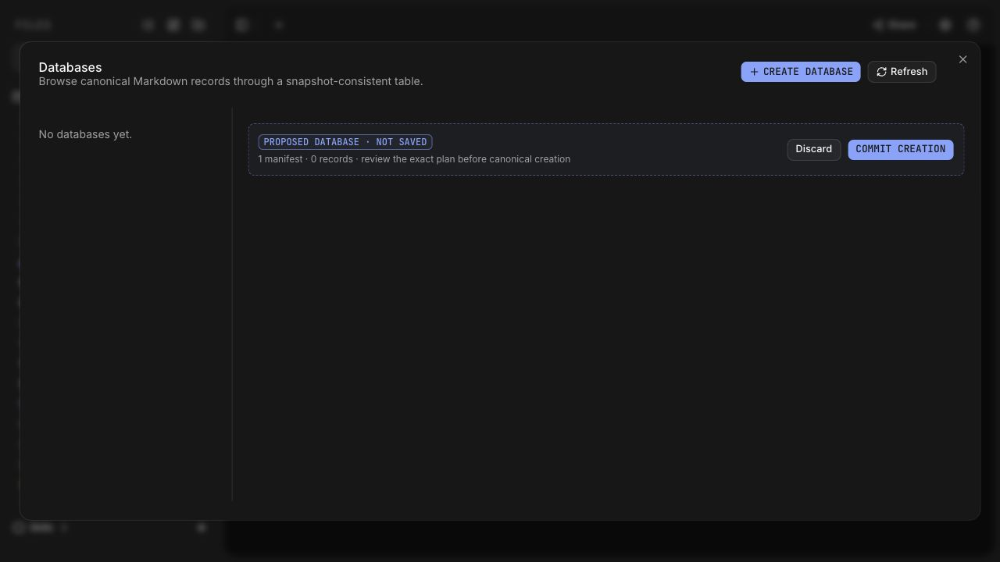

# RFC 0001: Notion database UX alignment checklist

- Status: Active
- Audit date: 2026-07-23
- Scope: desktop and web editor database journeys
- Engine checklist: [database implementation checklist](./0001-databases-implementation-checklist.md)
- Capability reference: [Notion parity matrix](./0001-notion-parity-matrix.md)

This checklist resets the user-experience acceptance bar for SynapseNote
databases. The engine already implements many Notion-class primitives, and the
first document-native entry slice is now present, but the primary human journey
still does not consistently behave like a Notion database. Checked items in the
engine checklist prove capability; they do not prove that a user can discover
and use it through a Notion-like flow. The gap-driven execution plan is tracked
in the [new UX implementation checklist](./0001-notion-ux-gap-implementation-checklist.md).

## Audit verdict

The current implementation is a strong **database administration surface** and
a weak **document-native database experience**.

### Product definition correction (2026-07-23)

The acceptance bar is now explicit: SynapseNote must provide the same
document-native interaction grammar as Notion, not merely a capable database
engine or a friendlier database manager. A database is an editor block or an
ordinary page whose table is immediately usable in the current document.

The following are non-negotiable for the primary human path:

1. **Create in context.** New page/database creation lands on a normal page
   or at the current editor cursor. It must not open a management modal, a
   database rail, or a multi-method setup wizard before the user sees the
   table.
2. **Table first.** The first rendered state is a title plus a table with a
   required Title column and an inline `New page` row. The user can rename the
   title, add a property, and enter a row without stable IDs, folders, schema,
   index, or review terminology.
3. **Inline means inline.** An inline database occupies the document flow and
   shares the editor's spacing, selection, undo, and focus model. A linked view
   is chosen from a small in-place picker; it does not route through the global
   database workspace.
4. **One visual system.** Inline and full-page databases use the same Notion-
   style title, visible view tabs, compact table toolbar, property-header
   menus, and record peek/page behavior. Administration/import/diagnostics and
   agent context are secondary actions behind `...` or an explicit inspector.
5. **Progressive disclosure.** Machine IDs, canonical folders, schema/index
   state, review plans, and agent provenance remain available for safety and
   recovery, but are hidden from the first-use surface and never determine the
   default layout.

The historical capture failed this bar: `#database/new` showed a large
`New database` method chooser while an `Untitled database` table surface was
already mounted underneath it. That was an administration workflow, not the
Notion page/block workflow. The capture remains at
`assets/0001-notion-ux-audit/06-current-new-database-screen.png` as a regression
baseline. The current implementation removes that chooser from the blank
human path and hands the page directly to the canonical workspace; the live
web capture proves the resulting table route, while a complete Electron,
visual, and human-session capture remains an acceptance gate.

- The command palette, sidebar toolbar, empty-space menu, onboarding footer,
  and empty-editor footer now expose a user-facing `New database` entry. A
  guided `New database` → `Linked view of database` slash entry is also
  available for `/database` and `/table`. The normal
  New-page dialog now exposes a named `New database` action and a visible
  Page/Database type chooser; a running web journey now proves the handoff and
  resulting table, while Electron parity remains a separate gate.
- The default management surface is still shared with the legacy dialog, but
  the `Open databases` power-user command now enters its no-overlay page
  presentation instead of a global modal. It is not yet the ordinary
  page/sidebar experience.
- Blank creation now makes the title optional, hides storage details behind
  `Advanced`, commits the low-risk human path directly, and selects the first
  source/view after commit. Template, folder, CSV, agent-authored, and elevated
  paths still retain the explicit review-and-commit boundary.
- Direct-safe human cell and new-row writes now auto-approve the exact plan and
  refresh without a ghost-review interruption. Schema, destructive, bulk, and
  elevated actions retain explicit review; optimistic local acknowledgement and
  full mutation classification are still incomplete.
- The renderer, schemas, saved views, record pages/peeks, templates,
  permissions, import/export, automations, and agent APIs are substantial
  reusable assets. The main missing layer is information architecture and
  interaction design.

Existing `Complete` labels in the parity matrix therefore mean **engine
capability complete**, not **Notion UX complete**, until this checklist passes.

## Evidence and limits

The audit covered the first-use path in the running app and inspected the
corresponding app/core code. It did not commit the proposed database, mutate the
user's canonical project, or run the repository-wide/server test suite.

### Captured journey (pre-entry-point baseline)

1. **Blank editor baseline:** this screenshot predates the entry-point slice;
   current onboarding/empty canvas and sidebar surfaces now show `New database`,
   and the normal New-page dialog now exposes the same named Database choice.

   

2. **Command palette:** `Open databases` is discoverable only after invoking
   the command surface and scanning unrelated commands.

   

3. **Database workspace:** an empty modal management surface appears with a
   database rail and snapshot-oriented technical copy.

   

4. **Creation form:** Blank, Template, Existing folder, and CSV/TSV are useful,
   but the default path exposes `canonical folder`, `stable key`, and other
   implementation concepts before the user sees a table.

   

5. **Creation review:** the result remains a proposed ghost with a separate
   `Commit creation` action. This is valuable for agent-authored or risky
   changes, but it is friction in the ordinary human blank-database path.

   

### Code evidence

| Area           | Current implementation                                                                                                                                                         | UX implication                                                                                                       |
| -------------- | ------------------------------------------------------------------------------------------------------------------------------------------------------------------------------ | -------------------------------------------------------------------------------------------------------------------- |
| Global entry   | `App.tsx` retains the power-user `databasesOpen` surface, while `#database/<database>/<source>/<view?>` is now a stable route-level workspace. `New database` entry points dispatch one typed event into page presentation, and `Open databases` selects that no-overlay page presentation. | Direct, normal New-page, sidebar/recent, search, backlink, relation, and command-result entries converge on stable routes; responsive and cross-host proof remain open. |
| New item       | `NewItemDialog` keeps the file/folder model for compatibility but exposes a visible `Page`/`Database` chooser; its Database choice dispatches the shared creation event. | Database discovery is a first-class choice in the normal picker; the shared creation writer remains the canonical path. |
| Creation       | `DatabaseCreationDialog.tsx` accepts an optional blank title, keeps storage details in a collapsed disclosure, and presents Blank, Template, Existing folder, CSV/TSV, and Assistant in one chooser. Blank routes through an automatic exact-plan commit; templates/imports/folder/agent paths retain the explicit review boundary, with the production surface injecting the installed-agent composer. Existing-folder identity assignment then hands off to a dedicated advanced source-identity migration surface. | The first-use path is shorter and safer for routine human creation while all higher-risk methods remain discoverable from the same start surface and retain explicit review boundaries. |
| Blank schema   | `createBlankDatabaseDesiredState` creates one title property; after commit the shell selects the new source and first view on the canonical route. | A minimal database lands in an editable table; the management surface remains available for administration. |
| Inline block   | Fresh `New database`/`Linked view of database`/`Inline database` inserts use a catalog/source/view picker; raw references remain advanced for existing MDX, and the block renders shared records with visible tabs and full-page handoff. | The core inline/linked journey is now unified for creation, editing, conversion, and removal; duplicate-view action and full state-matrix parity remain open. |
| Database shell | `DatabaseTableDialog.tsx` supports the canonical `DatabaseWorkspacePage` plus the legacy management wrapper; the page header owns breadcrumbs, title, favorite, icon/cover, and page actions while the table surface remains shared. Blank creation now explicitly closes the temporary page shell after route handoff, including when the parent listener order changes. | The primary path is document-native in source and focused DOM coverage; the legacy administration surface remains secondary. Visual, responsive, accessibility, and cross-host evidence are still required before claiming full Notion parity. |
| Human writes   | Direct-safe cell/row writes use plan → auto-approval → commit; destructive, bulk, schema, and elevated writes retain plan → ghost → explicit review → commit.                    | The interruption is removed for common edits, but optimistic/offline acknowledgement and full policy coverage remain. |
| Views          | Saved views now render as visible tabs with `+`; the dropdown and `Manage views` dialog remain available.                                                                      | The primary view switch is closer to Notion, but reorder/rename/favorite controls still live in management.          |
| Renderer       | `editor/components/DatabaseView.tsx` renders all major layouts and record peeks.                                                                                               | This is reusable once insertion, editing, and view controls are redesigned.                                          |
| Journey tests  | Component tests are broad, a primary-journey E2E file exists, and an in-app browser capture covers page-first and inline creation; the local Playwright executable remains unavailable. | Web functional evidence covers the core slice, but the full E2E matrix and Electron journey remain open. |

Screenshots cannot establish focus traps, keyboard ordering, screen-reader
names, contrast, responsive behavior, data-loss safety, or performance. Those
remain acceptance work below.

## Implementation evidence since the audit

The first document-native insertion slice is now implemented. The 2026-07-23
browser capture closes the core inline/linked interaction contract below; its
broader visual, accessibility, responsive, and cross-host acceptance gates
remain open:

- The slash menu now offers `New database` and `Linked view of database` in user-facing
  language. The raw `Database view` descriptor remains readable for existing
  MDX but is no longer a fresh-insert option.
- Choosing `Linked view of database` inserts an inline placeholder that searches the
  database catalog, chooses a source, and then chooses a saved view. It writes
  the stable references back to the current block; missing references expose
  the same `Choose replacement` picker.
- The three stable reference properties are classified as advanced in the
  descriptor, so the regular PropPanel no longer leads with raw IDs; the
  serialized MDX and advanced panel remain the compatibility/debug escape
  hatch.
- Choosing `New database` opens the database shell directly in creation mode, so a
  user does not have to rediscover the `Create database` action in the admin
  rail.
- Blank creation accepts an optional title, uses `Untitled database` as a
  deterministic fallback, selects the newly committed source/view immediately,
  and exposes saved views as visible tabs with a nearby `+` affordance. The
  existing dropdown and reviewed commit path remain as compatibility and safety
  fallbacks.
- The creation summary keeps human-facing view/property information prominent
  and moves record meaning, canonical folder, and stable key under a collapsed
  `Advanced storage details` disclosure.
- A route-level `#database/<database>/<source>/<view?>` workspace now renders
  the existing database surface without a modal overlay, preserves the selected
  view in the URL, and is used by inline linked views' `Open full database`
  action. Its page header now carries contextual breadcrumbs, an editable title,
  favorite state, optional icon/cover chrome, and a reviewed `Customize page`
  action. The management surface remains available as a compatibility/admin
  surface; responsive, accessibility, and cross-host proof remain separate
  gates.
- `New database` is now reachable from the sidebar toolbar, empty-space context
  menu, onboarding pack footer, empty-editor footer, and command palette. The
  host-owned sidebar callback and event-based fallbacks converge on the same
  typed page route, so the app opens one creation flow instead of maintaining
  parallel writers.
- Focused evidence passes in
  `packages/app/src/editor/slash-command/component-items.test.ts` and
  `packages/app/src/editor/components/DatabaseView.dom.test.tsx`; app
  typecheck and the core registry suite also pass.
- A historical live Vite capture reached the real `127.0.0.1:5173` shell and
  the administration-oriented `Create database` surface after the
  context-preview compiler expression was split into named steps. The
  follow-up capture below supersedes its modal-only conclusion for the
  page-first and inline slices; it does not prove Electron parity or the
  remaining visual/release gates.

### Notion-first table surface implementation evidence (2026-07-23)

The first implementation slice now enforces the product correction at the
default entry surfaces:

- `#database/new` uses a table-first page shell while the low-risk blank
  mutation settles; the administration chooser remains available only from the
  explicit database-management surface.
- A fresh inline database intent renders an embedded table shell in the editor
  flow before the blank mutation settles, with Title, `+` property, view tab,
  and a `New page` row visible. Stable references replace the shell in place
  after commit.
- The canonical canvas hides `Create database`, `Open page`, archived-record
  toggles, source/record-meaning copy, table layout/calculation controls, and
  property type labels from the primary surface. Those capabilities remain
  reachable through secondary menus or accessible semantics.
- The canonical canvas table-edge `+` now opens a compact name/type property
  picker; the existing properties manager remains the reviewed fallback for
  advanced schema work.
- Inline and canonical table-edge creation of an empty property uses a separate
  human direct-safe policy with exact plan/commit/undo; agents and all schema
  migrations, conversions, and destructive edits remain review-required.

Focused evidence (no repository-wide/server suite or broad E2E):

- `NotionDatabaseCreationPage.dom.test.tsx`
- `DatabaseTableDialog.dom.test.tsx` canonical canvas test
- `DatabaseTableDialog.dom.test.tsx` table-edge property picker test
- `DatabaseView.dom.test.tsx` inline table-first intent test
- `component-items.test.ts` transient blank-create intent test
- app `typecheck`

This is implementation evidence only. The structural count at that point was
**110/128**;
no visual parity checkbox is closed until the running web/Electron journey
confirms the same interaction and appearance.

### Notion canvas page vocabulary evidence (2026-07-23)

The document-native canvas now removes another administration-first cue:

- The source title is not repeated as a second heading above the table.
- The primary creation action reads `New` (accessible name `New page`) and
  its composer reads `New page` / `Add page`.
- The administration presentation retains `New record` and reviewed-plan
  copy, keeping the safety boundary explicit without leaking it into the
  normal page experience.

Evidence: commit `a1977f9c`, focused `DatabaseTableDialog.dom.test.tsx` canvas
journey (18 expectations), app typecheck, and targeted Biome check. This
closes no visual/cross-host gate; the structural count remains **112/128**.

The packaged Turbo Electron launch remains blocked at
`@nedian0brien/synapse-native-config#build`: `@napi-rs/cli` cannot run
`cargo metadata` in this checkout. After the Mac was unlocked, a direct
development Electron fallback provided focused live evidence: both the
sidebar toolbar and empty-state `New database` actions converged on the
canonical page route, exposing `Untitled database`, `Table`, `New page`,
`Add property`, `Filters`, and `View settings` without a leftover `Create
database` chooser. NUI-105 remains open because command-palette, slash,
normal New-page, full visual cross-host comparison, and manual accessibility
evidence are still missing.

Commit `21a35284` also fixed a lifecycle regression found in that capture: the
temporary Notion creator's nested reviewed form was still portaled after the
canonical route mounted. The host now clears child creation state on close,
with a focused `DatabaseTableDialog.dom.test.tsx` regression test.

Commit `16e64889` then aligned the page title's accessible name with its
visible value (`Untitled database`/the renamed title), while keeping
`Rename database page` as tooltip guidance. This keeps screen-reader and agent
navigation anchored to the page identity rather than the edit action.

Commit `3e84141d` removes the modal-style close button from the canonical
canvas presentation. The page still has its visible `Databases` breadcrumb for
return navigation, while the legacy management dialog retains its close
control.

### UX-0 and continuity evidence closure (2026-07-23)

The route, state, mutation, and continuity contracts are now backed by focused
code and test evidence rather than remaining documentation-only gates:

- **UX-003**: `database-navigation.ts` owns the canonical
  `#database/<database>/<source>/<view?>` identity and keeps records on the
  ordinary document hash. `database-navigation.test.ts` passes 10 tests / 27
  expectations; `App.dom.test.tsx` covers creation history and canonical
  back/forward restoration; the route-level `DatabaseTableDialog.dom.test.tsx`
  tests cover the non-portal page and selected-view hash.
- **UX-004**: inline and full-page surfaces converge on the shared
  `DatabaseTableSurface`/`DatabaseTable` implementation and the same state
  meanings. `DatabaseView.dom.test.tsx` covers loading, empty, offline/stale,
  and permission states; `DatabaseTableViewState.dom.test.tsx` covers the
  shared scroll/focus state restoration contract.
- **UX-005/UX-006**: `database-mutation-policy.ts` exposes the explicit human /
  agent matrix. `database-mutation-policy.test.ts` passes 4 tests / 73
  expectations, proving direct-safe human cell/title/row/blank/property/view
  writes, review-required schema/bulk/destructive/external/migration paths, and
  the agent/non-user-principal fail-closed rule.
- **UX-007**: direct-safe edits render an optimistic value without a ghost,
  restore cell focus after acknowledgement or Escape, preserve the last
  verified snapshot while offline, surface conflicts, and reconcile exact
  preconditioned writes through the bounded offline queue. Focused
  `DatabaseTableDialog.dom.test.tsx` coverage passes 5 tests / 41 expectations,
  `DatabaseView.dom.test.tsx` covers linked offline/permission/empty behavior,
  and `database-offline-mutation-queue.test.ts` passes 9 tests / 20
  expectations.
- **UX-1010**: the same continuity tests verify focus return, per-view scroll
  restoration, stable-ID selection refresh, stale snapshot retention, and
  conflict reload without a full-table navigation flash.
- **UX-1009**: `database-ux-budgets.ts` freezes the warm-local p95 contract:
  shell 250 ms, first data 1,000 ms, view switch 500 ms, direct-safe cell save
  750 ms, and record peek 400 ms. The budget helper has focused boundary tests;
  `DatabaseTable.performance.dom.test.tsx` consumes the 500 ms view-interaction
  budget and currently reports p95 238.857 ms for the 1,000-row/30-property
  render (5 samples). Browser/Electron journey timing still needs to collect
  the remaining four labels.
- **UX-1115**: iteration used the smallest affected checks: focused navigation,
  mutation-policy, offline-queue, JSON compatibility, view-state, DatabaseView,
  Table continuity, latency-budget, and 1,000-row performance suites, plus one
  attempt at the single document-native Playwright file. The repository-wide
  check and slow server suite were not used as an iteration loop, matching the
  release-check policy.
- **UX-010 / UX-1109**: compatibility fixtures now cover the v1 manifest corpus,
  saved views, typed Markdown and MDX record pages, and a real MDX
  `<DatabaseView>` block that stores only stable database/source/view
  references. `migration.test.ts` preserves source bytes, semantics, and IDs;
  `golden-fixtures.test.ts` materializes the `.md`, `.mdx`, and all-property
  fixtures; `registry.test.ts` pins dirty block serialization and inline-mode
  default omission; `DatabaseView.dom.test.tsx` covers live projection and
  host-block reference writes; and `command-palette-recents.test.ts` covers
  last-opened database route persistence. These are compatibility evidence, not
  a claim that visual or cross-host gates are complete.

These closures increase the structural UX count to **112/128**. UX-008/UX-009
and UX-10/UX-11 visual, manual, cross-host, and release gates remain open.

## Follow-up browser evidence (2026-07-23)

The IPv4 development server now serves the app at `http://127.0.0.1:5173/`.
From the sidebar, `New database` opens a full-page, non-overlay creation
surface at `#database/new`; Blank creation then lands on the canonical
`#database/<database>/<source>/<view>` route with an editable table and a
new-row affordance. The first two rows were created in the running app, and a
short-lived `transaction_in_progress` read barrier was retried without leaving
an error alert visible.

### Normal New-page database journey evidence (2026-07-23)

From the running IPv4 app, the command-palette `New file` command opened the
normal `New file` surface with a visible `New page type` group containing
`Page` and `Database`. Selecting `Database` navigated to `#database/new` and
showed the page-based creation surface. The blank path accepted the optional
name `Normal new page audit`; submitting it reached the canonical
`#database/<database>/<source>/<view>` route with the Title property, visible
Table view, `New record`/first-row affordance, and collapsed `Advanced storage
details`. Navigating back to `#database/new` and pressing `Cancel` returned to
the document root (`hash === ''`) without creating another database.

This is evidence for the page-first and inline/linked creation slices. It does
not establish ordinary document chrome/sidebar integration, the complete
linked-view state matrix, Electron parity,
accessibility/responsive behavior, usability timing, performance, or
packaged-release readiness. Those acceptance gates remain unchecked below.

### Slash database command evidence (2026-07-23)

In the same running web app, opening an existing page and typing `/database`
into the editor showed a grouped `Data` slash menu whose first choices were
`New database`, `Linked view of database`, and `Inline database`. The same
ordered choices are returned for `/table`; the menu preview describes the
blank table and linked shared-record behavior. The temporary query was undone
after capture, so no project document was changed. The focused
`component-items.test.ts` suite pins the labels, aliases, and first-choice
ordering.

### Open databases page-jump evidence (2026-07-23)

Selecting `Open databases` from the command palette in the running web app now
opens the full-height database workspace without a dialog overlay. The capture
shows the database breadcrumbs, source rail, view tabs, table controls, and
first-row affordance. `App.dom.test.tsx` verifies that this command selects
`presentation="page"`; the canonical `DatabaseTableDialog` page test verifies
that the overlay is absent. Sidebar/recent/search/backlink/relation URL
integration converges on the same stable identity; responsive and cross-host
proof remain separate gates.

### Inline database journey evidence (2026-07-23)

On the same running IPv4 app, a new document was created and the visible
`/` command menu was used to choose `Inline database`. The searchable database
picker offered both `Create new database` and existing database candidates. The
blank inline flow created `Inline browser audit` without leaving the document,
replaced the setup block with an editable Table, and focused the `New row title`
cell. A row named `Inline first record` was saved in place; the block displayed
the database title, a visible `Table` view tab, the shared-record explanation,
refresh/full-page controls, and the inline saved-state/undo affordance.

Opening the linked block's full database produced the canonical
`#database/<database>/<source>/<view>` route and showed the same record. Removing
the linked block returned to the host document, and reopening that canonical
route still showed `Inline first record`, proving that block removal does not
delete the source or its records. The focused `DatabaseView.dom.test.tsx`
journey and linked-view cache tests cover replacement, conversion, invalid and
permission/offline states, stable IDs, and the shared-record contract.

The same block action menu exposes `Duplicate view configuration`; selecting it
opens the canonical saved-view manager with the current view copied as a new
stable view configuration. The action is covered by the live menu capture and
the `DatabaseViewManagerDialog` initial-duplicate DOM test.

### Inline title accessibility evidence (2026-07-23)

The inline database title is a visible button, so its accessibility name now
matches the displayed source/database name (`Tasks`, or the database name when
no source is selected). The rename affordance remains discoverable through the
`Rename inline database` tooltip, and activating the named title opens the
existing `Inline database title` editor. This keeps the visual Notion-like
title while giving agents and accessibility clients the entity name instead of
an action-only label. The focused `DatabaseView.dom.test.tsx` single-view
journey passes 1 test / 6 expectations; the broader file still contains a
known multiline-paste commit-count baseline failure and was not rerun.

### Inline action-menu context evidence (2026-07-23)

The inline overflow button now exposes `Database view actions for Tasks · Open
tasks` when the linked view is ready, while retaining the generic loading label
until the database description resolves. The context is derived from the
visible source/database and saved-view names, not machine IDs, so an agent can
select the right repeated inline block without opening the menu first. The
focused single-view DOM journey passes 1 test / 11 expectations, with the
existing long journey assertions updated to the contextual name.

The adjacent icon controls use the same convention (`Refresh linked database
view: Tasks · Open tasks`, `Change database view: Tasks · Open tasks`, and
`Open full database: Tasks · Open tasks`). The focused journey verifies all
three names and the offline-refresh journey verifies the refresh action still
works after the context is added.

The inline agent trigger follows the same visible context (`Ask agent about
Tasks · Open tasks`) instead of a document-wide generic `Ask agent` label. Its
scope payload remains the stable database/source/view reference; only the
human/AX label is contextualized. The combined focused run passes 2 tests / 15
expectations.

The saved-view add button is contextualized as `New database view for Tasks ·
Open tasks`, preserving the compact plus icon while making its target explicit
to agents. The focused single-view journey covers this label and the existing
long journey uses it for view-manager navigation.

The containing landmark follows the same convention: a ready block is exposed
as `Linked database view: Tasks · Open tasks` while loading keeps the generic
`Linked database view` label. The browser journey selectors now match the
contextual landmark without requiring a machine ID.

Table row controls in the primary inline surface now name the visible page title
instead of an opaque record ID (`Inspect context for record Shared canonical
row`, `Open record Shared canonical row`, and the corresponding duplicate,
archive, move, and delete actions). Stable IDs remain available to the data
scope and `data-record-id` attributes, so this is an accessibility/agent-label
change rather than an identity change.

The inline Board surface now applies the same title-first naming to its visible
card and card actions: `Record First task`, `Open record First task`, `Move
record First task to group`, `Duplicate record First task`, `Inspect context for
record First task`, `Archive record First task`, and `Delete record First task`.
The card's stable record ID remains in `data-record-id` and all mutation scopes.
`DatabaseBoard.dom.test.tsx` passes 3 tests / 16 expectations, and the two
linked-Board journeys in `DatabaseView.dom.test.tsx` pass 2 tests / 17
expectations after their selectors were aligned to the semantic region and
active view tab.

The follow-up regression capture found that remounting the manager during a
draft could replay the initial action and create duplicate copies. The manager
now keeps a stable instance across schema refreshes, synchronizes its view-name
state without remounting, and guards the initial action by stable key. The
focused manager/view suite passes 30 tests / 227 expectations, and the live
browser check now shows exactly one `Table copy` after one duplicate action.

### Direct manipulation evidence (2026-07-23)

The table-first interaction contract is now covered by the focused DOM suites
and the running implementation. `DatabaseTableDialog.dom.test.tsx` passes 65
tests / 393 expectations, including sticky table/title/new-row structure,
Enter-to-create with post-commit focus restoration, configured title opening,
type-specific direct editors, optimistic reconciliation, compact save/offline/
conflict/failure states, selection/bulk review thresholds, archive versus delete,
keyboard traversal and TSV/multi-cell paste, persisted layout and row density,
and secondary action menus for import/export, diagnostics, automations, and
archived rows. `DatabaseView.dom.test.tsx` additionally covers the inline
selection, review, undo/redo shortcut, and full-page handoff paths. The normal
table row-create path now emits a monotonic focus request only after the exact
commit succeeds, so a disabled mutation state cannot steal the next useful
input position. The table's `Database actions → History` entry now opens the
same durable Agent Runs receipt surface used by the agent recovery flow; the
focused entry-point and receipt tests below close UX-407.

### Canonical canvas route evidence (2026-07-23)

Canonical `#database/<database>/<source>/<view?>` targets now replace the
document editor inside `SidebarInset` and render the explicit
`DatabaseWorkspacePage` surface with a non-portal `canvas` presentation. The
shared implementation is named `DatabaseTableSurface`; the old
`DatabaseTableDialog` export is only the compatibility wrapper for management
and reviewed modal callers. The reviewed management and `#database/new`
creation surfaces remain page/dialog presentations.
`App.dom.test.tsx` passes 14 tests / 50 expectations and verifies the canvas is
mounted inside the sidebar inset, while the focused database suite renders
`DatabaseWorkspacePage` and verifies the real workspace has no Dialog portal or
overlay. Canvas no longer mounts the duplicate internal `Databases` rail or
refetches its catalog; source navigation comes from the ordinary
`DatabaseSidebarSection`, while cross-database lookup remains available through
the inline searchable picker. The management/page presentation keeps its rail
for discovery. The route suite also covers hash view selection, back/forward
restoration, missing-source back handling, and permission-denied handling
without an unsafe retry. This closes UX-201, UX-202, UX-205, UX-207, and UX-208.

UX-209 is covered at the implementation/evidence layer; responsive visual
acceptance remains a separate UX-1007 gate. UX-210 is covered by the conversion
evidence below.

### Normal database page chrome evidence (2026-07-23)

The canonical page now exposes the same hierarchy users expect from a normal
Notion-style page: breadcrumbs and an inline title are kept in the page header,
favorite state remains a first-class toggle, and the database icon is rendered
as an emoji/image/default fallback. `Customize page` opens a focused appearance
editor for an optional icon and cover; saving closes that editor and presents
the exact schema plan in the parent page's ghost review before the user commits
it. A cover is rendered above the header only when it passes the shared safe
image/path resolver, so unsupported values fail closed instead of becoming
unsafe image sources.

The page icon/cover fields are optional bounded manifest metadata. The app
desired-state compiler and server draft/plan/verification bases preserve them
through title, deletion, button, and data-plane mutations, so appearance edits
do not change database/source/view/record identities. Clearing either field
removes the optional key rather than writing an empty value.

Focused evidence:

- `DatabaseTableDialog.dom.test.tsx`: the page presentation opens `Customize
  database page`, edits icon/cover, reaches the parent `Commit change` review,
  asserts the desired-state payload, and pins the page/canvas responsive
  structure (page/canvas filtered run: 2 tests / 26 expectations).
- `schema.test.ts`: optional icon/cover round-trip and the 2 KB bound (1 test /
  2 expectations).
- `database-cell-mutation.test.ts`: appearance persistence, clearing, and
  stable identity preservation (1 test / 4 expectations).
- App typecheck, server typecheck, targeted Biome, and `git diff --check` pass;
  the full server suite and broad E2E were intentionally not run.

This closes UX-204 at the implementation/evidence layer. Visual pixel parity,
responsive behavior, accessibility, Electron, performance, and release gates
remain open below.

### Database entry-point parity evidence (2026-07-23)

All database discovery paths now converge on stable identities instead of
reopening the legacy database manager. The command palette searches catalog
database/source names and human keys, and its recent list stores the same
encoded `#database/<database>/<source>/<view?>` target. A record peek's
backlinks use the ordinary document hash (including anchors), while relation
records use the same canonical record-document route; neither path clones a
record or embeds a second database surface.

Focused evidence:

- `CommandPalette.dom.test.tsx`: searchable database command, catalog-backed
  database search, and recent database reopening (3 tests / 15 expectations).
- `DatabaseRecordPeek.dom.test.tsx`: canonical icon/cover/body/backlinks/
  comments/history/relations surface (1 / 7).
- `DatabaseRelationsDialog.dom.test.tsx`: related record links use the
  canonical document route (1 / 2).
- `database-navigation.test.ts`: stable database/source/view hashes,
  backlink anchors, malformed-route rejection, and favorite identity contract
  (9 / 23).

This closes UX-206 at the implementation/evidence layer. Responsive,
accessibility, visual, Electron, performance, and packaged-release evidence
remain open.

### Responsive database canvas guardrails (2026-07-23)

The wide database canvas now keeps overflow ownership local to the component:
the page body explicitly hides incidental horizontal overflow while the table
container owns both axes, the table itself can grow to its columns, and the
view-tab strip scrolls horizontally when its labels no longer fit. The page
header's title/action row and action group both wrap and can shrink, so narrow
widths do not force the page itself wider than the viewport. The same structure
is used by the non-portal canvas presentation and the route-level page.

Focused page/canvas DOM evidence asserts the `min-w-0`/`flex-wrap` chrome,
`overflow-x-hidden` page body, table-local `overflow-auto`, and tab-local
`overflow-x-auto` classes (2 tests / 26 expectations). App typecheck, targeted
Biome, and diff check pass. This closes UX-209 at the implementation/evidence
layer; the 768px visual/browser check remains UX-1007.

### Inline/full-page state parity evidence (2026-07-23)

The linked inline block uses the same state meanings as the page workspace:
loading remains an accessible busy surface, empty sources keep an actionable
new-row affordance, permission denial never reuses an offline cache, and
missing/offline/stale/error states expose only safe replacement or retry
actions. A successful linked snapshot can remain visible with an explicit stale
status after refresh loses transport; a permission failure clears that cache.
The page workspace covers the corresponding loading, missing, permission,
offline, stale, invalid-schema, stale-index, and recoverable-service states.

Focused evidence:

- `DatabaseView.dom.test.tsx`: inline loading, offline/stale snapshot,
  permission denial, and empty-source behavior (4 tests / 18 expectations).
- `DatabaseTableDialog.dom.test.tsx`: page loading, missing/back,
  permission-denied, offline, stale-cache, invalid-schema/stale-index, and
  recoverable-service states (7 tests / 33 expectations).

This closes UX-309 at the functional implementation/evidence layer. The full
visual state matrix and cross-host capture remain NUI-701/NUI-702 gates.

### In-context property affordance evidence (2026-07-23)

Table schema management is now discoverable where users edit data. When the
host exposes schema writers, a right-edge `Add property` action opens the
canonical properties surface; otherwise the table stays read-only instead of
showing a dead control. Every visible property header has one stable-ID menu
with visibility, move left/right, calculation, context inspection,
rename/configure, type conversion, duplicate, sort, filter, and
dependency-aware delete actions. Sort and filter open the active view's
existing settings while targeting the selected property; duplicate preserves
the source property's typed configuration and lets the server mint a fresh
stable identity. The Title property remains frozen from invalid
move/delete/duplicate operations, and the dialog's add/rename/reorder/delete
flows commit only through the existing exact mutation boundary.

The same surface now uses human-facing property type labels and examples
(`Multi-select`, “Several choices from a list”, and so on) in the add-property
picker, property badges, table headers, and conversion dialog. Internal enum
names remain available to agents and diagnostics without being the first thing
human users must decode.

Title is treated as the one required identity property: the schema rejects a
missing, optional, or duplicate Title; the human surface marks it Frozen and
disables rename, reorder, delete, and duplicate; and conversion explains why
Title and derived properties need a broader migration instead of a local type
change.

Cell editing keeps type-specific controls at the point of entry: rich text,
dates, files, places, relations, select/status, multi-select/person, checkbox,
and computed/read-only families have explicit branches; scalar number, URL,
email, and phone properties use matching input types and input modes.

Review proposals now label their human summary as `Data:` or `Schema:` based on
the diff scope. Property add/duplicate/rename/delete/reorder, computed-property,
Unique ID, Place privacy, appearance, and other schema paths pass the explicit
`schema` policy; routine cell writes pass the `cell` policy and retain their
direct-safe behavior.

Focused evidence:

- `DatabaseTableDialog.dom.test.tsx`: host-gated `Add property` and contextual
  header menu affordances, including Sort, Filter, and Duplicate dispatch
  (2 tests / 18 expectations).
- `DatabaseAdvancedFilterDialog.dom.test.tsx`: nested filter editing plus
  header-targeted property initialization (2 tests / 7 expectations).
- `DatabaseSavedViewSettingsDialog.dom.test.tsx`: all active-view settings plus
  header-targeted sort initialization (13 tests / 16 expectations).
- `database-cell-mutation.test.ts`: duplicate-property configuration/key
  compiler and Title guard (1 test / 3 expectations).
- `DatabasePropertiesDialog.dom.test.tsx`: property listing, add, delete,
  inline rename, requested-property focus, reorder, friendly type labels,
  Title safety, mutation lock, and error behavior (8 tests / 27 expectations).
- `DatabasePropertyConversionDialog.dom.test.tsx`: stable conversion identity,
  lossy approval, friendly target copy, and the Title conversion blocker (3
  tests / 11 expectations).
- `packages/core/src/database/schema.test.ts`: exactly-one-required-Title
  schema invariant (1 test / 6 expectations).
- `DatabaseTableDialog.dom.test.tsx`: typed scalar controls, checkbox and
  multi-select editors, plus the existing rich text/date/files/place/relation/
  select/status/person/formula/button/unique-id coverage (12 focused tests / 46
  expectations for the type-editor slice).
- `DatabaseTableDialog.dom.test.tsx`: schema-vs-data review scope labels for
  manifest creation and record deletion (2 tests / 23 expectations).
- `database-mutation-policy.test.ts`: explicit cell/schema/agent review matrix
  and direct-safe allow-list (4 tests / 68 expectations).
- `database-property-deletion.test.ts`: complete-snapshot value counting and
  formula/rollup/relation/view dependency discovery, plus Title/incomplete
  snapshot guards (2 tests / 5 expectations).
- `DatabasePropertyDeletionPreviewDialog.dom.test.tsx`: destructive deletion
  preview copy, value/record/dependency counts, recovery guidance, and the
  explicit confirmation action (1 test / 11 expectations).
- `DatabaseTableDialog.dom.test.tsx`: Formula and Rollup errors expose a
  loaded-record count beside the property header and preserve the full code
  and message on the affected cell (2 tests / 7 expectations).
- `DatabaseTableDialog.dom.test.tsx`: saved-view header visibility and order
  actions emit the active view's projection instead of mutating source or
  personal layout state (1 test / 2 expectations).
- `DatabaseTableDialog.dom.test.tsx` and `DatabaseSavedViewSettingsDialog.dom.test.tsx`:
  header property projection changes and full View settings saves converge on
  the same reviewed configuration boundary (1 / 2 and 1 / 2 expectations).

Deleting a non-Title property now fetches a complete source snapshot before
opening `Review property deletion`. The preview names the values to clear,
records checked, and dependent properties or saved views. Confirmation keeps
the existing safe two-phase boundary: a reviewed value-unset commit runs while
the property still exists, then the Properties dialog reopens so the user can
explicitly review the schema removal. The two commits are not auto-chained
because back-to-back commits against the same database can wedge the server;
both remain undoable through History.

This closes UX-501 through UX-510 at the functional
implementation/evidence layer.
Visual parity and the broader property-family acceptance gates remain open.

### Visible saved-view tab evidence (2026-07-23)

Saved views are now primary, visible tabs beside the database title. Each tab
keeps its drag handle and active-view menu for reorder, filters, view settings,
and view management; the old select is retained only as a `md:hidden` compact
fallback for narrow screens. The focused default-view DOM journey verifies the
primary-tab marker, compact fallback boundary, drag affordance, active tab, and
All-records navigation even when the selected saved view uses the List layout
(1 test / 19 expectations). The tab strip lives above the layout switch, so
the same `+` affordance is available to every supported view renderer.

This closes UX-601 at the functional implementation/evidence layer. Visual
responsive proof remains open under UX-1007.

### Saved-view creation suggestion evidence (2026-07-23)

The saved-view manager now explains the starter configuration under the name
and layout controls. Board names its grouping property, Timeline/Calendar name
their Date mapping, Gallery names its Files preview when available, and Chart,
Map, Feed, Dashboard, Form, List, and Table describe their first projection or
data source. The same layout-specific default constructors remain the canonical
source of the emitted view, so the hint cannot drift from the reviewed plan.
`DatabaseViewManagerDialog.dom.test.tsx` verifies the Board suggestion and
canonical group (1 focused test / 3 expectations; the existing layout matrix
covers the remaining constructors).

This closes UX-603 at the functional implementation/evidence layer.

### Coherent saved-view settings evidence (2026-07-23)

`Saved view settings` now makes the single reviewed boundary explicit: opening
behavior, property projection/order, sort, group, conditional colors, and
layout-specific display controls are presented as one surface. The scope copy
also points users to the active view's Filters action, which uses the same
canonical view mutation boundary rather than a schema change. A focused DOM
test verifies all six query/projection/display sections plus the scope summary
(1 test / 7 expectations); the typed revision test and advanced-filter tests
continue to cover the emitted view and filter plans.

This closes UX-604 at the functional implementation/evidence layer.

### Active query explainer evidence (2026-07-23)

Canonical and inline/linked database headers now show the active saved view's
filters and sort directions as compact, clickable explainers. Nested filters are
flattened into a bounded, property-name summary with a rule count; each filter
chip reopens Filters and each sort chip reopens the reviewed View settings
surface. `DatabaseViewQuerySummary.dom.test.tsx` covers nested AND/OR/NOT
summaries, both sort directions, routing callbacks, and the no-query state
(2 tests / 9 expectations).

This closes UX-605 at the functional implementation/evidence layer.

### Saved-view tab lifecycle menu evidence (2026-07-23)

The active saved-view tab menu now exposes Filters, View settings, Rename,
Duplicate, Favorite, move-left/right, Make/Clear default, Delete, and Manage
views. Canonical tabs dispatch lifecycle/default mutations through the same
review policy as the manager; default deletion remains disabled, and rename
uses a small reviewed dialog that preserves the stable view ID. Inline/linked
tabs expose the same menu vocabulary and delegate mutations to the canonical
manager when needed. Focused evidence covers the menu's safe-default and busy
states (2 tests / 17 expectations), the rename dialog (1 / 2), and the
canonical tab journey (1 / 25).

This closes UX-606 at the functional implementation/evidence layer.

### Last saved-view safety evidence (2026-07-23)

Deleting a saved view now has one invariant at every layer: a source must keep
at least one usable view. The lifecycle compiler rejects a last-view delete,
the tab menu disables it with an explicit explanation, and the manager applies
the same disabled state; default-view deletion remains separately protected.
Focused evidence covers the compiler (1 test / 10 expectations), tab-menu
default/last-view states (2 tests / 20), and manager single-view safety (1 / 1).

This closes UX-607 at the functional implementation/evidence layer.

### Saved-view switch memory evidence (2026-07-23)

Switching to a previously loaded view reuses its verified result snapshot while
the canonical query refreshes, so the tab/content transition does not blank the
workspace unnecessarily. Table state is keyed by source and view and restores
scrollTop plus the last focused record/property cell; inline tables use the
same state contract. Focused evidence covers restore/report behavior (2 DOM
journeys / 30 expectations, including the canonical tab journey).

This closes UX-608 at the functional implementation/evidence layer.

### Independent linked-view settings evidence (2026-07-23)

Linked blocks continue to serialize only stable database/source/view identities
and canonical record references, while an optional `viewOverrides` payload owns
the block's layout, filter, sort, group, projection, conditional-color, and
open-behavior settings. The query data plane applies those overrides to the
selected saved view without mutating the canonical manifest; two linked blocks
can therefore show the same record identity with different projections and
queries. Inline Filters and View settings now edit the block-local payload
directly, while record mutations still use the canonical database. Focused
evidence covers schema/overlay semantics (1 core test / 5 expectations), the
server query boundary (1 test / 4 expectations), and two inline blocks sharing
rows with independent requests/projections (1 DOM journey / 10 expectations).

This closes UX-609 at the functional implementation/evidence layer.

### Cross-layout view-surface contract evidence (2026-07-23)

Canonical and inline database surfaces now expose the same visible Filters and
View settings controls beside the active view, while the shared layout marker
and active-view callback keep every renderer on the same title/tab/control/state
boundary. Record opening continues through the same canonical `openRecord`
adapter for table, board, timeline, calendar, list, gallery, chart, map, feed,
and dashboard; form remains intentionally response-oriented. A focused linked
Feed journey verifies the non-table surface marker, aligned controls, and
context/record action wiring (1 DOM journey / 6 expectations), while the
canonical table journey remains the cross-view tab/control baseline.

This closes UX-610 at the functional implementation/evidence layer; visual
cross-layout and packaged-host evidence remain release gates.

### Canonical record-title entry evidence (2026-07-23)

Every supported record-oriented renderer now exposes the visible record title
as an action backed by the same host `onOpen` adapter: table, board, list,
feed, calendar, timeline (including the bar and no-date lane), gallery, chart
drill-through, map markers/missing-location list, and dashboard widgets. The
table keeps title editing as a separate pencil action, so opening a page never
silently starts an edit. Stable `data-record-title-link` markers make the
contract inspectable without coupling tests to layout-specific markup.

Focused evidence covers direct title activation and canonical record identity
in `DatabaseTableDialog.dom.test.tsx`, `DatabaseList.dom.test.tsx`,
`DatabaseBoard.dom.test.tsx`, `DatabaseFeed.dom.test.tsx`,
`DatabaseCalendar.dom.test.tsx`, and `DatabaseTimeline.dom.test.tsx`; existing
Gallery, Chart, Map, Dashboard, and full workspace journeys cover the remaining
renderer entry points. The affected renderer suite passes 99 tests / 553
expectations.

The same title-first rule now covers action labels, not only title links, in
the alternate inline renderers. Calendar and Timeline controls identify the
record for open/inspect/move/resize actions; List names expand/collapse and
inspect controls; Gallery, Feed, Chart, and Map name open/inspect controls.
Stable record IDs remain in the DOM markers and callbacks. Focused evidence
passes 24 tests / 91 expectations across the seven renderer suites and 6 tests
/ 62 expectations in the linked DatabaseView journeys; no browser E2E rerun
was needed. The primary inline Table also names property links, copy controls,
buttons, and cell-edit affordances with the visible page title; full-page
management retains stable-ID labels for compatibility.
`DatabaseTableDialog.dom.test.tsx` also directly covers the inline URL
link/copy/edit labels (1 test / 3 expectations).
The inline cell context menu now carries the same record/property context and
names open/edit/inspect/agent actions by title; its focused regression passes
2 tests / 13 expectations. Full-page management keeps its existing generic
menu names for compatibility.

This closes UX-701 at the functional implementation/evidence layer. Shared
record-page composition, breadcrumbs, body editing, and visual/cross-host
proof remain open under UX-702 onward and the release gates.

### Shared record-page surface evidence (2026-07-23)

`DatabaseRecordPageSurface` is now the shared structural record-page component
for all three presentation modes. Side peeks and center peeks keep their
Sheet/Dialog host, while the full-page editor keeps ordinary canvas chrome;
both hosts render the same surface marker and sizing contract, so mode-specific
navigation does not fork record identity or content ownership. The peek still
owns its read-only fetch state, and the full page still owns its live Y.Doc
property/editor bindings; those are intentional host adapters around the
shared surface.

Focused evidence: `DatabaseRecordPeek.dom.test.tsx` and
`DatabaseRecordPageChrome.dom.test.tsx` pass 3 tests / 41 expectations, and app
typecheck passes. Pixel-level composition, responsive behavior, and Electron
host evidence remain release gates.

This closes UX-702 at the functional implementation/evidence layer.

### Record breadcrumb and return-to-view evidence (2026-07-23)

Canonical record pages and both peek modes now expose a `Database breadcrumbs`
navigation landmark with database, source, and current record segments. The
database segment points to the stable source route, or to the exact originating
saved view when session navigation state is available. Peek headers now expose
the same `Back to database view` action already present on full pages; it
updates the hash before closing the peek so the view context is restored without
opening a second database surface.

Focused evidence covers the center-peek source breadcrumb, side-peek
originating-view action, and full-page breadcrumb/return continuity in
`DatabaseRecordPeek.dom.test.tsx` and `DatabaseRecordPageChrome.dom.test.tsx`
(4 tests / 47 expectations). The navigation helper's stable-ID and malformed
state tests remain the canonical route guard. Responsive and cross-host proof
remain release gates.

This closes UX-703 at the functional implementation/evidence layer.

### Table/page synchronization evidence (2026-07-23)

`DatabaseRecordPageChrome` now subscribes to the same validated
`database-changed` event that refreshes the table. When an event targets the
open database/source/record (or is a workspace-wide index event), a clean
record page requests a Y.Doc sync delta through its existing collaboration
connection. Pages with unsynced local edits are deliberately skipped, so a
remote table write cannot overwrite an in-progress body/property edit. The
table continues to refresh its query snapshot after commit, and both surfaces
therefore converge on the same canonical Markdown record without a manual page
reload.

Focused evidence in `DatabaseRecordPageChrome.dom.test.tsx` emits a validated
record update and verifies the existing provider's `forceSync` path, alongside
the title/property mutation journey (3 tests / 29 expectations in the focused
test; the paired peek/chrome run passes 4 / 48). App typecheck passes.

This closes UX-704 at the functional implementation/evidence layer. Conflict
resolution, offline/reconnect, responsive visual, and packaged-host evidence
remain release gates.

### Record body editing evidence (2026-07-23)

The ordinary database record page now owns an explicit body slot below its
title and property panels. `EditorActivityPool` passes the same normal
SourceEditor/Tiptap editor stack into that slot for regular WYSIWYG pages;
source mode and managed-artifact documents keep their existing specialized
identity/source presentation. The body host retains the existing flex sizing,
portal target, mode gating, placeholder, and provider identity, so moving it
under the page chrome does not change editor behavior or Y.Doc ownership.

Focused evidence in `DatabaseRecordPageChrome.dom.test.tsx` renders an editor
body, asserts the `below-properties` contract marker, and verifies that every
property row precedes the body in document order (2 tests / 48 expectations
for the focused chrome file). `EditorActivityPool.test.ts` continues to pass
42 tests / 84 expectations, app typecheck and targeted Biome checks pass.

This closes UX-705 at the functional implementation/evidence layer. Normal
editor editing, source-mode parity, and visual/cross-host proof remain release
gates.

### Record-page affordance evidence (2026-07-23)

The full-page record action row now exposes the normal page affordances for
Comments, Record history, Permissions, appearance, and both source-level and
record-level layout customization. Permissions opens the existing scoped
database permission/share surface with the current database and record IDs.
Appearance reuses the validated icon/cover editor in record mode and patches
only the canonical record frontmatter; existing PageHeader resolution keeps
the icon and cover visible in the page chrome and peek. Comments, history, and
layout continue to use their existing record-scoped dialogs and reviewed
mutation paths.

Focused evidence in `DatabaseRecordPageChrome.dom.test.tsx` asserts all six
page actions and saves a record icon/cover through the record appearance
dialog (2 tests / 48 expectations). `DatabasePermissionsDialog.dom.test.tsx`
passes its exact grant journey (1 test), the existing `PageHeader.test.tsx`
passes 9 tests / 26 expectations for icon/cover and title rendering, and app
typecheck/Biome checks pass.

This closes UX-706 at the functional implementation/evidence layer. Permission
policy edge states, responsive visual behavior, and packaged-host proof remain
release gates.

### Previous/next record navigation evidence (2026-07-23)

Full-page records already consume the bounded session navigation state created
by the active database view. Record peeks now expose the same guarded Previous
record and Next record actions. Moving within the loaded result set swaps the
peek's canonical record while preserving its side/center mode; a path outside
the loaded set hands off to the canonical full-page route. Both paths update
the originating database/source/view index through the stable navigation
helper, so Back to database view returns to the same saved view context.

Focused evidence in `DatabaseRecordPeek.dom.test.tsx` covers the three peek
journeys (3 tests / 18 expectations), `DatabaseRecordPageChrome.dom.test.tsx`
covers full-page Previous/Next/return continuity (2 tests / 48 expectations),
and `database-record-navigation.test.ts` covers stable-ID, malformed-state,
and bounded-order guards (3 tests / 6 expectations). App typecheck and
targeted Biome checks pass.

This closes UX-707 at the functional implementation/evidence layer. Deep-link
reload, mobile visual controls, and packaged-host proof remain release gates.

### Record mutation menu parity evidence (2026-07-23)

The full-page record action row now exposes the same mutation vocabulary as a
database row: Duplicate record, Archive/Restore record, Move record, and Delete
record. Each action loads the canonical projected record and routes through the
existing desired-state compiler and reviewed `executeMutation` boundary, so the
page does not introduce a second write path or an unreviewed destructive action.
Move is enabled only when the database declares a compatible source mapping and
uses an explicit target-source picker before planning the transition.

Focused evidence in `DatabaseRecordPageChrome.dom.test.tsx` covers the four
page actions and exact desired-state payloads (3 tests / 64 expectations for
the full focused Chrome file). The matching row mutation journeys in
`DatabaseTableDialog.dom.test.tsx` pass 4 tests / 35 expectations for delete,
duplicate, restore, and compatible move. App typecheck and targeted Biome
checks pass.

This closes UX-708 at the functional implementation/evidence layer. Post-commit
record removal/navigation, archive-list refresh, conflict/undo receipts,
responsive menu layout, and packaged-host proof remain release gates.

### Relation property navigation evidence (2026-07-23)

Record-page Relation properties now resolve permission-visible target titles
through the bounded exact-record reader and render each target as a direct
canonical page link. The page never opens the global database manager for this
navigation. Missing or denied targets remain a non-disclosing unavailable chip;
the existing pencil affordance switches back to the Relation editor so direct
property mutation is preserved.

Focused evidence in `DatabaseRecordPageChrome.dom.test.tsx` loads a related
record and verifies its title, stable record ID, canonical document hash, and
absence of a database dialog (4 tests / 68 expectations for the file).
`DatabaseRelationsDialog.dom.test.tsx` continues to verify the bounded relation
surface (1 test / 2 expectations). App typecheck and targeted Biome checks pass.

This closes UX-709 at the functional implementation/evidence layer. Missing/
denied/truncated visual states, relation editing conflict/undo, responsive
chips, and packaged-host proof remain release gates.

### Record deep-link and state safety evidence (2026-07-23)

Canonical record pages now preload the permission-filtered record projection
after schema verification, which makes archived state and record-level access
available before page actions render. A missing source/record (404) produces an
explicit `missing` state with a safe Back to database view action; permission
denial (403) produces a non-retryable `permission` state. Both states suppress
the database property/action surface and the editable body, preventing a stale
local document from appearing as an available record. Archived records retain
the page identity, show an informational archived state, and expose Restore in
the mutation menu. Existing stable record navigation and database route
reload/back-forward behavior remain unchanged.

Focused evidence in `DatabaseRecordPageChrome.dom.test.tsx` passes 7 tests / 77
expectations for title/edit, actions, relation links, missing, permission,
archived, and previous/next journeys. The matching table state matrix passes 3
tests / 16 expectations for missing, permission, and archived/restore;
`App.dom.test.tsx` passes the canonical database reload/back-forward journey (1
test / 10 expectations), and `database-record-navigation.test.ts` continues to
cover stable deep-link state (3 tests / 6 expectations). App typecheck and
targeted Biome checks pass.

This closes UX-710 at the functional implementation/evidence layer. Electron,
browser reload capture, offline/reconnect, responsive, accessibility, and
packaged-host proof remain release gates.

### Sidebar and recent database navigation evidence (2026-07-23)

The ordinary file sidebar now exposes database sources as a peer `Databases`
section. It loads the catalog only when expanded, navigates by the stable route,
opens when the current hash is a database page, and marks the active source with
`aria-current="page"`. The workspace command palette already treats database
targets as first-class recent entries; its UI test confirms a catalog-backed
database appears under `Recently opened` and reopens the canonical route.
`DatabaseSidebarSection.dom.test.tsx` passes 3 tests / 7 expectations and the
focused recent-navigation test passes 1 / 5. This closes UX-203. Normal page
chrome and search/backlinks/relations entry points are evidenced above;
responsive visual proof remains open under UX-1007.

### Inline/full-page conversion evidence (2026-07-23)

The linked-view action now writes the current `databaseId`, `sourceId`, and
`viewId` together with the new `mode` whenever a block is converted. The
conversion path never embeds records or clones a source. The focused
`DatabaseView.dom.test.tsx` projection test exercises the menu action and
asserts the stable references plus absence of an embedded record payload. This
closes UX-210; responsive and broader visual conversion journeys remain open.

### Unified database creation start surface evidence (2026-07-23)

`DatabaseCreationDialog` now presents Blank, Template, Existing folder, CSV/TSV,
and Assistant as one creation-method chooser. Blank remains the direct-safe
path; templates and imports retain exact-plan review, and existing-folder
creation still hands off to the blocker-free onboarding preview after the
manifest commit. Assistant mounts the app's normal installed-agent creation
composer rather than inventing a second database writer; the handoff prompt is
explicitly framed as an agent proposal that must use the same reviewed plan and
commit boundary. The dialog accepts the composer as a host-provided slot so
focused DOM tests remain provider-free while the production table surface wires
the real `CreatePromptComposer`.

Focused evidence: `DatabaseCreationDialog.dom.test.tsx` passes 9 tests / 38
expectations, including the Assistant chooser and the no-direct-commit guard;
the existing resulting-page preview journey in
`DatabaseTableDialog.dom.test.tsx` passes 1 test / 4 expectations, and the
existing folder onboarding journey passes 1 test / 7 expectations. App
typecheck and targeted Biome checks pass.

This closes UX-801 at the functional start-surface layer. Visual first-use
parity, resulting-page convergence, and packaged-host proof remain open under
UX-808 and UX-11; the functional template/import/agent/migration slices are
recorded below.

### Template preview evidence (2026-07-23)

Starter templates now compile through the same desired-state contract with two
real saved views: a Table and a Board grouped by the template's status/stage/
confidence property. The grouped view is created in the canonical manifest, not
just painted in the preview, so the user lands with the promised layout after
approval. The creation surface adds a dedicated template preview that lists
view names/layouts and every property type, while the existing bounded page
preview shows realistic sample rows before commit.

Focused evidence: `database-creation.test.ts` passes 8 tests / 56
expectations, including all seven templates' Table + Board contract;
`DatabaseCreationDialog.dom.test.tsx` passes the template preview journey (1
test / 6 expectations); and the focused server `database-plan.test.ts` view
regressions pass 2 tests / 8 expectations. App typecheck and targeted Biome
checks pass.

This closes UX-802 at the functional preview/desired-state layer. Richer
template-specific calendar/timeline configurations, visual first-use parity,
and packaged-host proof remain open under UX-808 and UX-11; editable proposal
controls are recorded in the UX-807 evidence below.

### Blank-first creation evidence (2026-07-23)

Blank remains the initial creation method and keeps its optional-name,
direct-safe commit path. Cancelling an advanced method resets the method and its
mode-specific inputs to Blank, while preserving the typed human title for a
retry-friendly return. A successful commit remounts the creation surface so a
later New database action cannot inherit Template, import, or Assistant
implicitly; failed commits keep the current draft available for retry.

Focused evidence: `DatabaseCreationDialog.dom.test.tsx` covers the advanced
cancel-to-Blank reset (1 test / 4 expectations); the full creation dialog suite
passes 11 tests / 49 expectations, and the focused
`DatabaseTableDialog.dom.test.tsx` failure/cancel/folder journeys pass 3 tests /
13 expectations. App typecheck and targeted Biome checks pass.

This closes UX-803 at the functional default/reset layer. Timing/usability
proof, visual first-use parity, and packaged-host evidence remain open under
UX-11.

### CSV/TSV import preview evidence (2026-07-23)

The import branch now parses a bounded preview before preparing the exact
creation state. It shows the detected CSV/TSV format, headers, inferred
property types, the target `Table` view, and up to three sample rows. Row-level
issues such as an empty required Title are listed with their source row number
before the review/commit action; malformed rectangular input surfaces its parse
error in the same preview. Valid files continue through the existing typed
desired-state compiler and reviewed commit boundary.

Focused evidence: `DatabaseCreationDialog.dom.test.tsx` passes 12 tests / 59
expectations, including the valid header/type/target-view preview and an
invalid-row pre-commit warning. App typecheck and targeted Biome checks pass.

This closes UX-804 at the functional import-preview layer. Richer per-cell
coercion explanations, visual first-use parity, and packaged-host evidence
remain open under UX-11.

### Existing-folder advanced migration evidence (2026-07-23)

Existing-folder creation now ends the manifest-creation step before opening a
dedicated source-identity migration surface. The migration surface previews the
exact folder-bound file set, keeps incomplete scans and non-identity changes
blocked, labels the scope as identity assignment only, and requires an explicit
approval action. The underlying task remains the existing `import` operation;
the UI boundary is deliberately distinct from manifest-version migration and
does not mutate files during creation or preview.

Focused evidence: `DatabaseOnboardingDialog.dom.test.tsx` passes 2 tests / 11
expectations for blocker safety and exact reviewed start; the focused
`DatabaseTableDialog.dom.test.tsx` folder journey passes 1 test / 10
expectations and proves the migration surface opens only after the manifest
commit. App typecheck and targeted Biome checks pass.

This closes UX-805 at the functional advanced-migration boundary. Broader
multi-source migration, accessibility, visual first-use, and packaged-host
evidence remain open under UX-10/UX-11.

### Agent-assisted database plan preview evidence (2026-07-23)

The Assistant creation surface now feeds the natural-language composer through
a preview-only intent channel. A conservative local compiler maps the goal to a
starter template and renders the suggested name, typed properties, Table and
Board views, and optional sample pages. The preview is explicitly marked as an
unsaved agent proposal; toggling sample pages changes only the proposal display.
No manifest, stable ID, or record file is written from this surface, and the
installed-agent handoff still owns the exact plan and approval boundary.

Focused evidence: `database-creation.test.ts` passes 9 tests / 60 expectations,
`DatabaseAgentCreationPlanPreview.dom.test.tsx` passes 2 tests / 8
expectations, and the full `CreatePromptComposer.dom.test.tsx` passes 13 tests /
58 expectations including the production preview wiring. The composer callback
itself is covered by `ComposerMentionInput.dom.test.tsx` (16 tests / 46
expectations). The creation dialog remains green at 12 tests / 59 expectations;
app typecheck and targeted Biome checks pass.

This closes UX-806 at the functional proposal-preview layer. Model-backed
schema generation, richer goal clarification, editable proposal fields, and
packaged-host evidence remain open under UX-807 and UX-11.

### Agent proposal editing evidence (2026-07-23)

The Assistant proposal preview now exposes direct property-name/type and
view-name/layout controls while the proposal is still unsaved. Title remains
locked to the required `title` type; other properties use the bounded supported
type set, and view layouts stay within Table/Board. Edited values are carried
into the handoff as an explicit “requested database proposal edits” block so
the agent receives the same human-reviewed intent rather than an unrelated
second writer. Sample-page inclusion remains an explicit toggle.

Focused evidence: `DatabaseAgentCreationPlanPreview.dom.test.tsx` passes 3 tests
/ 12 expectations, including property/view edits; the full
`CreatePromptComposer.dom.test.tsx` passes 14 tests / 62 expectations, including
handoff propagation of edited fields. The underlying creation compiler passes 9
tests / 63 expectations; app typecheck and targeted Biome checks pass.

This closes UX-807 at the functional proposal-editing and handoff layer.
Richer model-backed clarification, broader property/layout families, visual
first-use, and packaged-host evidence remain open under UX-11.

### Resulting page/block landing evidence (2026-07-23)

Successful desired-state creation now resolves the first source/view and
replaces the current hash with the canonical `#database/<database>/<source>/
<view?>` route for every creation method. When creation started from the legacy
management dialog, the shell closes after the route handoff so the user lands
in the document-native page rather than an admin rail. Existing-folder creation
keeps the shell only while its dedicated source-identity migration review is
open; the manifest itself is already on the canonical route.

Focused evidence: the `DatabaseTableDialog.dom.test.tsx` template/agent-shaped
review journey now commits and asserts the canonical resulting-page route plus
management-shell close callback (1 test / 7 expectations). The folder journey
continues to prove the separate migration overlay opens only after manifest
commit (1 / 10). App typecheck and targeted Biome checks pass.

This closes UX-808 at the functional resulting-page handoff layer. Cross-host
agent commit callbacks, visual first-use, responsive, and packaged-release
evidence remain open under UX-11.

### Notion creation handoff continuity evidence (2026-07-23)

The page-first blank creation path now treats an already-converged canonical
database as a successful navigation target instead of a blocked mutation. The
temporary creation page closes explicitly after it replaces the route, so the
canonical page workspace cannot remain hidden behind an overlay when navigation
listeners run in a different order. The in-flight request is kept alive across
the React StrictMode effect probe, preventing both duplicate database creation
and the prior indefinite `Preparing your editable table` state; a real unmount
still aborts the request.

Focused evidence in `a450e698 fix: complete notion database page handoff`:

- `NotionDatabaseCreationPage.dom.test.tsx`: 3 tests / 15 expectations,
  including parent-callback churn and a StrictMode no-duplicate mutation probe.
- `database-mutation-client.test.ts`: converged non-committable plans remain
  converged and never enter review/commit.
- `DatabaseTableDialog.dom.test.tsx`: blank catalog creation and post-handoff
  inline new-page focus pass (2 filtered tests / 9 expectations).
- App typecheck and targeted Biome/diff checks pass.

This closes a functional continuity failure in the Notion-first slice; it does
not close UX-008/UX-009, NUI-105, NUI-701–NUI-705, or the manual accessibility,
visual, usability, performance, and release gates.

### Stable machine-ID disclosure evidence (2026-07-23)

Canonical database workspaces and record surfaces now carry stable database,
source, view, and record identity in machine-readable `data-*` attributes. Rows,
properties, saved-view tabs, and Context Pack entries carry the same object
identity contract without adding raw IDs to the primary labels. The shared
`DatabaseMachineIdsDetails` component keeps the identifiers collapsed by
default; opening the progressive-disclosure section exposes the exact values
for agents, support, and automation. Context Inspector scope, pack IDs,
omitted-property IDs, field IDs, and the exact pack are also hidden behind
details by default.

Focused evidence: `DatabaseMachineIdsDetails.dom.test.tsx` passes 2 tests / 15
expectations for the collapsed/revealed contract; the focused Context Inspector
DOM and static-render tests pass; `DatabaseRecordPageChrome.dom.test.tsx`
asserts record-surface identity attributes; and
`DatabaseTableDialog.dom.test.tsx` asserts workspace identity attributes and
machine-object markers. App typecheck and targeted Biome checks pass.

This closes UX-901 at the functional stable-identity/progressive-disclosure
layer. Context retrieval explainability, agent invocation scope, proposal
grouping, and the remaining UX-9 items remain open below.

### Context Inspector compact-summary evidence (2026-07-23)

The Context Inspector now leads with a compact retrieval summary before the
longer redaction, omission, citation, field-selection, and exact-pack panels.
The summary names the captured schema fields, whether an Agent View or the
database default was used, requested/returned selection counts, estimated and
available token budget plus max/reserve, truncation cause and continuation
availability, and citation count/disclosure level. The exact Context Pack and
selected-field preview remain collapsed until explicitly opened, preserving a
token-efficient first read while retaining the complete evidence on demand.

Focused evidence: `DatabaseContextInspectorDialog.dom.test.tsx` passes 2
focused tests / 19 expectations for field projection and the compact summary;
`DatabaseContextInspectorDialog.test.tsx` passes 6 tests / 25 expectations for
static rendering, projection immutability, and scoped fetch contracts. App
typecheck and targeted Biome checks pass.

This closes UX-902 at the functional compact-inspection layer. Proposal
provenance/grouping, retrieval-query explainability, and the remaining UX-9
items remain open.

### Scoped database agent invocation evidence (2026-07-23)

Database and inline-view headers now expose one shared `Ask agent` menu. Its
default scope is the current database/source/view, and a non-empty table
selection narrows that scope to the selected record IDs. Table rows expose the
same action both in the row action rail and row context menu; property menus
offer the property-only scope. Full record pages and side/center peeks expose
the same record-scoped action, so changing surfaces does not change the agent
contract.

The composer shows a human-readable scope summary and an explicit warning that
the agent must not widen the scope without asking. The dispatched instruction
contains the stable database/source/view/record/property IDs as a bounded
SynapseNote MCP scope block. IDs stay out of the primary label and remain
available only to the agent transport or the existing advanced disclosure.

Focused evidence: `database-agent-scope.test.ts` passes 2 tests; the scoped
`OpenInAgentMenu.dom.test.tsx` case passes within the 13-test handoff suite;
`DatabaseTableDialog.dom.test.tsx` covers row and property scope callbacks;
record page/peek DOM suites pass 10 tests / 100 expectations; and app
typecheck plus targeted Biome checks pass. The workspace lookup is lazy on web
hosts so mounting an inline view does not add an unrelated workspace request;
Electron resolves its project path synchronously.

This closes UX-903 at the functional scoped-invocation layer. Proposal
provenance/grouping, retrieval-query explainability, and the remaining UX-9
items remain open.

### Agent proposal provenance and review-group evidence (2026-07-23)

Agent Run details now identify the proposal source before the scope and diff:
agent suggestions are explicitly separated from human changes, while principal
and session identifiers remain behind a `Show source details` disclosure. The
same detail surface now labels the immutable plan as one review group, lists
its required/optional approval scopes, and explains that the group commits
together. This makes a multi-record/schema proposal reviewable as one unit
without implying that its draft values are canonical.

Focused evidence: `DatabaseAgentRunsDialog.dom.test.tsx` passes 4 tests / 27
expectations, including agent provenance, hidden source details, and a grouped
approval summary. Existing ghost/creation review continues to mark unsaved
changes as `Proposed · not saved`, keeps the human plan summary first, and
groups atomic approval scopes. App typecheck and targeted Biome checks pass.

This closes UX-904 at the functional provenance/grouping layer. Human-language
plan explanations, selective approval safety, sensitive-operation review,
retrieval explainability, and the remaining UX-9 items remain open.

### Human-language agent plan evidence (2026-07-23)

Agent Run details now put a short `Plan summary` before technical metadata:
risk is stated in plain language, the number of approval scopes is visible, and
the user is told that the reviewed scope is checked before commit. Plan ID,
hash, snapshot, expiry, and risk reasons are grouped under `Show plan details`;
the proposed diff and recovery receipt retain their own progressive disclosures.
This keeps the decision surface readable while preserving exact audit data on
demand.

Focused evidence: `DatabaseAgentRunsDialog.dom.test.tsx` passes 4 tests / 30
expectations, including the summary-first order and collapsed plan-details
disclosure. App typecheck and targeted Biome checks pass.

This closes UX-905 at the functional plan-explanation layer. Selective approval
safety, sensitive-operation review, retrieval explainability, and the remaining
UX-9 items remain open.

### Atomic approval safety evidence (2026-07-23)

When a plan has required approval scopes, the review surface now explicitly
states that selective approval is unavailable for that atomic group and that
all required scopes must be approved together. The explanation names
referential and rollback safety as the reason; the exact plan still commits as
one verified transaction. The server independently rejects partial approval
code selections with a typed `approval_required` response containing the
atomic group and required codes, so the UI copy is backed by a transport-level
guard rather than being advisory only.

Focused evidence: the resulting-page creation journey in
`DatabaseTableDialog.dom.test.tsx` asserts the atomic-group copy; the focused
`database-commit.test.ts` approval-mismatch test passes 1 test / 7
expectations. App typecheck and targeted Biome checks pass.

This closes UX-906 at the functional atomic-approval layer. Sensitive
operation review, retrieval explainability, and the remaining UX-9 items
remain open.

### Sensitive operation review evidence (2026-07-23)

The browser mutation policy now keeps permission changes, destructive/permanent
deletion, external actions, migrations, and bulk edits in the required-review
column for both human and agent actors; only routine cell/title/record-create/
view work may use the direct-safe shortcut. The policy test enumerates all 13
operation rows and verifies that an agent or non-user principal can never inherit
the human shortcut. Bulk mutation, record deletion, schema changes, Button
external steps, and migration tasks therefore retain the exact review seam.

The permissions dialog now makes that seam visible and actionable: sharing,
editing, and revoking a grant first produce a review card with the principal,
scope, role/actions, immediate-effect warning, and an explicit approval button.
The same copy names permanent deletion, external actions, broad schema
migrations, and threshold-crossing bulk edits as always-reviewed operations.

Focused evidence: `database-mutation-policy.test.ts` passes 4 tests / 68
expectations; `DatabasePermissionsDialog.dom.test.tsx` passes 1 test / 14
expectations for create/edit/revoke review; the atomic creation review asserts
the sensitive-operation policy copy. App typecheck and targeted Biome checks
pass; no full server suite or broad E2E rerun was needed.

This closes UX-907 at the functional sensitive-operation review layer.
Retrieval explainability, stable agent contracts, and the remaining UX-9 items
remain open.

### Agent Run current-view recovery evidence (2026-07-23)

Undo, retry, and resume now emit a scoped Agent Run change event after the
server confirms the recovery. Canonical tables, inline/linked views, and record
pages subscribe to that event and refresh their existing data surface in place;
the current route, view, and selected row IDs remain local state. Table refresh
also preserves the live selection rather than reapplying only the initial route
selection, so a recovery cannot silently move the user to a different review
context.

The Agent Runs dialog keeps its selected run and remains open during recovery,
then shows a recovery receipt while the underlying view refreshes. The event
payload carries database/source/record scope, allowing unrelated open surfaces
to ignore the change.

Focused evidence: `DatabaseAgentRunsDialog.dom.test.tsx` passes the undo and
retry journeys (including the scoped recovery event); the table snapshot test
passes 1 test / 23 expectations, proving an Agent Run refresh and retained row
selection; the event helper DOM test passes 1 test. App typecheck and targeted
Biome checks pass; no full server suite or broad E2E rerun was needed.

This closes UX-908 at the functional current-view recovery layer. Retrieval
explainability, stable agent contracts, and the remaining UX-9 items remain
open.

### Retrieval explainability evidence (2026-07-23)

Context Pack responses now carry explainability metadata for the exact root
retrieval: the structured filter and archive scope, filter property IDs,
typed-sort ranking and deterministic record-ID tie-breaker, requested/returned/
omitted property projection, matched/returned/omitted record counts,
permission-policy exclusions, evidence mode/search scope, and continuation
state. The metadata is also included in the bounded Context Inspector summary,
so the agent or user can understand why a result was returned and what was
left out without opening the full pack. Technical filter expressions,
property IDs, policy revisions, and the complete machine-readable object stay
behind a collapsed `Show retrieval details` disclosure; the visible card also
keeps the token estimate and available budget together with the retrieval
outcome.

Focused evidence: `database-context-pack.test.ts` passes the schema/budget and
disclosure tests with retrieval metadata assertions; the server typecheck
passes; `DatabaseContextInspectorDialog.dom.test.tsx` passes the compact
summary/retrieval explainability assertions. Targeted Biome checks and
documentation link checks pass; no full server suite or broad E2E rerun was
needed.

This closes UX-909 at the functional retrieval-explainability layer. Visual,
responsive, accessibility, cross-host, and the remaining UX-10/UX-11 release
gates remain open.

### Stable agent API and MCP contract evidence (2026-07-23)

The canonical database route remains an address for the same stable
`databaseId`/`sourceId`/`viewId` objects; it does not introduce a second agent
identity or put route strings into the MCP prompt. The route round-trip test
now feeds its decoded target directly into the shared database-agent scope
instruction and asserts that the exact IDs are preserved in the MCP boundary.
The existing server transport conformance suite continues to certify the
versioned HTTP/direct/MCP read and write contracts, while the UI keeps using
the read-only `data` progression and approval-gated `data_plan`/`data_commit`
boundary.

Focused evidence: `database-navigation.test.ts` passes 10 tests / 27
expectations, including the route-to-MCP scope contract; the scoped agent
handoff tests and server HTTP/MCP conformance evidence remain green. App
typecheck and targeted Biome checks pass; no full server suite or broad E2E
rerun was needed.

This closes UX-910 at the functional stable-contract layer. Visual,
responsive, accessibility, cross-host, and packaged-release gates remain open.

### Keyboard order evidence (2026-07-23)

The canonical database page keeps a predictable DOM/keyboard progression:
breadcrumb/back control, editable page title, saved-view tabs, database
actions, table headers, grid cells, and the load-more pagination affordance.
The table's roving cell focus then moves with the arrow keys, while the new
record control remains before the table and the pagination control remains
after the loaded grid. This gives keyboard users the same structure as the
visual page without requiring pointer-only controls.

Focused evidence: the route-level `DatabaseTableDialog.dom.test.tsx` journey
asserts the ordered landmarks (26 expectations in the focused run); the
existing cell-navigation and edit-focus tests cover arrow movement and focus
restoration. App typecheck and targeted Biome checks pass; no full server suite
or broad E2E rerun was needed.

This closes UX-1001 at the functional keyboard-order layer. Focus visibility,
screen-reader announcements, contrast, responsive, and performance gates
remain open.

### Focus, grid selection, and edit announcement evidence (2026-07-23)

Database cells now expose an explicit `focus-visible` ring in addition to the
roving `tabIndex` contract. The grid declares `aria-multiselectable`, selected
cells/rows retain `aria-selected`, and a polite live region announces the
focused row/property, selected cell count, and edit start/cancel state. The
existing context-menu Escape path and two-frame edit-focus restoration keep
keyboard users in the same cell context instead of trapping or jumping them
to the page root.

Focused evidence: the targeted `DatabaseTableDialog.dom.test.tsx` keyboard,
edit-focus, and rectangular-selection cases pass 3 tests / 29 expectations,
including the focus class, grid selection semantics, live announcements,
roving movement, and edit restoration. App typecheck and targeted Biome checks
pass; no full server suite or broad E2E rerun was needed.

This closes UX-1002 at the functional grid-focus and announcement layer.
Screen-reader coverage across every layout, contrast, responsive, and
performance gates remain open.

### Control names and semantic states evidence (2026-07-23)

Canonical database surfaces keep icon-only controls named with stable
`aria-label` values, while tabs expose `role="tab"` and `aria-selected`, the
table exposes a named `role="grid"`, and transient saves/errors/recovery
surfaces use status or alert semantics. The route-level surface also keeps
the page title, view tabs, filters, new-record action, property controls, and
overflow menu discoverable by their accessible names rather than icon glyphs.

Focused evidence: the route-level `DatabaseTableDialog.dom.test.tsx` journey
asserts that every rendered icon-only button has an accessible name and that
the canonical grid carries its selection semantics (28 expectations in the
focused run). Existing table, saved-view, review, picker, and conflict DOM
tests cover the corresponding menu/dialog state roles. App typecheck and
targeted Biome checks pass; no full server suite or broad E2E rerun was
needed.

This closes UX-1003 at the functional naming/semantics layer. Full
screen-reader matrix, contrast, responsive, and performance gates remain open.

### Screen-reader landmark coverage evidence (2026-07-23)

The primary database surfaces expose a stable semantic landmark contract for
assistive technology: the table route has a named grid and labelled tabs and
controls; Board exposes a named region, swimlanes, record lists, and named card
actions; Calendar exposes a named region, date groups, and labelled navigation;
record peek exposes a named dialog with breadcrumbs and actions; the property
editor exposes a named dialog and labelled property list; and Agent Runs
exposes a named review dialog with its refresh, scope, diff, and recovery
controls.

Focused evidence: `DatabaseTableDialog.dom.test.tsx` (28 expectations),
`DatabaseBoard.dom.test.tsx` (12), `DatabaseCalendar.dom.test.tsx` (9),
`DatabaseRecordPeek.dom.test.tsx` (12), `DatabasePropertiesDialog.dom.test.tsx`
(9), and `DatabaseAgentRunsDialog.dom.test.tsx` (17) all pass their focused
semantic landmark cases. App typecheck and targeted Biome checks pass; no full
server suite or broad E2E rerun was needed.

This closes UX-1004 at the automated screen-reader landmark/role contract
layer. Manual assistive-technology sessions across every layout, contrast,
responsive, and performance gates remain release follow-up work.

### Focus return and modal-stack evidence (2026-07-23)

The shared `DialogContent` records the focused opener during Radix's open
autofocus phase and restores it during close autofocus when the consumer has
not supplied an intentional override. This gives controlled database dialogs
the same return path as trigger-backed dialogs, including property editors,
advanced filters, view settings, and Agent Run review. The existing table cell
menu keeps its explicit Escape-to-cell restoration, while the center record
peek and the other dialog families inherit the shared contract; side peeks
continue to use the Sheet primitive's focus scope.

Focused evidence: `DatabasePropertiesDialog.dom.test.tsx` opens a controlled
property editor from a focused trigger, closes it through the dialog close
control, and observes focus on the opener; the existing
`DatabaseTableDialog.dom.test.tsx` menu test observes Escape returning to the
originating cell. App typecheck and targeted Biome checks pass, and the
behavior has a patch changeset. No full server suite or broad E2E rerun was
needed.

This closes UX-1005 at the shared focus-return and modal-stack guard layer.
Manual assistive-technology sessions and full cross-surface focus journeys
remain release follow-up work.

### Theme contrast and conditional-color evidence (2026-07-23)

Conditional-color surfaces use low-alpha backgrounds with semantic
`text-foreground` in Board, Calendar, List, and Gallery, plus explicit dark
theme background variants; the table uses the same dark-aware tint map while
retaining its inherited foreground. Timeline bars use explicit solid palette
colors with white or black text chosen per color rather than relying on hue
alone, so colored labels remain readable in both themes. Color remains a
secondary cue because the record label and state text stay present.

Focused evidence: `DatabaseColorContrast.test.ts` computes WCAG relative
luminance ratios for every Timeline conditional color (all are at least 4.5:1)
and asserts semantic foreground/dark-theme classes across the tinted layout
maps. Existing focused Board, Calendar, List, Gallery, and Timeline DOM tests
continue to assert conditional-color application. App typecheck and targeted
Biome checks pass; no full server suite or broad E2E rerun was needed.

This closes UX-1006 at the automated theme/contrast contract layer. Manual
browser contrast sampling and full visual responsive coverage remain release
follow-up work.

### 768px primary-path guardrail evidence (2026-07-23)

The canonical page keeps the primary path usable at compact widths by wrapping
the page chrome/actions, providing a `md:hidden` saved-view selector, clipping
horizontal overflow at the page body while retaining vertical scrolling, and
scoping table overflow to the table container. Saved-view tabs use their own
horizontal scroller, so a narrow viewport never requires page-level two-axis
scrolling or clips the new-record/filter actions.

Focused evidence: the route-level `DatabaseTableDialog.dom.test.tsx` journey
asserts page-body `overflow-x-hidden`/`overflow-y-auto`, table-local
`overflow-auto`, tab `overflow-x-auto`, and the compact view switcher's
`md:hidden`/accessible saved-view control (31 expectations in the focused run).
App typecheck and targeted Biome checks pass; no full server suite or broad E2E
rerun was needed.

This closes UX-1007 at the DOM/CSS guardrail layer. A manual 768px browser
capture and full visual responsive matrix remain release follow-up work.

### Database History and recovery evidence (2026-07-23)

The `Database actions` menu now exposes a human-facing `History` item on both
the management and canonical canvas database surfaces. App wiring passes the
selection through to `DatabaseAgentRunsDialog`, so the entry opens durable Agent
Run receipts instead of a transient mutation log. The receipt surface shows the
compact run list, exact scope, proposed and actual diff, mutation ID,
verification status, and the undo token; its recovery test previews and applies
undo without leaving the History surface. The inline view mutation journey also
covers the table's Undo/Redo buttons plus `Ctrl/Cmd+Z` and `Shift+Ctrl/Cmd+Z`
shortcuts, including a revision-conflict recovery state.

Focused evidence:

- `DatabaseTableDialog.dom.test.tsx`: the History menu item invokes the host
  recovery surface (1 test / 32 expectations when filtered).
- `DatabaseAgentRunsDialog.dom.test.tsx`: compact history loads the selected
  exact run and exposes scope/diff/mutation/undo details (1 / 8); the adjacent
  recovery test previews and applies the exact undo receipt.
- `DatabaseView.dom.test.tsx`: inline Undo/Redo controls, keyboard shortcuts,
  and stale-revision conflict behavior remain covered in the long mutation
  journey.

This closes UX-407; cross-host, accessibility, responsive, visual, usability,
performance, and packaged-release evidence remain open.

## Re-audit snapshot (2026-07-23)

The implementation has moved the surface closer to Notion, but it has not
crossed the document-native UX bar:

| Measure | Current result | Interpretation |
| --- | --- | --- |
| Engine implementation checklist | 310/335 numbered items complete | Core/database and agent contracts are substantially implemented. |
| Notion UX checklist | 112/128 gates complete | Vocabulary/claim-boundary, compatibility fixtures for manifests/records/saved views/MDX DatabaseView blocks/last-opened state, normal New-page creation, slash database entry, page-based database discovery, inline/linked insertion, inline/full-page state parity, table-first direct manipulation, friendly property names/examples, Title safety, type-specific cell editors, schema-vs-data mutation classification, in-context property-add/header affordances including property-specific sort/filter/duplicate actions, destructive property-deletion impact previews, adjacent Formula/Rollup error indicators, view-scoped property visibility/order, converged header/settings-menu view actions, visible reorderable saved-view tabs, layout-independent new-view `+` affordances, layout-specific saved-view property suggestions, coherent saved-view settings, active filter/sort explainers, saved-view tab lifecycle menu, last-view deletion safety, saved-view switch memory, independent linked-block view settings without copied rows, cross-layout title/tab/control/state/record-opening contract, canonical record-title entrypoints, shared side/center/full-page record surface, record breadcrumbs and return-to-view continuity, table/page synchronization, record body editing below properties, record-page comments/history/permissions/appearance/layout affordances, previous/next record navigation in the active view context, row/page mutation menu parity for duplicate/archive/restore/move/delete, direct Relation property links to canonical record pages, safe record deep-link/reload/missing/archived/permission states, unified Blank/template/import/folder/Assistant creation start surface, realistic template views/property-type/sample-page previews, Blank-fast-path/reset behavior without implicit advanced choices, CSV/TSV format/header/type/invalid-row/target-view previews, dedicated existing-folder source-identity migration review, natural-language agent plan previews for properties/views/templates/optional samples, editable agent property/view/sample suggestions carried into the handoff, resulting-page/block landing after every successful creation method, stable machine-ID attributes and collapsed advanced disclosure across canonical surfaces, compact Context Inspector summary for schema/view/selection/tokens/truncation/citations, retrieval query/filter/ranking/projection/permission/token explainability, stable agent API/MCP contracts across the UI route redesign, scoped agent invocation from database/view/selection/row/property/record page with stable-ID MCP boundaries, agent proposal provenance and atomic review grouping, human-language agent plan summaries with technical details under disclosure, atomic approval copy with server-enforced required-scope selection, sensitive-operation review policy and permission-change confirmation, current-view-preserving Agent Run undo/retry/resume recovery, keyboard order across title/tabs/controls/headers/cells/new-row/pagination, focus-visible grid navigation with selection/edit announcements, named and semantically labelled controls/menus/dialogs, screen-reader landmarks across table/board/calendar/record peek/property editor/agent review, shared focus return after menus/pickers/peeks/advanced dialogs/review, theme-safe WCAG contrast for light/dark conditional colors and tags, 768px compact primary-path guardrails without page-level two-axis scrolling, named canonical workspace canvas routing without a duplicate rail, sidebar/recent/search/backlink/relation navigation, normal database page chrome, responsive canvas guardrails, stable inline/full-page conversion, durable History/receipt recovery, explicit route/state/mutation/continuity contracts, direct-safe/offline/undo evidence, focus/scroll preservation, explicit warm-local interaction budgets, and focused-check iteration policy are evidenced; full visual, 768px browser, and cross-host journey gates remain open. |
| First-use database entry | `New database` in sidebar, empty states, normal new-page dialog, command palette, plus slash-menu `New database`/`Linked view of database`; normal picker exposes Page/Database chooser and the resulting route lands in an editable table. `Open databases` enters the no-overlay page workspace. | Discovery, sidebar/recent navigation, and the web first-use path are evidenced; additional entry points and Electron proof remain open. |
| Blank creation | Optional title, `Untitled database` fallback, direct-safe exact-plan commit, immediate source/view selection, title/new-row focus | The blank human path is continuous in DOM coverage; the same start surface now exposes template/import/folder/Assistant entry points while their review and visual browser proof remain open. |
| Full-page navigation | Stable `#database/<database>/<source>/<view?>` route, no-overlay canvas presentation, sidebar source section, command-palette recents/search, backlink and relation links, normal page chrome, and local overflow guardrails | Route, page surface, and navigation identity are evidenced; responsive visual/cross-host proof remains incomplete. |
| Inline linked view | Catalog → source → saved-view picker, inline creation, shared rows, visible tabs, replacement, conversion, duplicate configuration, block removal, and aligned loading/empty/error/permission/offline/stale states | The core inline/linked functional contract is evidenced; the complete visual state matrix remains open. |
| Direct editing | Direct-safe cell/row auto-approval, optimistic reconciliation, offline/conflict/failure states, post-commit focus, standard undo/redo, and durable History receipts are covered by focused DOM evidence | Elevated mutations retain exact review; full visual/cross-host acceptance remains open. |
| Browser evidence | In-app web renderer is reachable on IPv4 and normal New-page, page-first, inline creation, record sharing, and cancellation journeys are captured. Direct Electron dev launch has reached the canonical table once, but a complete post-handoff journey is not yet captured; the latest attempt was blocked by the locked Mac. | The core web slice and a partial Electron surface are evidenced, but NUI-105/NUI-701–NUI-705 remain release gates for cross-host, accessibility, responsive, usability, performance, and packaged-release parity. |

### Priority order for the next implementation pass

1. **P0 — Notion-first verification:** the method chooser is now removed from
   the blank human path in code and focused DOM evidence. Capture the running
   web/Electron surface to verify title focus, immediate table editing, and the
   first-row affordance visually.
2. **P0 — One document-native shell:** inline and full-page surfaces now share
   the compact title/tabs/table contract in code. Complete the linked state
   matrix and cross-host evidence while keeping database rail, schema,
   diagnostics, and import/template/agent tools secondary.
3. **P0 — Direct manipulation:** routine human cell/row/property/view edits are
   optimistic and undoable in focused evidence; retain exact review only for
   agent, destructive, permission, external, and threshold-crossing bulk work.
4. **P1 — Inline/record continuity:** finish inline creation, conversion,
   block actions, canonical record pages, and relation navigation without the
   global database manager.
5. **P1 — In-context configuration:** move property and active-view actions
   into table headers/tabs and consolidate settings around the active view.
6. **P2 — Evidence and release:** run browser journeys, accessibility and
   responsive checks, usability sessions, performance budgets, and migration
   rehearsals before changing any parity claim to complete.

## User-facing vocabulary

These nouns are the default copy for the human surface. Stable IDs, manifest
paths, and source keys are implementation details shown only in advanced or
diagnostic contexts.

| Noun                     | Meaning in the UI                                                                         |
| ------------------------ | ----------------------------------------------------------------------------------------- |
| Database                 | A named collection of page records with a shared schema.                                  |
| Page                     | One database record whose title, properties, and body share one identity.                 |
| View                     | A saved way to display the same records, including layout and view-scoped settings.       |
| Linked view              | An inline block that reads shared records from a database and can choose its own view.    |
| Property                 | A named column on records, edited with a type-specific control.                           |
| Template                 | A starting schema, view set, and optional example records.                                |
| Advanced storage details | Stable IDs, canonical folders, source mappings, and diagnostics for agents or migrations. |

## Official Notion interaction baseline

The target is semantic and interaction parity, not a pixel clone. As of the
audit date, official Notion documentation describes these core behaviors:

- Create a new page and select **Table**, or type `/database` in an existing
  page. Start from scratch, an existing source, AI, or suggested templates.
- A new database defaults to a table. Its first column names database pages;
  additional columns are properties.
- Database items are pages. `New` or `+ New` adds one, and opening it reveals
  page content beneath its properties.
- A full-page database behaves like an ordinary sidebar page. An inline
  database lives inside another page and can expand or convert to full-page.
- Saved views are directly switchable; a nearby `+` creates another view. Each
  view owns filters, sorts, groups, property visibility, and open behavior.
- Properties are added at the table's right edge or from a property-header menu,
  and cells use type-appropriate editors.

Sources:

- [Introduction to databases](https://www.notion.com/help/intro-to-databases)
- [Create a database](https://www.notion.com/help/create-a-database)
- [Database properties](https://www.notion.com/help/database-properties)
- [Views, filters, sorts and groups](https://www.notion.com/help/views-filters-and-sorts)
- [Database layouts](https://www.notion.com/help/layouts)

## UX gap matrix

| Journey         | Current SynapseNote UX                                   | Notion baseline                                   | Health          | Required correction                                             |
| --------------- | -------------------------------------------------------- | ------------------------------------------------- | --------------- | --------------------------------------------------------------- |
| Discover        | Command opens a management dialog.                       | New page type and `/database`.                    | Unhealthy       | Put databases in the normal page/block creation grammar.        |
| Start blank     | Form → review → commit → later open.                     | Create and immediately edit a table.              | Unhealthy       | Enter the table in one continuous flow.                         |
| Understand      | Copy starts with canonical storage and record semantics. | A collection of pages and properties.             | Unhealthy       | Use task language; move storage details under Advanced.         |
| Navigate        | Database lives inside a modal rail.                      | Full-page database is an ordinary navigable page. | Unhealthy       | Add route, sidebar presence, page chrome, and history behavior. |
| Insert inline   | Raw stable IDs go into a generic component.              | Slash insertion offers new/linked choices.        | Unhealthy       | Build a guided inline/linked picker.                            |
| Add row         | Separate form says `Plan new record`.                    | `New` or inline row immediately creates a page.   | Unhealthy       | Support immediate inline title entry.                           |
| Edit cell       | Proposed ghost requires explicit commit.                 | Direct cell edit, autosave, undo.                 | Unhealthy       | Autosave ordinary human edits; review elevated risk.            |
| Switch views    | Dropdown plus management dialog.                         | Visible view tabs and adjacent `+`.               | At risk         | Make view switching/creation persistent and in-context.         |
| Configure views | Powerful but spread across toolbar/dialogs.              | One view menu owns view settings.                 | At risk         | Consolidate controls behind the active view.                    |
| Open record     | Page and peek primitives exist.                          | Each row is a page with peek/full-page modes.     | Good foundation | Make it primary and consistent in every view.                   |
| Safety/agents   | Exact plan, ghost, risk, receipt, and recovery exist.    | No equivalent Notion contract.                    | Differentiator  | Keep for agents, destructive/bulk work, and optional preview.   |
| Empty state     | Sparse management message.                               | Usable table with clear first actions.            | Unhealthy       | Show Name, first row, templates, import, and AI in context.     |

## Target product contract

1. **A database is a page or block first.** Manifests and Markdown remain the
   storage model, but users need not understand them to create or edit data.
2. **Human direct manipulation is immediate and undoable.** Normal cell, row,
   title, property, and view edits save without a second confirmation.
3. **Agent writes are explicit, scoped, and reviewable.** Agent-authored,
   destructive, permission-changing, external-action, and large bulk mutations
   retain exact plans, ghosts, risks, receipts, and recovery.
4. **Every record is visibly a page.** Title cell, peek, full page, body,
   comments, history, and relations share one stable record identity.
5. **Progressive disclosure protects first use.** Storage, IDs, source mappings,
   diagnostics, imports/exports, and automations must not dominate routine work.
6. **Agent-friendly does not mean human-hostile.** Stable schemas,
   token-efficient projections, and exact mutation contracts sit behind a
   familiar document-native UI.

## New implementation checklist

Every item began unchecked. Check it only with code, the smallest relevant
automated test, and—for visual behavior—a captured running-app journey. Engine
capability alone is insufficient.

### UX-0 — Claims, measures, and architecture

- [x] **UX-001** Label parity-matrix completion as engine capability until the
      corresponding UX gates pass.
- [x] **UX-002** Define user-facing nouns: database, view, property, page,
      linked view, template, and advanced storage details.
- [x] **UX-003** Define a full-page database route/document identity without
      duplicating manifest, source, or view identities.
- [x] **UX-004** Define one database-surface state model reusable by full-page
      and inline rendering, not modal-only state.
- [x] **UX-005** Classify mutations as direct-safe, elevated-risk, destructive,
      external-side-effect, agent-authored, or bulk.
- [x] **UX-006** Define confirmation policy per class: direct-safe human edits
      skip ghost review; agent/elevated-risk work retains it.
- [x] **UX-007** Specify optimistic update, acknowledgement, conflict, offline,
      retry, and undo behavior for direct-safe edits.
- [ ] **UX-008** Define local usability evidence: success, actions, time, errors,
      abandonment, and recovery.
- [ ] **UX-009** Freeze visual baselines at desktop widths 1280/1440 and compact
      width 768 using existing SynapseNote tokens.
- [x] **UX-010** Add compatibility rules/fixtures for manifests, records, saved
      views, and existing `<DatabaseView>` blocks.

### UX-1 — Entry points and instant blank creation

- [x] **UX-101** Add `Database`/`Table` to the normal new-page flow. Evidence:
      `NewItemDialog.dom.test.tsx` and the 2026-07-23 browser journey show the
      Page/Database chooser and canonical route handoff.
- [x] **UX-102** Add `/database` and `/table` commands whose first choice is
      `New database` or `Linked view of database`. Evidence: the running-app
      slash-menu capture on 2026-07-23 shows both queries resolving to the
      ordered `New database`, `Linked view of database`, and `Inline database`
      choices; `component-items.test.ts` pins the order and aliases.
- [x] **UX-103** Add a visible database option to the editor's empty-page insert
      affordances; do not require the command palette. Evidence: slash-menu
      browser capture plus `DatabaseView.dom.test.tsx` and entry-point DOM
      coverage.
- [x] **UX-104** Keep `Open databases` as a power-user jump, but route it to a
      page or searchable picker rather than a global management modal. Evidence:
      `App.dom.test.tsx` verifies the command selects the page presentation;
      the 2026-07-23 running-app capture shows the full-height workspace with
      no dialog overlay. Ordinary sidebar/recent integration remains UX-201–208.
- [x] **UX-105** Make the blank path require no fields beyond an optional title.
      Evidence: blank-creation DOM coverage and the browser creation surface
      with an optional `Database name`.
- [x] **UX-106** Create the minimal canonical schema and immediately show its
      editable table after the creation action. Evidence: the browser route
      shows the canonical Table grid immediately after Blank submission.
- [x] **UX-107** Default the first property to Name/title and show `+ New` or an
      equivalent first-record affordance. Evidence: browser Table capture shows
      the Title column, `New record`, and focused `New record title` row.
- [x] **UX-108** Focus the database title for full-page creation and the first
      title cell for inline creation. Evidence: `DatabaseCreationDialog.tsx`
      uses auto-focus for the creation name, the Table DOM focus test covers
      inline handoff, and the inline browser journey captured the new-row title.
- [x] **UX-109** Make Escape/back during creation leave no orphaned database,
      source, manifest, or page. Evidence: `App.dom.test.tsx`,
      `DatabaseTableDialog.dom.test.tsx`, and the browser cancellation journey
      return from `#database/new` to an empty hash without a second database.
- [x] **UX-110** Move canonical folder, stable key, source IDs, and record
      meaning behind `Advanced`. Evidence: the browser creation surface keeps
      `Advanced storage details` collapsed and the creation DOM suite covers
      the disclosure.
- [x] **UX-111** Preserve the typed title and offer local retry when creation
      fails. Evidence: the failed-creation DOM journey reopens with the typed
      title and a retry action.
- [x] **UX-112** Verify `new page → database → visible table` in at most two
      primary actions after opening New. Evidence: the browser journey uses
      Database then Create database and lands on the editable table route.

### UX-2 — Full-page database as a workspace page

- [x] **UX-201** Render a full-page database in the main canvas, not
      `DatabaseTableDialog`. Evidence: `DatabaseWorkspacePage` owns the
      canonical route, `DatabaseTableSurface` is the shared non-modal body,
      and App/database DOM tests verify SidebarInset placement with no portal or
      overlay.
- [x] **UX-202** Give it a stable URL/hash that survives reload and back/forward
      navigation.
- [x] **UX-203** Show full-page databases in the sidebar/tree and recent items
      like ordinary pages.
- [x] **UX-204** Reuse normal page chrome for icon, cover, title, breadcrumbs,
      favorite, and page actions where applicable. Evidence: the canonical
      `DatabaseWorkspacePage` renders contextual breadcrumbs, inline title and
      favorite controls, resolves optional icon/cover metadata through the
      shared safe image helpers, and exposes the reviewed `Customize page`
      editor; focused page DOM, schema, and mutation tests cover the payload
      and stable-ID preservation.
- [x] **UX-205** Preserve the selected view in navigation/local state without a
      canonical write on simple view switches.
- [x] **UX-206** Open databases from search, backlinks, relations, recent items,
      and command results. Evidence: `CommandPalette` search/recent entries,
      `DatabaseRecordPeek` backlinks, and `DatabaseRelationsDialog` relations
      all converge on the stable database or canonical record route; focused
      command, peek, relation, and navigation-contract tests cover the paths.
- [x] **UX-207** Replace the modal database rail with existing navigation and a
      picker only for cross-database lookup. Evidence: canonical
      `DatabaseWorkspacePage` omits the internal source rail and catalog fetch;
      the ordinary sidebar owns source navigation and the inline picker owns
      cross-database lookup, while management discovery retains its rail.
- [x] **UX-208** Reload into the same database/view with clear missing and
      permission-denied states.
- [x] **UX-209** Support a responsive wide canvas without broken page chrome or
      unintended two-axis scrolling. Evidence: page/canvas layout uses wrapping
      `min-w-0` chrome, page-body `overflow-x-hidden`, table-local `overflow-auto`,
      and tab-local `overflow-x-auto`; focused DOM assertions cover these
      guardrails. The 768px visual/browser check remains UX-1007.
- [x] **UX-210** Offer inline/full-page conversion only when records and stable
      identities remain shared, never cloned.

### UX-3 — Inline and linked insertion

- [x] **UX-301** Replace raw stable-ID editing for new `DatabaseView` blocks
      with a searchable database/source/view picker.
- [x] **UX-302** Create a new inline database without leaving the current page.
- [x] **UX-303** Link an existing database and choose or create its saved view.
- [x] **UX-304** Explain that records are shared while saved-view configuration
      belongs to the chosen view.
- [x] **UX-305** Show database title and visible view tabs in the inline block.
- [x] **UX-306** Add block actions: open source, duplicate view configuration,
      convert, replace source, and remove block.
- [x] **UX-307** Keep stable IDs in MDX but expose them only in advanced/debug
      details.
- [x] **UX-308** Recover missing source/view references with `Choose replacement`.
- [x] **UX-309** Align inline loading, empty, error, permission, offline, and
      stale states with full-page behavior. Evidence: inline and page focused
      suites cover the shared state meanings, safe retry/replacement actions,
      offline snapshot/stale behavior, and permission cache clearing; the full
      visual matrix remains a separate release gate.
- [x] **UX-310** Prove that removing a linked block never deletes its source or
      records.

### UX-4 — Table-first direct manipulation

- [x] **UX-401** Default to a table with sticky header, title column, and new-row
      affordance.
- [x] **UX-402** Create a page by typing in the new-row title cell and pressing
      Enter; leave focus in a useful next position.
- [x] **UX-403** Open the title using the configured side peek, center peek, or
      full-page behavior.
- [x] **UX-404** Edit direct-safe cells in place with type-specific editors and
      no plan/commit banner.
- [x] **UX-405** Render optimistic edits and reconcile canonical results without
      cursor/focus jumps.
- [x] **UX-406** Show compact saving, saved, offline, conflict, and failed states
      without converting the table into a transaction screen.
- [x] **UX-407** Expose undo/redo through standard shortcuts/history; place exact
      receipts under History. Evidence: the table History entry, Agent Runs
      receipt-detail/recovery tests, and inline shortcut/button mutation journey
      above.
- [x] **UX-408** Support row selection/bulk actions and trigger review only when
      the UX-005 threshold is crossed.
- [x] **UX-409** Keep archive and permanent delete distinct and explain recovery.
- [x] **UX-410** Support keyboard travel, Enter-to-edit, Escape-to-cancel, paste,
      multi-cell paste, and row creation.
- [x] **UX-411** Persist column resize/reorder and row density as immediate view
      configuration.
- [x] **UX-412** Move import/export, diagnostics, automations, and archived rows
      into secondary menus.

### UX-5 — Properties in context

- [x] **UX-501** Add a right-edge `+` column affordance with a property picker.
      Evidence: host-gated `Add property` opens the canonical properties
      surface, while read-only hosts do not expose a dead action.
- [x] **UX-502** Add a header menu for rename, configure, sort, filter,
      calculate, insert left/right, hide, duplicate, and delete. The stable
      header menu dispatches Sort and Filter into the active view's settings
      with the selected property targeted, and Duplicate compiles a typed
      configuration-preserving add-property plan with a fresh stable key; the
      Title property remains disabled for invalid duplication.
- [x] **UX-503** Use friendly property names/examples before schema terminology.
      Add, property badges, table headers, and conversion targets show labels
      such as `Multi-select` and a short example; stable enum names remain an
      advanced/agent-facing detail.
- [x] **UX-504** Keep Title uniquely required and explain conversion blockers.
      The schema enforces exactly one required Title; the property surface
      marks it Frozen and disables unsafe local actions, while conversion
      explicitly explains the broader-migration blocker.
- [x] **UX-505** Use type-specific cell editors for every implemented family.
      Rich text, date, files, place, relation, select/status,
      multi-select/person, and checkbox values use structured editors; scalar
      number, URL, email, and phone values use matching HTML input types; and
      formula, rollup, metadata, unique-ID, verification, and button families
      stay explicitly read-only or action-specific.
- [x] **UX-506** Classify schema changes separately from cell-value changes.
      Review summaries label `Data:` versus `Schema:` scopes, and property
      mutation callers pass the explicit schema policy while cell edits pass
      the direct-safe cell policy.
- [x] **UX-507** Preview destructive property deletion with value count,
      dependency impact, and recovery. A complete source snapshot feeds the
      preview dialog; confirmation keeps value cleanup and schema removal as
      separate reviewed, undoable commits.
- [x] **UX-508** Put formula/rollup errors beside the relevant property/cell.
      The property header shows the count and error codes across loaded rows;
      each affected cell retains a visible code plus the full accessible
      message and machine-readable error attributes.
- [x] **UX-509** Make property visibility/order view-scoped, not schema changes.
      In a saved view, header and layout visibility/order actions emit the
      active view projection through the reviewed view mutation path; personal
      per-source layout remains separate, and the source schema is unchanged.
- [x] **UX-510** Ensure header and settings-menu property actions converge on
      one canonical result. Header projection actions and the full View settings
      dialog share the same reviewed view-configuration compiler; cancelled
      reviews do not leave an optimistic local projection behind.

### UX-6 — Visible views and coherent settings

- [x] **UX-601** Replace the primary view dropdown with visible reorderable tabs
      near the database title. The title-adjacent tab strip is primary; the
      select remains only as a narrow-screen compact fallback.
- [x] **UX-602** Put `+` beside the tabs for every supported layout. The
      shared title-adjacent tab strip is rendered before the layout switch, so
      table, board, timeline, calendar, list, gallery, chart, map, feed,
      dashboard, and form surfaces all share the same `New database view`
      affordance.
- [x] **UX-603** Name a new view and choose its layout with sensible property
      suggestions before it appears. The manager names each layout's starter
      group/date/preview/dimension/source property while preserving the same
      canonical default constructor used by the reviewed create plan.
- [x] **UX-604** Put layout, properties, filter, sort, group, color, open
      behavior, and layout settings in one active-view menu. `Saved view
      settings` makes the shared reviewed scope explicit; Filters remains the
      active-view query action on the same canonical boundary.
- [x] **UX-605** Keep active quick filters/sorts visible as compact explainers.
      Canonical and inline/linked headers show bounded filter summaries and
      sort-direction chips; each reopens the relevant reviewed surface.
- [x] **UX-606** Add rename, duplicate, favorite, reorder, default, and delete
      to the view-tab context menu. The active tab menu shares the manager's
      lifecycle actions and keeps default deletion disabled.
- [x] **UX-607** Prevent deletion of the last usable view or atomically create a
      fallback. The lifecycle compiler, tab menu, and manager all protect the
      last saved view; deletion is disabled until another view exists.
- [x] **UX-608** Switch views immediately and preserve scroll/focus per view.
      Verified view results are reused during refresh, and table scroll/focus
      state is restored per source/view in canonical and inline surfaces.
- [x] **UX-609** Let linked blocks use independent views without copying rows.
      Linked blocks persist local `viewOverrides` for query and presentation
      settings while retaining stable canonical record references; focused core,
      server, and DOM evidence covers independent requests/projections.
- [x] **UX-610** Align title, tabs, controls, states, and record opening across
      every supported layout. Canonical and inline surfaces share visible
      Filters/View settings controls and the active record-opening adapter;
      focused non-table Feed evidence confirms the contract.

### UX-7 — Records are pages

- [x] **UX-701** Make each applicable record title open its one canonical page.
      All supported renderers expose a visible title action through the shared
      `onOpen` adapter; table title editing remains a separate explicit action.
- [x] **UX-702** Share one record-page component across side peek, center peek,
      and full page. `DatabaseRecordPageSurface` owns the shared structural
      contract while each host retains its appropriate navigation/editor adapter.
- [x] **UX-703** Show database breadcrumbs and return-to-view on record pages.
      Full page and side/center peek share the `Database breadcrumbs` landmark;
      an originating saved view is restored through the stable navigation hash.
- [x] **UX-704** Synchronize title/property edits between table and page without
      manual refresh. Clean page providers request the canonical Y.Doc delta on
      matching database-change events and skip dirty local documents.
- [x] **UX-705** Render page body below properties with normal editor behavior.
- [x] **UX-706** Expose comments, history, permissions, icon, cover, and layout
      through normal page affordances.
- [x] **UX-707** Navigate previous/next records in the active view context.
- [x] **UX-708** Align duplicate, move, archive, restore, and delete between row
      and page menus. The full-page action menu reuses the row desired-state
      compilers and reviewed mutation boundary; compatible moves use an
      explicit mapped-source picker.
- [x] **UX-709** Navigate relations without opening the global database dialog.
      Relation properties resolve permission-visible titles into direct
      canonical record links; the existing edit affordance preserves Relation
      mutation without adding a second writer.
- [x] **UX-710** Verify deep links, reload, missing, archived, and denied states.
      Record pages preload the permission-filtered projection, show explicit
      safe missing/permission states, hide unavailable record content, and
      expose Restore for archived records; stable route reload/back-forward is
      covered by the existing database navigation journey.

### UX-8 — Templates, import, and assisted creation

- [x] **UX-801** Put Blank, templates, import, existing folder, and
      agent-assisted creation in one start surface. The creation surface now
      exposes Blank, Template, Existing folder, CSV/TSV, and Assistant in one
      chooser. The Assistant option mounts the normal installed-agent handoff
      composer and explicitly keeps the exact-plan review boundary; folder
      identity assignment remains a separate advanced approval step.
- [x] **UX-802** Preview templates with realistic properties, views, and rows.
      Every starter template now creates a Table and a grouped Board view; the
      chooser previews those layouts, each property type, and bounded sample
      pages before the reviewed commit.
- [x] **UX-803** Keep Blank fastest and remember no advanced choice implicitly.
      Blank remains the initial method; cancellation resets advanced choices,
      successful commits remount the creator, and failed commits preserve the
      draft for retry.
- [x] **UX-804** Preview CSV/TSV headers, inferred types, invalid rows, and
      target view before commit. The bounded preview shows the detected format,
      sample rows, typed property inference, target Table view, and row-level
      reasons before the reviewed commit.
- [x] **UX-805** Move existing-folder identity assignment into a dedicated
      advanced migration flow. Manifest creation ends before the separate
      source-identity preview; only the explicit approval action can queue the
      reviewed import task, and the surface states that schema/manifest-version
      migration is out of scope.
- [x] **UX-806** Turn a natural-language goal into a preview of properties,
      views, templates, and optional sample records. The Assistant composer
      shows a clearly unsaved proposal with inferred starter template, typed
      properties, Table/Board views, and a sample-page toggle before agent
      handoff or exact-plan approval.
- [x] **UX-807** Edit agent-suggested properties/views directly before approval.
      Property names/types and view names/layouts are editable inside the
      unsaved proposal; bounded type/layout controls preserve Title and
      Table/Board safety, and the edits are carried into the agent handoff as
      explicit requested overrides.
- [x] **UX-808** Land every successful method in the resulting page/block, not
      the management shell. Successful creation resolves the canonical source
      and first view, routes to the document-native page, and closes the legacy
      management shell; existing-folder identity review remains the explicit
      post-manifest exception.

### UX-9 — Agent-friendly differentiation

- [x] **UX-901** Keep stable machine IDs behind every object without showing
      them by default.
- [x] **UX-902** Add a context inspector for compact schema, view, selection,
      token estimate, truncation, and citations.
- [x] **UX-903** Invoke agents from database, view, selection, row, property, or
      record page with scope explicit in the composer. A shared `Ask agent`
      menu resolves the current database/source/view, selected rows, one row,
      or one property; record pages and peeks use the same stable-ID boundary.
- [x] **UX-904** Distinguish agent proposals from human edits and group related
      proposals into one review. Agent Run details label the proposal source,
      keep actor IDs behind disclosure, and present the immutable plan and its
      required/optional approval scopes as one review group.
- [x] **UX-905** Explain plans in human language first; put IDs, files, risk, and
      receipts under details. Agent Run detail leads with a plain-language plan
      summary and keeps exact plan metadata and risk reasons in a collapsed
      disclosure alongside the proposed diff and recovery receipt.
- [x] **UX-906** Permit selective approval only when atomic/referential safety is
      preserved; otherwise explain atomic grouping. Atomic review copy now states
      that selective approval is unavailable and that every required scope must be
      approved together; the server rejects partial approval selections before
      mutation with the typed atomic-group response.
- [x] **UX-907** Always review permission changes, permanent deletion, external
      actions, broad schema migration, and threshold-crossing bulk edits. The
      policy matrix keeps all sensitive operations behind required review for
      human and agent actors, and the permissions dialog now requires an
      explicit approval card before a grant or revocation takes effect.
- [x] **UX-908** Inspect, undo, retry, or resume an agent run without losing the
      current view. Recovery emits a scoped change event, refreshes canonical/
      inline/record surfaces in place, and preserves the current route, view,
      and live row selection while the Agent Runs dialog stays open.
- [x] **UX-909** Explain retrieval query, filters, ranking, returned/omitted
      fields, permissions, and token budget. Context Pack retrieval metadata
      records the exact structured query, filter fields, deterministic ranking,
      projection and omission counts, permission exclusions, disclosure mode,
      continuation state, and token outcome; Context Inspector shows a compact
      human-readable card with machine details under disclosure.
- [x] **UX-910** Preserve stable agent APIs/MCP contracts through the UI/route
      redesign. The canonical route round-trip feeds the decoded stable IDs
      into the shared MCP scope instruction, and existing HTTP/MCP conformance
      continues to certify the versioned database data-plane boundary.

### UX-10 — Accessibility, responsive behavior, and performance

- [x] **UX-1001** Define keyboard order across title, tabs, controls, headers,
      cells, new row, and pagination. The canonical page DOM and focused table
      tests pin this progression, while arrow-key navigation handles the grid
      cells and edit focus returns to the edited cell.
- [x] **UX-1002** Implement visible focus, roving grid focus, selection, and edit
      announcements without trapping users. Database cells use an explicit
      focus-visible ring, roving tab indices, `aria-selected`/multiselectable
      grid semantics, and a polite live region for focus, selection, and edit
      state; Escape and post-edit restoration keep focus in context.
- [x] **UX-1003** Name icon controls and apply correct semantics to menus,
      pickers, dialogs, save states, and conflicts. Canonical surfaces keep
      icon-only buttons named, tabs/grid expose their roles and state, and
      transient status/alert surfaces remain machine-readable and visible.
- [x] **UX-1004** Test screen readers on table, board, calendar, record peek,
      property editor, and agent review. Focused semantic landmark tests cover
      every primary surface; manual assistive-technology sessions remain a
      release follow-up.
- [x] **UX-1005** Return focus correctly after menus, pickers, peeks, advanced
      dialogs, and review; avoid nested modal stacks. Shared DialogContent
      restores the focused opener for controlled dialogs, and the table menu
      retains explicit Escape-to-cell restoration.
- [x] **UX-1006** Verify WCAG contrast in light/dark themes, including tags and
      conditional colors. Low-alpha surfaces keep semantic foreground plus
      dark-theme variants, and Timeline's colored labels are backed by a
      WCAG AA palette contract.
- [x] **UX-1007** Keep the primary path usable at 768 CSS pixels without clipped
      actions or two-axis page scrolling. The page shell, tab scroller, table
      scroller, and compact saved-view selector are pinned by the route test.
- [x] **UX-1008** Bound large-view rendering while retaining keyboard and
      screen-reader behavior. Table rendering virtualizes 1,000-row views,
      caps mounted columns at 100, and preserves roving focus while scrolling
      into an unmounted range. Evidence: `DatabaseTable.performance.dom.test.tsx`
      (2 tests / 14 expectations, p95 238.857 ms against a 500 ms render
      budget) and the focused virtual-range journey in
      `DatabaseTableDialog.dom.test.tsx` (1 test / 6 expectations).
- [x] **UX-1009** Set budgets for shell, first data, view switch, cell save, and
      record peek latency.
- [x] **UX-1010** Prevent focus jumps, full-table flashes, and scroll resets on
      save, refresh, presence, and agent proposals.

### UX-11 — Journey tests, usability gates, and release

- [ ] **UX-1101** E2E full-page blank creation from the new-page flow. The
      focused journey is implemented in
      `tests/stress/database-document-native-journeys.e2e.ts`; execution is
      pending a Playwright Chromium runtime in this checkout.
- [ ] **UX-1102** E2E `/database` inline creation. The focused journey is
      implemented in `tests/stress/database-document-native-journeys.e2e.ts`;
      execution is pending the same browser runtime gate.
- [ ] **UX-1103** E2E linked-view insertion for an existing database. The
      focused journey is implemented in
      `tests/stress/database-document-native-journeys.e2e.ts`; execution is
      pending the same browser runtime gate.
- [ ] **UX-1104** E2E row creation, typed cell editing, reload persistence, and
      undo.
- [ ] **UX-1105** E2E property add/configure/reorder/hide and destructive delete
      review.
- [ ] **UX-1106** E2E view create/switch/configure/duplicate/reorder/delete using
      visible tabs. The primary journey now also asserts the title-based List
      view context action after switching to the created saved view; discovery
      lists 3 tests, while execution remains pending the Chromium runtime.
- [ ] **UX-1107** E2E row → peek → full page → return to the same view context.
- [ ] **UX-1108** E2E different policies for agent proposal, human direct edit,
      and destructive human action.
- [x] **UX-1109** Migration fixtures for existing manifests, pages, views, MDX
      references, and last-opened state.
- [ ] **UX-1110** Automated accessibility plus manual keyboard/screen-reader
      checks on primary journeys. The Context Inspector description now uses a
      block-level semantic container so expanded stable-ID details do not nest
      `
/<dl>` inside a paragraph; its focused DOM suite passes. Manual
      keyboard and screen-reader checks remain required before closing this gate.

  The automated database-workspace slice is now defined in
  `packages/app/tests/a11y/database-primary.e2e.ts` (`DB-A11Y-01`). It seeds a
  canonical record through the same plan/commit API as the agent path, opens the
  normal `Databases` surface, waits for the real Table workspace, and runs
  axe-core against `[data-database-workspace]` with WCAG 2.1 tags, blocking
  serious and critical violations. Biome, app typecheck, and Playwright test
  discovery pass; execution is still pending the missing local Chromium
  binary, and manual keyboard/screen-reader review remains open.
- [ ] **UX-1111** Five uncoached first-use sessions: at least four users create a
      database, add a property, add two pages, and create a second view without the
      command palette or raw IDs.
- [ ] **UX-1112** Median `new page → editable table` under 15 seconds and no more
      than two primary actions after opening New.
- [ ] **UX-1113** Median `add property → edit value` under 20 seconds and `create
second view → switch back` under 25 seconds.
- [ ] **UX-1114** Capture final desktop/compact journeys beside this baseline
      and record remaining differences.
- [x] **UX-1115** Run affected app/component/E2E tests while iterating; reserve
      the repository-wide check and slow server suite for PR readiness.
- [ ] **UX-1116** Update help, release notes, parity claims, and the engine
      checklist only after usability gates pass.

## Delivery sequence

| Phase | Scope              | Exit gate                                                                        |
| ----- | ------------------ | -------------------------------------------------------------------------------- |
| P0    | UX-0               | Route/state, mutation policy, and compatibility fixtures are agreed.             |
| P1    | UX-1 + UX-2        | A blank full-page database is created and edited in the normal canvas.           |
| P2    | UX-4 + UX-5 + UX-6 | Table/property/view work no longer depends on the management dialog.             |
| P3    | UX-3 + UX-7        | Inline/linked views and record pages form one document-native flow.              |
| P4    | UX-8 + UX-9        | Assisted creation and agent review preserve safety without taxing routine edits. |
| P5    | UX-10 + UX-11      | Accessibility, performance, migration, usability, and release evidence pass.     |

## Definition of Notion-aligned UX complete

- A first-time user creates a full-page or inline database without the command
  palette, raw IDs, canonical-path terminology, or a management dialog.
- Blank creation lands immediately in an editable table whose rows clearly open
  as pages.
- Ordinary human edits are direct, autosaved, resilient, and undoable; agent,
  destructive, broad, and external-effect mutations retain exact review.
- Views are visible/in-context, properties are created from the table, and
  record pages preserve view context.
- Existing canonical data and agent APIs remain compatible.
- UX-10 and UX-11 accessibility, performance, migration, and first-use evidence
  pass.
