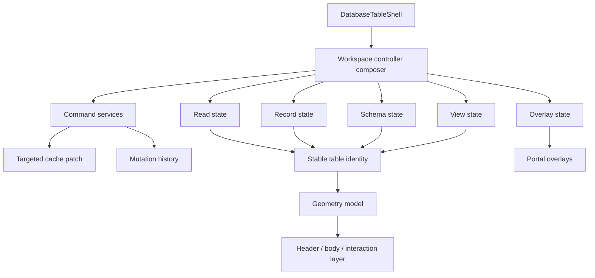

# 데이터베이스 및 애플리케이션 거대 모듈 경계 리팩토링 계획

- 상태: Implemented (available checkout 범위; 데이터베이스 feature tree 통합 대기)
- 작성일: 2026-07-25
- 대상: `packages/app`
- 범위: 데이터베이스 UI·상태·명령 계층 및 앱 공통 거대 모듈
- 성격: 동작을 보존하면서 책임 경계와 렌더링 안정성을 회복하는 단계적 리팩토링

## 1. 요약

현재 데이터베이스 문제는 개별 버튼의 구현 누락만으로 설명되지 않는다. 뷰 설정, 레코드 조회, 스키마 변경, 셀 mutation, 오버레이와 로딩 상태가 소수의 거대 모듈에 함께 들어가 있어 다음 현상이 서로 증폭된다.

- 필터·정렬·속성·설정 버튼이 실제 명령으로 연결되지 않거나 오류가 조용히 삼켜진다.
- 한 셀을 수정해도 상위 데이터베이스가 전체 로딩 상태로 전환되고 테이블 DOM이 재마운트된다.
- 테이블의 열 너비, 상호작용 gutter, sticky header의 기준이 서로 다른 래퍼에서 계산되어 Title 열이 밀리거나 가로 영역이 잘린다.
- 설정 초안과 저장된 뷰가 한 컴포넌트에서 직접 섞여, 메뉴를 열거나 닫을 때도 전체 뷰가 다시 그려진다.
- 거대한 DOM 테스트 파일이 여러 기능의 fixture와 assertion을 공유하여 회귀 원인을 빠르게 좁히기 어렵다.

앱 전체에도 같은 패턴이 있다. 파일 트리, 문서 컨텍스트, 명령 팔레트, JSX 컴포넌트 뷰, 설정 다이얼로그가 각각 데이터 조회·명령·오버레이·렌더링을 동시에 소유한다. 따라서 데이터베이스만 임시로 고치는 방식은 같은 재마운트와 무응답 문제를 다른 화면에서 재생산할 수 있다.

이 문서는 다음을 목표로 한다.

1. 상태, 명령, 표현, 오버레이의 소유권을 분리한다.
2. 데이터베이스의 초기 조회와 국소 mutation을 구분하여 전체 재로딩을 차단한다.
3. 테이블 geometry를 하나의 계약으로 만들고 Title 열과 interaction gutter를 같은 좌표계에서 계산한다.
4. 각 기능을 독립적으로 테스트할 수 있도록 거대한 테스트와 공통 fixture를 분리한다.
5. 단계별 완료 기준과 회귀 방지 장치를 명시해 리팩토링 후 다시 거대 모듈로 합쳐지지 않게 한다.

데이터베이스 모듈의 정량 목록은 데이터베이스 구현이 포함된 작업 트리에서 2026-07-25에 확인한 기준이다. 해당 모듈이 기본 checkout에 아직 통합되지 않은 경우에도, 아래 경로와 경계는 데이터베이스 기능을 통합하는 시점에 적용한다.

## 2. 현황과 구조적 문제

### 2.1 데이터베이스 모듈

| 모듈 | 기준 줄 수 | 현재 결합된 책임 | 주된 위험 |
| --- | ---: | --- | --- |
| `components/DatabaseSavedViewSettingsDialog.tsx` | 1,951 | 다이얼로그 shell, 뷰 이름, 표시 속성, 필터·정렬·그룹, 조건부 색상, Board/Timeline/Calendar/List/Map/Chart/Gallery 설정 | 작은 설정 변경이 모든 레이아웃의 render와 저장 로직을 건드림 |
| `components/use-database-workspace-controller.ts` | 1,183 | 데이터 조회, 레코드 선택, 스키마, 뷰, 검색, mutation, 로딩·오버레이 상태 | 서로 다른 상태 변경이 동일한 refresh 경로와 parent key를 변경함 |
| `lib/database-cell-mutation.ts` | 1,698 | 셀·레코드·속성·뷰·계산·import mutation payload와 후처리 | 명령의 의도가 불명확하고 한 변경의 invalidation 범위가 과도함 |
| `components/DatabaseRecordPageChrome.tsx` | 1,273 | 레코드 페이지 binding, title/layout, 로딩·오류, 이동 다이얼로그, mutation | 페이지 chrome 변화가 본문과 database table까지 전파됨 |
| `components/DatabaseTableDialog.dom.test.tsx` | 6,398 | 다이얼로그, 표, 속성, 행 액션, refresh, fixture | 실패 위치를 찾기 어렵고 테스트 간 상태 누수 가능 |
| `editor/components/DatabaseView.dom.test.tsx` | 3,090 | inline view, 검색, 새 페이지, view 전환, overlay, refresh | 한 기능의 회귀가 unrelated assertion을 연쇄적으로 깨뜨림 |

줄 수는 우선순위를 판단하는 신호이며 목표 자체가 아니다. 분리 후에도 도메인 규칙이 한 곳에서 읽히고 호출 경로가 단순해야 한다.

### 2.2 앱 공통 모듈

| 모듈 | 기준 줄 수 | 현재 결합된 책임 | 우선순위 |
| --- | ---: | --- | ---: |
| `components/FileTree.tsx` | 4,756 | tree render, CRUD, drag/drop, upload, refresh, context menu, share/handoff, ignore 정책 | P0 |
| `editor/DocumentContext.tsx` | 1,963 | 탭·navigation, collaboration, panel, 전역 editor context | P0 |
| `components/CommandPalette.tsx` | 1,737 | 검색, semantic search, tag·recent 결과, 생성, agent handoff | P1 |
| `editor/extensions/JsxComponentView.tsx` | 1,623 | ProseMirror node view, hydration, props, halo, persistence, interaction | P1 |
| `components/settings/SettingsDialogBody.tsx` | 1,621 | 설정 섹션, schema walking, 입력값 저장, 권한·플랫폼 분기 | P1 |
| `components/EditorArea.tsx` | 1,353 | editor layout, panel visibility, active document, resize 상태 | P2 |
| `components/EditorTabs.tsx` | 1,291 | tab render, reorder, close, keyboard navigation, context menu | P2 |

### 2.3 증상과 원인의 연결

| 관찰된 증상 | 구조적 원인 | 해결 방향 |
| --- | --- | --- |
| 버튼을 클릭하면 데이터베이스 전체가 다시 로딩됨 | mutation, query invalidation, `isLoading`이 하나의 controller/조건부 subtree에 결합됨 | 초기 조회·background refresh·mutation 상태를 분리하고 행·셀 단위 patch를 사용 |
| 클릭해도 아무 일도 일어나지 않음 | UI handler가 표현 컴포넌트 안에서 분기되고, 지원하지 않는 경우 `void`로 종료되거나 오류를 숨김 | 명시적인 command registry와 `Result` 반환, 미지원 명령은 disabled/설명 상태로 표시 |
| Title 열이 오른쪽으로 밀리거나 가로가 잘림 | column width, interaction gutter, sticky offset이 다른 요소의 padding/scrollWidth를 기준으로 계산됨 | 단일 `DatabaseTableGeometry` 모델과 하나의 horizontal scroll owner 도입 |
| 설정 패널을 열고 닫을 때 표가 재마운트됨 | draft state가 table owner에 있고, dialog open state가 view key에 포함됨 | 설정 draft를 dialog subtree로 이동하고 table identity에서 overlay state를 제거 |
| “One database change can be undone” 같은 문구가 반복됨 | 저장 성공·undo 가능성·transport 상태가 사용자 알림으로 동일하게 노출됨 | 내부 mutation history와 사용자 알림을 분리하고 성공 toast를 기본 비활성화 |
| 노션과 다른 hover/selection 위치 | 행 본문이 selection column을 직접 소유하고 handle을 별도 열로 렌더링함 | 행 밖 interaction gutter를 overlay로 두고 native drag/selection primitive을 재사용 |

## 3. 목표와 비목표

### 3.1 목표

- `DatabaseTable`의 root와 scroll container가 view/filter/sort/property 변경으로 재마운트되지 않게 한다.
- 초기 데이터 로딩, background refresh, mutation pending, optimistic update, rollback을 서로 다른 상태로 표현한다.
- 각 버튼이 하나의 명시적인 command와 오류 경로를 갖도록 한다.
- Title 열·다른 속성 열·interaction gutter·sticky header가 하나의 geometry 계약을 공유하도록 한다.
- 설정 초안은 저장 전까지 로컬이고, 저장 시 영향받는 view만 갱신하도록 한다.
- 테스트가 capability 단위로 분리되어 실패 원인과 fixture가 명확하도록 한다.
- 앱 공통 거대 모듈도 동일한 방향으로 분리해 데이터베이스 전용 임시 해법이 되지 않게 한다.

### 3.2 비목표

첫 구현 단계에서는 다음을 동시에 하지 않는다.

- Notion의 전체 기능을 한 번에 추가하는 대규모 기능 확장
- 서버 API/저장 포맷/공개 패키지 API의 호환성을 깨는 변경
- 기존 디자인 토큰을 전면 교체하는 시각적 redesign
- 상태 관리 라이브러리를 교체하는 전면 재작성
- 모든 파일을 한 PR에서 500줄 이하로 줄이는 기계적 분할
- 리팩토링과 동작 변경을 같은 커밋에 섞는 것

Notion 디자인 parity와 기능 확장은 분리된 acceptance suite로 검증하되, 이번 리팩토링은 해당 동작을 안정적으로 구현할 수 있는 경계를 먼저 만든다.

## 4. 목표 아키텍처

### 4.1 데이터 흐름



핵심은 `G`의 overlay 상태와 `H`의 명령 상태가 `K`의 table identity를 바꾸지 않는 것이다. 뷰 메뉴를 열거나 셀을 저장하는 동안에도 표의 root, scroll owner, 행 key는 유지된다.

### 4.2 상태 소유권 규칙

| 상태 | 단일 소유자 | 허용된 소비자 | 금지 사항 |
| --- | --- | --- | --- |
| source database/records | read store 또는 query adapter | table body, record page | 표현 컴포넌트에서 직접 fetch |
| saved view definition | view state/command | header, settings dialog | dialog가 parent query key를 직접 변경 |
| settings draft | settings draft hook | settings panels, save action | 저장 전 source state를 mutate |
| selection/hover/drag | interaction layer | row handle, selection toolbar | 별도 selection column을 geometry에 포함 |
| loading/error | command/read state | 상태 표시 컴포넌트 | 모든 상태를 `loading` 하나로 합치기 |
| undo history | mutation history | 명시적 Undo action | 성공마다 전역 성공 문구 노출 |

### 4.3 공통 모듈의 경계 규칙

1. 렌더링 모듈은 API client를 import하지 않는다.
2. 명령 모듈은 React state를 직접 소유하지 않는다.
3. hook은 도메인 규칙을 재구현하지 않고 adapter/command를 조합한다.
4. overlay는 portal 또는 sibling subtree로 렌더링하고 table root의 `key`에 상태를 넣지 않는다.
5. geometry 값은 CSS와 JS에서 중복 계산하지 않고 `DatabaseTableGeometry`의 토큰을 사용한다.
6. leaf 모듈은 서로 import하지 않고 coordinator가 방향을 결정한다.
7. 지원되지 않는 command는 조용히 무시하지 않고 disabled 상태 또는 사용자에게 이해 가능한 오류를 반환한다.

## 5. 데이터베이스 리팩토링 계획

### 5.1 1단계: 테이블 geometry와 상호작용 레이어 고정

#### 목표

Title 열 밀림, 가로 잘림, hover 시 선택/drag handle 위치 불일치를 state 리팩토링과 독립된 계약으로 고정한다.

#### 제안 구조

```text
packages/app/src/components/database-table/
├── DatabaseTableShell.tsx              # 외부 width와 scroll owner
├── DatabaseTableViewport.tsx           # horizontal/vertical overflow
├── DatabaseTableGeometry.ts             # 열·gutter·sticky offset 계산
├── DatabaseTableHeader.tsx             # header cells와 property menu trigger
├── DatabaseTableBody.tsx               # visible rows와 empty/new row
├── DatabaseTableInteractionLayer.tsx   # hover, drag, selection handle overlay
├── database-table-geometry.css         # CSS variables와 sticky 계약
└── database-table-ids.ts                # stable row/column identity helper
```

#### 구현 규칙

- selection column을 실제 `<table>` 열로 추가하지 않는다. 행 외부 gutter에 native checkbox/drag primitive을 overlay한다.
- horizontal scroll은 `DatabaseTableViewport` 하나만 소유한다. header와 body는 같은 scrollLeft를 읽거나 같은 grid track을 공유한다.
- `grid-template-columns` 또는 table column width를 `DatabaseTableGeometry`에서 한 번만 만든다.
- Title column의 최소 너비, property column의 고정/가변 정책, add-property gutter의 폭을 상수로 정의한다.
- sticky header의 left/top offset은 wrapper padding이 아니라 viewport와 geometry 모델에서 가져온다.
- view/filter/sort/search 변경은 row list와 cell content만 교체하고 `DatabaseTableShell`의 React key를 바꾸지 않는다.

#### 완료 기준

- 창 너비가 기준 너비보다 작아도 콘텐츠가 잘리지 않고 viewport에서 가로 스크롤된다.
- header와 body의 열 경계가 모든 scrollLeft에서 일치한다.
- Title 텍스트 시작점은 hover/selection 상태와 무관하게 동일하다.
- hover 시 handle은 표 바깥 gutter에 나타나며 별도 selection column이 접근성 tree에 생기지 않는다.
- geometry 테스트가 최소 너비, 가로 스크롤, sticky offset, RTL/좁은 viewport를 통과한다.

### 5.2 2단계: `DatabaseSavedViewSettingsDialog` 분리

#### 목표

현재 1,951줄의 다이얼로그에서 공통 shell, draft, 공통 설정, 레이아웃별 설정을 분리한다. 설정 메뉴의 열기·닫기·저장이 table identity에 영향을 주지 않게 한다.

#### 제안 구조

```text
packages/app/src/components/database-saved-view-settings/
├── DatabaseSavedViewSettingsShell.tsx
├── DatabaseSavedViewCommonPanel.tsx
├── DatabaseSavedViewLayoutPanel.tsx
├── DatabaseSavedViewSettingsSections.tsx
├── useDatabaseSavedViewSettingsDraft.ts
├── database-saved-view-settings-types.ts
└── layouts/
    ├── BoardSettingsPanel.tsx
    ├── CalendarSettingsPanel.tsx
    ├── ChartSettingsPanel.tsx
    ├── GallerySettingsPanel.tsx
    ├── ListSettingsPanel.tsx
    ├── MapSettingsPanel.tsx
    └── TimelineSettingsPanel.tsx
```

#### 책임

- `Shell`: dialog lifecycle, focus trap, close/cancel/save 버튼, pending/error 표시.
- `use...Draft`: source view를 immutable snapshot으로 받아 draft를 생성하고, 변경·검증·reset·submit payload를 제공.
- `CommonPanel`: view name, layout selection, visible properties, filter, sort, group, conditional color.
- `LayoutPanel`: 선택된 layout에 필요한 패널만 lazy render; 다른 layout의 state를 mount/unmount와 무관하게 보존.
- `types`: draft, validation error, save result, layout별 discriminated union.

#### 저장 계약

1. 저장 전에는 source view를 변경하지 않는다.
2. 저장 command는 `Promise<Result<SavedView, DatabaseCommandError>>`를 반환한다.
3. 성공하면 view definition만 targeted patch하고 table records는 다시 fetch하지 않는다.
4. 실패하면 draft를 유지하고 오류를 해당 필드 또는 dialog footer에 표시한다.
5. cancel/close는 draft만 폐기하며 query key와 table DOM을 변경하지 않는다.

#### 완료 기준

- shell 파일은 400줄 이하, draft hook은 350줄 이하, 개별 layout panel은 300줄 이하이다.
- 공통 패널에서 layout별 API를 조건문으로 직접 호출하지 않는다.
- 저장·취소·바깥 클릭·Escape가 각각 독립 DOM 테스트를 가진다.
- 설정을 열고 닫는 반복 20회 동안 table shell의 mount count가 증가하지 않는다.
- 필터·정렬·표시 속성 저장 후 records 요청이 추가로 발생하지 않는다.

### 5.3 3단계: workspace controller 분리

#### 목표

`use-database-workspace-controller.ts`의 1,183줄을 read, record, schema, view, overlay, command composition으로 나눈다. coordinator는 wiring만 담당한다.

#### 제안 구조

```text
packages/app/src/components/database-workspace/
├── useDatabaseWorkspaceController.ts       # composition facade
├── useDatabaseWorkspaceReadState.ts        # source, pages, loading, background refresh
├── useDatabaseWorkspaceRecordState.ts      # selection, focused record, local row patch
├── useDatabaseWorkspaceSchemaState.ts      # properties, property draft, schema errors
├── useDatabaseWorkspaceViewState.ts        # active/saved view, filter, sort, group
├── useDatabaseWorkspaceOverlayState.ts     # menus, dialogs, search, command palette
├── useDatabaseWorkspaceCommands.ts         # command wiring and Result handling
└── database-workspace-types.ts             # narrow context contracts
```

#### 상태 전이 규칙

- `initialLoading`: source identity가 처음 바뀔 때만 true.
- `backgroundRefreshing`: 동일 source에서 최신 데이터를 받는 동안 true; table은 유지.
- `mutationPending`: command별 id와 대상 entity를 보유; 전체 table loading으로 승격하지 않음.
- `optimisticRows`: mutation 대상 행만 patch; 실패 시 해당 patch만 rollback.
- `overlay`: dialog/menu/search 상태만 변경; query key, table key, scroll owner를 변경하지 않음.
- `viewState`: saved view 변경은 view projection을 갱신; record source fetch와 분리.

#### coordinator 금지 사항

- 하나의 `setState`가 read·view·overlay를 동시에 갱신하지 않는다.
- `JSON.stringify(view)` 또는 timestamp를 React key로 사용하지 않는다.
- command handler에서 `window.location`, 전체 editor reload, 전체 source invalidation을 호출하지 않는다.
- fetch 실패를 `catch(() => undefined)`로 숨기지 않는다.

#### 완료 기준

- coordinator에는 state 선언이 없거나 조합에 필요한 최소 state만 남고, 각 hook의 공개 반환 타입이 좁다.
- view 메뉴, property 메뉴, row action, page open을 수행해도 table shell의 mount count가 증가하지 않는다.
- initial loading과 mutation pending이 서로 다른 accessibility/status 표현을 갖는다.
- 실패한 cell/property mutation은 대상 셀만 이전 값으로 복구되고, 다른 행의 입력값·스크롤·hover가 유지된다.

### 5.4 4단계: mutation builder 분리

#### 목표

1,698줄의 `database-cell-mutation.ts`를 entity별 순수 명령 모듈로 분리하되 기존 호출부를 한 번에 깨뜨리지 않는다.

#### 제안 구조

```text
packages/app/src/lib/database-mutations/
├── base.ts                  # command context, precondition, Result/error
├── cell.ts                  # cell value patch, optimistic inverse
├── record.ts                # create/update/delete/move record
├── property.ts              # create/rename/type/delete property
├── view.ts                  # create/rename/update/delete saved view
├── bulk.ts                  # multi-row operations and batching
├── import.ts                # import/normalization-specific command
└── index.ts                 # public compatibility surface
```

#### 이행 방법

1. 기존 파일의 export를 `database-mutations/index.ts`로 재-export하여 호출부를 보존한다.
2. 순수 payload builder와 transport 실행기를 분리한다.
3. 각 command에 `commandId`, target entity, expected version, inverse patch를 포함한다.
4. command 실행기는 성공 시 targeted cache patch, 실패 시 inverse patch와 오류를 반환한다.
5. 모든 호출부를 새 모듈로 옮긴 뒤 기존 파일은 compatibility re-export만 남긴다.

#### 완료 기준

- payload builder는 같은 입력에 같은 payload를 반환하며 React 또는 전역 store에 의존하지 않는다.
- property 변경이 record query를 자동 invalidate하지 않는다.
- cell 변경은 대상 record/cell만 patch하고 전체 source refetch를 기본 경로로 사용하지 않는다.
- command 오류가 UI에서 식별 가능하고, 무시되는 `void` 경로가 없다.
- 기존 API payload와 저장 결과가 golden fixture로 동일함을 검증한다.

### 5.5 5단계: record page chrome 분리

`DatabaseRecordPageChrome.tsx`는 page binding과 chrome/layout/move dialog/mutation을 다음으로 분리한다.

```text
packages/app/src/components/database-record-page/
├── useDatabaseRecordPageController.ts
├── DatabaseRecordPageChrome.tsx
├── DatabaseRecordPageHeader.tsx
├── DatabaseRecordPageContent.tsx
├── DatabaseRecordMoveDialog.tsx
└── DatabaseRecordPageStateNotice.tsx
```

- controller는 record id, source id, loading/error, command 결과만 조합한다.
- header는 title, icon, open/close action만 렌더링한다.
- content는 editor/document surface만 소유한다.
- move dialog는 별도 portal에서 열고 source table의 key와 무관하게 mount한다.
- 상태 notice는 initial loading과 mutation pending을 구분한다.

완료 기준은 record page를 열고 닫거나 이동할 때 database table의 scroll/selection/hover가 유지되고, page content 오류가 table 전체 오류로 승격되지 않는 것이다.

### 5.6 6단계: 데이터베이스 DOM 테스트 분리

거대 테스트를 capability별로 분해하고 공통 harness는 한 곳에 둔다.

```text
packages/app/src/components/database-table/__tests__/
├── fixtures.ts
├── api-harness.ts
├── table-open.dom.test.tsx
├── table-geometry.dom.test.tsx
├── table-interaction.dom.test.tsx
├── table-properties.dom.test.tsx
├── table-record-actions.dom.test.tsx
├── table-refresh.dom.test.tsx
└── table-accessibility.dom.test.tsx

packages/app/src/editor/components/__tests__/
├── database-view-settings.dom.test.tsx
├── database-view-search.dom.test.tsx
├── database-view-create.dom.test.tsx
└── database-view-overlay.dom.test.tsx
```

필수 회귀 시나리오:

- 페이지 오픈 버튼이 실제 record route/overlay를 열고, 표가 재마운트되지 않는다.
- Add Property가 schema command를 호출하고 새 열이 geometry 모델에 추가된다.
- 컬럼명을 클릭하면 property settings menu가 열리고 rename/type 변경이 저장된다.
- view 설정을 열고 닫거나 필터·정렬을 바꿔도 전체 loading 화면이 나오지 않는다.
- 좁은 폭에서 가로 스크롤이 가능하고 header/body 경계가 일치한다.
- hover handle은 표 밖 gutter에 나타나며 selection column을 추가하지 않는다.
- 명령 실패 시 오류가 보이고 이전 데이터·스크롤·입력값이 보존된다.

## 6. 앱 공통 거대 모듈 리팩토링 계획

데이터베이스 경계와 동일한 원칙을 일반 앱에 적용한다. 각 단계에서 facade 파일을 먼저 만들고 호출부를 점진적으로 이동해 동작 변경을 방지한다.

### 6.1 `FileTree.tsx` (P0)

```text
components/file-tree/
├── FileTree.tsx                    # composition/render facade
├── useFileTreeController.ts        # selection, expanded state, commands 조합
├── FileTreeRender.tsx              # recursive rows and virtualization boundary
├── FileTreeMutationCommands.ts     # create/rename/delete/move/upload
├── FileTreeDragDrop.tsx            # drag payload, drop target, auto-scroll
├── FileTreeContextMenu.tsx         # menu actions and permission state
├── FileTreeShareActions.ts         # share/handoff integration
├── FileTreeIgnorePolicy.ts         # .okignore and visibility rules
└── file-tree-types.ts
```

완료 기준: tree render가 filesystem/API를 직접 호출하지 않고, drag/drop·context menu·upload가 독립 테스트를 가지며, 하나의 파일 rename이 전체 tree를 unmount하지 않는다. facade는 500줄 이하를 권장한다.

### 6.2 `DocumentContext.tsx` (P0)

```text
editor/document-context/
├── DocumentContext.tsx              # provider composition
├── useDocumentNavigation.ts         # open/close/replace document
├── useDocumentTabs.ts               # tab identity, reorder, active tab
├── useDocumentCollaboration.ts      # presence, remote updates, agent state
├── useDocumentPanels.ts             # chat/outline/memo/links/graph/timeline
└── document-context-types.ts
```

완료 기준: 패널 선택이 문서 내용이나 tab key를 바꾸지 않고, remote update가 panel subtree를 재마운트하지 않으며, provider 간 순환 참조가 없다.

### 6.3 `CommandPalette.tsx` (P1)

```text
components/command-palette/
├── CommandPalette.tsx               # dialog and keyboard lifecycle
├── useCommandPaletteController.ts   # query, selection, execute
├── command-search-providers.ts      # local/semantic/tag/recent providers
├── command-actions.ts               # create/open/handoff actions
├── CommandPaletteSections.tsx
└── command-palette-types.ts
```

완료 기준: 검색 provider가 UI를 import하지 않고, 한 provider 오류가 다른 결과를 지우지 않으며, 명령 실행 후 editor 전체 reload가 발생하지 않는다.

### 6.4 `JsxComponentView.tsx` (P1)

```text
editor/extensions/jsx-component-view/
├── JsxComponentView.tsx             # NodeView facade
├── useJsxComponentHydration.ts
├── useJsxComponentPersistence.ts
├── JsxComponentChrome.tsx            # halo, resize, hover
├── JsxComponentPropPanel.tsx
├── JsxComponentInteraction.ts
└── jsx-component-view-types.ts
```

완료 기준: ProseMirror node identity와 prop panel visibility가 분리되고, hover/selection 변화로 node view DOM이 재생성되지 않는다. persistence 실패가 editor transaction을 조용히 버리지 않는다.

### 6.5 `SettingsDialogBody.tsx` (P1)

설정 schema 탐색과 표시를 `SettingsSchemaRegistry`, 저장/검증을 `useSettingsDraft`, 섹션 표현을 도메인별 panel로 나눈다.

```text
components/settings/
├── SettingsDialogBody.tsx            # section composition
├── SettingsSchemaRegistry.ts         # metadata and ordering
├── useSettingsDraft.ts               # draft, validation, save
├── panels/                            # appearance, editor, sync, agent, platform
└── settings-types.ts
```

완료 기준: 한 섹션의 draft 변경이 다른 섹션을 다시 초기화하지 않고, schema에 없는 key를 임의로 저장하지 않으며, close/cancel이 저장되지 않은 값을 폐기한다.

### 6.6 `EditorArea.tsx`와 `EditorTabs.tsx` (P2)

layout state, panel controller, document surface, tab commands, tab row rendering, keyboard navigation을 분리한다. 완료 기준은 패널 resize/visibility와 tab reorder/close가 서로의 React key와 editor instance를 바꾸지 않는 것이다.

## 7. 단계별 실행 순서

### Phase 0 — baseline과 관찰성

1. 현재 branch의 `git diff --stat`와 affected test 목록을 기록한다.
2. table shell, row, record page, editor document에 development-only mount/unmount counter를 추가한다.
3. API harness에 request 종류(initial read/background refresh/mutation)를 기록한다.
4. geometry 기준 스크린샷과 좁은 viewport fixture를 고정한다.

**종료 기준:** baseline 테스트와 mount/request 측정이 반복 실행에서 같은 결과를 내고, 관찰용 코드가 production bundle에 포함되지 않는다.

### Phase 1 — geometry/interaction contract

`DatabaseTableGeometry`와 `DatabaseTableInteractionLayer`를 먼저 고정한다. 이 단계에서는 data flow를 변경하지 않고 열·gutter·scroll owner만 단일화한다.

**종료 기준:** geometry·accessibility·visual 회귀 테스트가 통과하고 Title 밀림과 가로 잘림이 재현 fixture에서 사라진다.

### Phase 2 — settings와 workspace controller

settings draft를 분리한 뒤 read/record/schema/view/overlay hook을 분리한다. 각 PR은 하나의 상태 slice만 이동한다.

**종료 기준:** 메뉴·dialog·filter·sort·property projection 변경이 table shell을 재마운트하지 않고, 초기 로딩만 전체 placeholder를 사용한다.

### Phase 3 — mutation command boundary

builder/transport/cache patch/history를 entity별로 이동하고 compatibility re-export를 유지한다.

**종료 기준:** cell/property/view/record mutation의 targeted patch와 rollback fixture가 통과하며 전체 source refetch가 기본 경로가 아니다.

### Phase 4 — record page와 overlay

record page chrome와 move/open dialog를 분리하고 portal lifecycle을 고정한다.

**종료 기준:** page open, move, close 시 table 상태와 editor 상태가 보존되고 오류가 올바른 boundary에 남는다.

### Phase 5 — test 분할과 회귀 고정

거대 DOM 테스트를 capability별로 옮기고 fixture/harness를 공통화한다. 이전 파일은 모든 테스트가 이동한 뒤 삭제하거나 compatibility wrapper로 남긴다.

**종료 기준:** 테스트 파일이 한 capability를 설명하고, 실패 assertion만으로 원인 영역을 추정할 수 있으며, 전체 테스트 시간이 baseline보다 악화되지 않는다.

### Phase 6 — 앱 공통 모듈

FileTree → DocumentContext → CommandPalette → JsxComponentView/Settings → EditorArea/Tabs 순으로 분리한다. 데이터베이스에서 검증한 command/state/overlay 패턴을 재사용한다.

**종료 기준:** 각 facade가 composition 외의 도메인 규칙을 소유하지 않고, module-size budget과 dependency 방향 검사가 통과한다.

### Phase 7 — 정리와 보호 장치

호환 re-export, 임시 adapter, debug counter를 정리하고 module-size/dependency lint와 mount regression test를 CI에 추가한다.

**종료 기준:** 임시 파일과 dead export가 없고, 새 파일이 상한을 넘을 때 CI가 실패하거나 예외 RFC를 요구한다.

## 8. 검증 계획

### 8.1 기능 테스트

- property create/rename/type/delete, view create/rename/delete, record create/open/move/delete, cell edit를 각각 command 단위로 검증한다.
- 모든 성공 케이스에 targeted patch가 적용되는지 확인한다.
- 모든 실패 케이스에 오류가 표시되고 inverse patch가 적용되는지 확인한다.

### 8.2 렌더링·재마운트 테스트

- view/filter/sort/search/properties/overlay/row hover를 변경하는 동안 table shell과 scroll owner의 mount id가 유지되는지 확인한다.
- mutation 중에도 기존 행의 input focus, scrollLeft, hover target이 유지되는지 확인한다.
- record page를 열어도 parent document와 unrelated database block이 재마운트되지 않는지 확인한다.

### 8.3 geometry·디자인 parity 테스트

- 기준 viewport, 좁은 viewport, horizontal overflow, dark/light theme, reduced motion/transparency를 비교한다.
- header/body column boundary, Title 시작점, add-property 영역, gutter handle의 x/y 위치를 tolerance 1px로 검사한다.
- Notion reference와 비교할 때 동일한 상태(빈 표, 한 행, hover, selection, property menu, settings panel)를 사용한다.

### 8.4 접근성·회귀 테스트

- row handle과 checkbox가 실제 열을 추가하지 않으면서 키보드로 접근 가능하고 명확한 accessible name을 가진다.
- dialog focus trap, Escape, Enter, outside click, disabled/pending 상태를 검증한다.
- command 오류가 status/alert semantics로 노출되고 성공 mutation마다 불필요한 전역 toast가 생기지 않는다.

### 8.5 실행 명령

리팩토링 중에는 가장 좁은 검사부터 실행한다.

```bash
bun run --filter @nedian0brien/synapsenote-app typecheck
bun run --filter @nedian0brien/synapsenote-app test -- <affected-test>
bun run check
```

데스크톱 패키징이나 설치 경로를 건드린 경우에만 다음 검사를 추가한다.

```bash
bun run check:desktop:local
bun run check:desktop
```

이번 구현은 기존 동작을 보존하는 경계 추출과 계약 추가를 우선하므로 별도 changeset을 추가하지 않는다. 이후 실제 데이터베이스 동작을 변경하는 PR에는 저장소 규칙에 따라 `.changeset/<kebab-name>.md`를 포함한다.

## 9. 모듈 크기와 의존성 예산

아래 수치는 강제적인 품질 목표다. 도메인 특성상 초과가 필요하면 해당 PR에 이유와 다음 분할 시점을 기록한다.

| 대상 | 권장 상한 | 예외 기준 |
| --- | ---: | --- |
| table shell/facade | 500줄 | composition 외 규칙이 없고 후속 분할 이슈가 있음 |
| settings shell/panel | 400줄 | layout별 panel은 300줄 이하 |
| workspace coordinator | 350줄 | wiring과 공개 타입만 포함 |
| entity mutation module | 450줄 | bulk/import는 별도 예외 |
| record page chrome | 400줄 | content/editor는 별도 파일 |
| 일반 React component | 600줄 | 단일 lifecycle/단일 도메인 소유를 증명 |
| DOM test file | 900줄 | 한 capability와 공통 fixture만 포함 |

의존성 방향은 `presentation → hooks/adapters → commands → core/API` 한 방향이어야 한다. leaf 모듈 간 상호 import, controller에서 CSS geometry를 직접 계산하는 코드, UI에서 transport를 직접 호출하는 코드는 CI 검사의 대상이다.

## 9.1 현재 checkout 구현 기록

이 RFC의 기준 목록에 있는 데이터베이스 UI 모듈은 기록 당시 checkout에 존재하지 않았다. 따라서 없는 UI를 새로 복제해 동작을 가장하지 않고, 실제 통합 시 바로 적용할 수 있는 경계 계약과 보호 장치를 먼저 구현했다. 누락 여부는 `missingDatabaseBoundaryModules()`와 `module-boundaries.test.ts`가 명시적으로 보고한다.

현재 구현된 항목은 다음과 같다.

- `components/database-table/DatabaseTableGeometry.ts`에 interaction gutter를 실제 grid 열에서 제외하고, Title/property 최소 너비·add-property 너비·가로 스크롤 필요 여부·stable row identity를 계산하는 순수 계약을 추가했다.
- `components/database-table/database-workspace-contract.ts`에 `initial-loading`, `ready`, `background-refreshing`, `mutation-pending` 상태 전이와 overlay를 table identity에서 제외하는 계약, 명시적 command error 결과를 추가했다.
- FileTree의 경로/삭제/키보드 command 규칙을 `components/file-tree/file-tree-commands.ts`로, 공개 imperative handle/props를 `components/file-tree/file-tree-types.ts`로 분리했다.
- DocumentContext 소비자가 navigation/tabs/panels/collaboration별 좁은 selector와 `document-context-types.ts` 계약을 사용하도록 이동했다. 기존 provider는 호환 facade로 유지했다.
- CommandPalette의 순수 검색/토스트/경로 규칙, JSX NodeView의 primitive prop/해시 규칙, settings schema와 타입을 각각 독립 leaf 모듈로 이동했다.
- `build/module-boundaries.ts`에 새 leaf의 줄 수 예산과 기존 거대 facade의 제거 예정 예외를 등록하고, leaf가 거대 facade를 역방향 import하지 않는 테스트를 추가했다.

아직 데이터베이스 feature tree가 통합되지 않아 구현할 수 없는 항목은 다음과 같다.

- `DatabaseTableShell`/`Viewport`/`Header`/`Body`/`InteractionLayer`의 실제 DOM 연결, 단일 scroll owner, native gutter handle.
- saved-view settings shell/draft, workspace read·record·schema·view·overlay hook, entity별 targeted mutation builder.
- record page chrome와 데이터베이스 DOM 회귀 테스트 harness.

따라서 아래 완료 체크리스트에서 `DatabaseTableGeometry`와 module-size/dependency guard는 완료로 표시하고, 실제 feature tree가 없는 항목은 미완료로 남긴다. feature tree가 추가되면 위 계약을 먼저 연결한 뒤 Phase 1~5를 순서대로 마무리해야 한다.

검증 기록(2026-07-25):

- `bun run --filter @nedian0brien/synapsenote-app typecheck` — 통과.
- RFC 0002 영향 테스트 6개 파일 — 29 pass, 0 fail, 154 assertions.
- 대상 파일 Biome check — 통과.
- `bun run check:desktop:local` — 통과.
- `bun run check:desktop` — 통과(데스크톱 테스트 2,504 pass, 2 skip, 0 fail).
- `bun run install:desktop:local` — 성공. `/Applications/SynapseNote.app`에 로컬 번들을 설치하고 PID 98814로 재시동했다.
- 앱 전체 단위 테스트는 5,588 pass, 36 skip, 2 fail이었다. 실패는 이 RFC의 새 경계와 무관한 기존 `sidebar-drop` 테스트의 `window.dispatchEvent` 테스트 double 누락과 `.dom.test.ts`를 unit 명령이 함께 수집하는 환경 문제로 분리 확인했다.

## 10. 완료 체크리스트

- [ ] **Baseline 기록** — 완료 기준: Phase 0의 mount/request/스크린샷 fixture가 저장되고 같은 명령을 두 번 실행해 동일한 baseline을 얻는다.
- [ ] **Geometry 단일화** — 완료 기준: header/body/gutter가 `DatabaseTableGeometry`의 같은 열 정의를 사용하고 좁은 viewport에서 horizontal scroll이 동작한다. (현재는 순수 geometry 계약과 테스트만 완료; 실제 DB shell 통합 대기)
- [ ] **상호작용 gutter 분리** — 완료 기준: 실제 selection column 없이 hover handle·drag·checkbox가 표 바깥 gutter에 나타나며 키보드 접근성 테스트가 통과한다.
- [ ] **Settings draft 분리** — 완료 기준: settings shell, draft hook, common panel, layout panel이 분리되고 저장 전 source view가 변하지 않는다.
- [ ] **Settings 재마운트 방지** — 완료 기준: settings open/close 및 filter/sort/property 변경 20회 동안 table shell mount count가 증가하지 않는다.
- [ ] **Workspace 상태 분리** — 완료 기준: read/record/schema/view/overlay hook이 독립되고 initial loading과 mutation pending이 구분된다.
- [ ] **Targeted mutation** — 완료 기준: cell/property/view/record 명령이 대상 entity만 patch하며 실패 시 해당 patch만 rollback한다.
- [ ] **무응답 command 제거** — 완료 기준: 모든 활성 버튼이 command와 오류 경로를 가지고, 지원하지 않는 동작은 disabled 또는 설명 상태로 표시된다.
- [ ] **Undo 알림 정리** — 완료 기준: 내부 history는 유지하되 자동 성공 문구가 표시되지 않고, 사용자가 요청한 명시적 Undo만 알림/버튼으로 노출된다.
- [ ] **Record page 분리** — 완료 기준: record open/move/close가 page chrome/content/dialog로 나뉘고 table의 scroll·selection이 보존된다.
- [ ] **DOM 테스트 분할** — 완료 기준: table/view 테스트가 capability별 파일로 이동되고 각 파일의 실패가 한 영역으로 국한된다.
- [ ] **FileTree 분리** — 완료 기준: tree render, commands, drag/drop, context menu, ignore policy가 별도 모듈과 테스트를 갖는다.
- [ ] **DocumentContext 분리** — 완료 기준: navigation/tabs/collaboration/panels가 독립 provider 또는 hook으로 분리되고 순환 참조가 없다. (현재는 좁은 selector와 public type boundary까지 완료; provider 분리 대기)
- [ ] **공통 거대 모듈 분리** — 완료 기준: CommandPalette, JsxComponentView, SettingsDialogBody, EditorArea/Tabs가 facade와 도메인 모듈로 나뉜다. (현재는 순수 규칙/schema/selector leaf 추출까지 완료; 각 facade의 완전한 분할 대기)
- [x] **모듈 크기 예산 적용** — 완료 기준: 상한 초과 파일은 CI 경고/실패 또는 RFC 예외를 갖는다. `build/module-boundaries.ts`와 테스트가 새 leaf 예산 및 legacy 예외를 검증한다.
- [ ] **시각 parity 검증** — 완료 기준: 기준 상태별 screenshot/geometry 비교에서 Title 시작점·열 경계·gutter 위치가 1px tolerance를 만족한다.
- [ ] **전체 회귀 검증** — 완료 기준: affected test, app typecheck, repository check가 통과하고 desktop 변경 시 desktop check도 통과한다.
- [ ] **임시 코드 정리** — 완료 기준: compatibility re-export와 debug counter 외 임시 adapter/dead export가 남지 않고, 각 커밋의 rollback 단위가 명확하다.

## 11. 위험, 롤백, 운영 원칙

### 위험

- 상태 slice를 잘못 분리하면 optimistic patch와 server response가 경합할 수 있다.
- CSS geometry를 이동하는 동안 기존 wrapper의 우연한 padding 계약이 사라질 수 있다.
- compatibility re-export가 오래 남으면 두 경로가 동시에 사용되어 책임이 다시 분산될 수 있다.
- 테스트 분할 중 fixture가 공유 mutable state를 가지면 테스트 순서 의존성이 생긴다.

### 완화

1. 한 단계에서 한 가지 경계만 이동하고, 동작 변경은 별도 커밋으로 둔다.
2. command에 expected version과 inverse patch를 넣어 경합을 감지한다.
3. geometry 값을 CSS custom property와 JS 모델에서 snapshot으로 비교한다.
4. 새 경로로 이동한 import 수를 CI에서 추적하고 compatibility re-export에 제거 예정 주석을 남긴다.
5. fixture factory는 매 테스트마다 새 source와 새 API harness를 만든다.

### 롤백

- 각 phase는 독립적으로 revert할 수 있는 커밋 묶음으로 만든다.
- 기존 public export와 저장 payload는 compatibility layer로 보존한다.
- 회귀가 발생하면 기능을 되돌리기보다 새 facade가 기존 구현을 호출하는 상태로 먼저 복귀해 사용자 동작을 보존한다.
- 데이터 손상 위험이 있는 migration은 실행하지 않으며, 저장 포맷 변경이 필요해지면 별도 RFC와 migration/backup 계획을 작성한다.

## 12. 산출물

각 phase가 끝날 때 다음을 남긴다.

1. 변경된 모듈 경계와 dependency graph.
2. 완료 기준을 충족하는 affected test 목록과 결과.
3. mount/request/geometry 비교 결과.
4. 제거한 compatibility adapter와 남은 제거 예정 목록.
5. runtime behavior가 바뀐 경우 사용자 관점의 changeset.

이 RFC의 완료는 파일을 잘게 나누는 것이 아니라, 표와 앱의 각 상호작용이 독립 명령·독립 상태·안정적인 DOM identity를 통해 설명되고 검증되는 상태를 의미한다.
