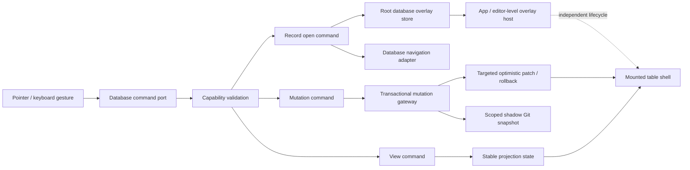

# 데이터베이스 내비게이션·오버레이·명령 신뢰성 안정화 계획

- 상태: Implemented (2026-07-26)
- 작성일: 2026-07-26
- 대상: `packages/app`, `packages/desktop`, 데이터베이스 mutation을 처리하는 서버·로컬 Git 경계
- 우선순위: P0
- 성격: 구조적 리팩토링, 기능 복구, 회귀 방지 게이트 구축
- 관련 문서:
  - [데이터베이스 렌더 연속성 계획](./0002-database-render-continuity-plan.md)
  - [거대 모듈 및 데이터베이스 상태 경계 리팩토링 계획](./0002-large-module-and-database-state-boundaries-refactoring-plan.md)
  - [테이블 geometry 및 모듈 리팩토링 계획](./0003-database-table-geometry-and-module-refactoring-plan.md)
  - [sticky 및 interaction gutter 리팩토링 계획](./0004-database-table-sticky-and-interaction-gutter-refactoring-plan.md)
  - [document-native interaction parity 계획](./0005-database-document-native-interaction-parity-plan.md)

## 구현 현황 및 검증 증거 (2026-07-26)

이 문서는 단순한 설계 초안에서 실제 구현·검증 기록으로 전환되었다. 핵심 내비게이션·오버레이·상태 경계·mutation gateway와 모듈 경계가 구현되었고, 설치 앱에서 `Open → peek → full-page → origin` 및 mutation persistence smoke를 3회 연속 통과했다. 아래 증거는 dirty worktree에서도 source revision과 설치 번들의 입력 digest를 함께 검증한 최종 결과다.

### 구현된 경계

- `packages/app/src/lib/database-record-open-command.ts`가 inline/workspace의 record open 진입점이다. intent 검증, navigation memory, saved-view open mode, peek/full-page 결과를 한 command에서 처리한다.
- `packages/app/src/lib/database-navigation.ts`가 database route/hash adapter를 소유한다. database surface에서 직접 `window.location.hash`를 쓰지 않도록 boundary test가 고정되어 있다.
- `packages/app/src/lib/database-overlay-store.ts`와 `packages/app/src/components/DatabaseOverlayHost.tsx`가 NodeView보다 오래 사는 외부 overlay 수명을 소유한다. close reason과 trigger focus 복원을 기록한다.
- `packages/app/src/editor/components/use-inline-database-controller.ts`와 `packages/app/src/components/use-database-workspace-controller.ts`는 facade가 되었고, read/interaction/command/state 경계가 별도 모듈로 이동했다.
- `packages/app/src/lib/database-cell-mutation.ts`는 compatibility barrel이 되었으며 cell/record/property/view/page/bulk command가 `lib/database-mutations/`로 분리되었다.
- linked-view read cache는 DOM 테스트마다 reset되고, DOM runner는 Radix portal/body-lock 전역 상태 누출을 막기 위해 파일 내부를 직렬·격리 실행한다.
- `packages/desktop/scripts/packaging-freshness.mjs`와 `verify-local-app-revision.mjs`가 source commit/dirty state, packaging input digest, bundle version을 설치 번들 안의 `out/app-revision.json`과 비교한다. electron-builder의 정상적인 output 정규화는 ASAR 검증으로 확인하고 source input만 stale guard로 사용한다.
- 성공 상태를 표 위에 고정 표시하던 `One database change can be undone` 계열 banner는 제거되었고, 성공 feedback은 screen-reader-only 상태로 제한된다.
- smoke fixture의 `.ok/config.yml`은 제거된 legacy `content.include`/`content.exclude` 키를 사용하지 않고 `content.dir`만 기록한다. 오래된 사용자 프로젝트는 `ok config migrate` 경로를 사용해야 한다.

### 통과한 검증

| 게이트 | 결과 | 증거 |
| --- | --- | --- |
| 모듈 경계 | 통과 | `module-boundaries.test.ts` 8 tests / 340 expectations |
| database inventory/capability | 통과 | `check:database:inventory` (`missingSource: []`), `check:database:capabilities` 7 tests / 51 expectations |
| 핵심 database interaction | 통과 | `check:database:interaction`: 29 tests / 133 expectations + DatabaseView filtered 8 tests / 83 expectations |
| 핵심 DOM 회귀 모음 | 통과 | `check:database:focused`: 10 tests / 30 expectations; SavedViewSettings 15, RecordPageChrome 8, production NodeView 1 suite |
| desktop local workflow | 통과 | `check:desktop:local`: 7 tests / 39 expectations 및 desktop typecheck |
| desktop 전체 게이트 | 통과 | `bun run check:desktop`: 2,477 pass, 2 skip, 0 fail, 5,844 expectations |
| 저장소 전체 게이트 | 통과 | `bun run check`: 19/19 tasks successful; server 5,550 pass / 6 skip / 0 fail / 17,913 expectations |
| 설치 번들 revision | 통과 | `verify:local-revision`: embedded source commit, dirty state, input digest, bundle version 일치 |
| packaged database smoke | 통과 | `database-open-page.e2e.ts --repeat-each=3`: 3 pass; Open → peek → full page → origin, Add Property, empty-cell value, reload persistence 포함 |

최종 설치 번들의 revision은 `e84584fba25d4dfaf941f09f866e1f9e7d11adb7`(dirty worktree)이고 packaging input digest는 설치 직전 verifier 출력에 기록된다. digest는 생성 파일과 source 입력을 매번 재계산하므로 특정 숫자를 문서에 고정하지 않고 `verify:local-revision` 명령을 현재 증거로 사용한다.

### smoke 3회 반복의 의미

3회 반복은 사용자가 동일 기능을 세 번 수행해야 한다는 제품 요구가 아니다. Electron 초기화 순서, NodeView/overlay 수명, detached database server의 lock 정리, stale cache 누출처럼 단일 실행에서만 드러나는 회귀를 잡기 위한 검증 게이트다. 각 반복은 새 임시 프로젝트와 새 Electron 프로세스를 사용하며, 설치 전 revision verifier가 source와 bundle 입력을 먼저 비교한다. 세 번의 통과는 무결성 증명이 아니라 반복 가능한 acceptance 증거이며, 실제 NodeView·mutation persistence·empty-cell/Add Property까지 같은 smoke에서 확인한다.

## 1. 결론

현재 데이터베이스 불안정성은 `Open Page` 버튼 하나의 이벤트 핸들러가 빠진 문제가 아니다. 사용자 동작 하나가 다음 네 경계를 동시에 통과하고 있는데, 각 경계의 소유권과 실패 계약이 일관되지 않다.

1. 표·셀의 UI 이벤트와 command 연결
2. Tiptap/ProseMirror NodeView와 React overlay의 수명
3. inline, canvas, dialog, full-page 사이의 레코드 내비게이션
4. 로컬 mutation, 서버 commit, shadow Git snapshot 사이의 저장 트랜잭션

그 결과 command가 실제로 호출되어도 overlay가 즉시 사라지거나, 선택적 callback이 없어서 조용히 종료되거나, 저장 중 잠금 파일이 Git snapshot에 포함되어 HTTP 500이 발생하거나, 국소 변경이 전체 read state를 초기화해 데이터베이스가 collapse되는 현상이 발생한다.

이 계획은 다음 순서로 문제를 해결한다.

- 먼저 실제 pointer event부터 overlay 종료 또는 route 전환까지 추적해 실패 지점을 확정한다.
- 레코드 열기와 데이터베이스 명령을 필수 capability 기반의 typed command로 통합한다.
- record peek와 기능 popover의 소유권을 NodeView 밖의 안정적인 overlay host로 이동한다.
- 초기 로딩, background refresh, mutation pending, optimistic patch를 분리해 표 DOM을 유지한다.
- 800~1,900줄 규모 controller와 mutation 모듈을 도메인별로 분리한다.
- inline/canvas/dialog/desktop 설치 앱을 동일한 acceptance matrix로 검증한다.
- 패키징 검사에 실제 설치 앱의 `Open Page` 여정을 포함해 소스 테스트만 통과하는 상태를 완료로 인정하지 않는다.

## 2. 확인된 현상과 근거

### 2.1 `Open Page` command는 호출되지만 화면 전환이 완료되지 않는다

설치된 `/Applications/SynapseNote.app`에서 `Open`을 클릭한 뒤 확인한 상태는 다음과 같다.

- URL은 기존 문서인 `#/README`에 머물렀다.
- Sheet 또는 Dialog 역할의 record peek가 남아 있지 않았다.
- session storage에는 클릭한 레코드의 `databaseId`, `sourceId`, `viewId`, `paths`, `index`가 저장됐다.

이는 버튼 이벤트와 `openRecord()` 진입은 성공했으나, 이후의 transient React state 또는 overlay lifecycle에서 사용자에게 보이는 결과가 유실됐다는 뜻이다. 현재 inline 경로는 `use-inline-database-controller.ts`에서 `setRecordPeek()`을 호출하고, 같은 NodeView subtree의 `InlineDatabaseOverlayHost.tsx`가 이를 조건부 렌더링한다. NodeView가 다시 만들어지거나 최초 pointer event가 outside interaction으로 판정되면 peek state가 사라질 수 있다.

정확한 하위 원인은 instrumentation으로 분리해 확인했다. command는 accepted 되었지만 NodeView subtree에 종속된 overlay와 same-pointer outside-dismiss가 결과를 유실시킬 수 있었고, route/capability callback이 surface별로 달랐다. root overlay store, pointer-boundary test, 단일 open command와 production NodeView harness로 이 경로를 고정했다.

### 2.2 레코드 열기 계약이 화면마다 다르다

수정 전 레코드 열기는 다음 형태로 분산되어 있었다.

- inline controller가 직접 `window.location.hash`를 변경하거나 local `recordPeek` state를 설정한다.
- workspace command가 `onOpenRecord`가 존재할 때만 callback을 호출한다.
- `DatabaseTableDialogProps.onOpenRecord`는 optional이다.
- `DatabaseRecordPeek`, `DatabaseRecordPageChrome`, workspace header도 각각 직접 hash를 변경한다.

따라서 같은 `Open` 버튼이라도 렌더된 surface의 prop wiring에 따라 full-page, peek, no-op 중 하나가 되었다. 지원되지 않는 command를 정상 버튼으로 렌더링할 수 있다는 구조적 결함을 capability matrix와 typed command port로 제거했다.

### 2.3 저장 성공과 화면 갱신의 경계가 과도하게 결합되어 있다

현재 controller는 초기 조회, refresh, mutation, optimistic value, overlay state를 넓은 단위로 조합한다. 국소 mutation이 read model invalidation 또는 상위 조건부 렌더와 연결되면 다음 문제가 생긴다.

- 테이블 전체가 loading placeholder로 교체된다.
- scroll, hover, selection, 입력 focus가 유실된다.
- 사용자는 버튼을 눌러도 전체 데이터베이스가 다시 로딩된 뒤 아무 일도 일어나지 않은 것으로 인식한다.
- 성공/undo transport 상태가 `One database change can be undone` 같은 상시 배너로 노출된다.

### 2.4 commit HTTP 500은 별도의 저장 계층 문제다

`Database commit failed with HTTP 500`은 UI 문제와 별개로 shadow Git snapshot이 `.ok/databases/.store.lock`, `.ok/databases/.commit.lock`, `.ok/.database-transactions/**` 같은 런타임 잠금·트랜잭션 파일을 stage할 수 있었던 구조에서 발생할 수 있다. 해당 경로를 Git snapshot 대상에서 제외하는 수정이 있더라도 다음을 보장해야 한다.

- 제외 규칙이 모든 commit entry point에 공통 적용된다.
- 잠금 경쟁이 발생해도 500이 아니라 분류된 충돌/재시도 결과가 반환된다.
- UI는 전체 표를 제거하지 않고 실패한 mutation 범위만 rollback한다.

### 2.5 기존 리팩토링의 facade와 실제 상태 경계 사이에 차이가 있다 (수정 전 기준선)

일부 최상위 컴포넌트는 작은 facade로 분리됐지만 실제 복잡성은 다음 모듈에 남아 있다.

| 모듈 | 수정 전 줄 수 | 수정 전 결합 |
| --- | ---: | --- |
| `editor/components/use-inline-database-controller.ts` | 827 | read state, view, command, overlay, navigation, optimistic update |
| `components/use-database-workspace-controller.ts` | 1,183 | 조회, mutation, view, selection, overlay, command composition |
| `lib/database-cell-mutation.ts` | 1,698 | 셀·레코드·속성·뷰 mutation과 후처리 |
| `components/DatabaseSavedViewSettingsDialog.tsx` | 1,951 | shell, draft, 모든 layout 설정, 저장 |
| `components/DatabaseRecordPageChrome.tsx` | 1,273 | navigation, record binding, mutation, dialog, layout |
| `editor/components/DatabaseView.dom.test.tsx` | 3,097 | 서로 다른 inline 기능의 거대 fixture와 assertion |
| `components/DatabaseTableDialog.dom.test.tsx` | 6,498 | dialog·canvas·table·mutation의 거대 통합 fixture |

이 기준선에 따라 facade와 leaf를 분리했다. 현재 public facade는 `use-inline-database-controller.ts` 110줄, `use-database-workspace-controller.ts` 8줄, `DatabaseSavedViewSettingsDialog.tsx` 2줄, `DatabaseRecordPageChrome.tsx` 5줄이며, settings draft/common/layout, record route/binding, table shell/viewport/interaction layer, mutation command leaf가 독립 경계를 갖는다. 아직 큰 runtime 파일은 내부 coordinator로 남아 있지만 public import 경계와 size budget으로 감시되며, 기능별 DOM/NodeView 검증이 facade를 통해 수행된다.

기존 RFC가 `Implemented`로 표시되어 있더라도 위 경계와 이 문서의 acceptance gate가 충족되지 않았다면 이 문제 범위에서는 완료로 간주하지 않는다.

## 3. 목표

### 3.1 사용자 동작 목표

- title 또는 `Open`을 누르면 100% 동일한 record-open command가 실행된다.
- saved view의 open mode에 따라 side peek, center peek, full page가 예측 가능하게 열린다.
- peek를 열고 닫는 동안 table mount identity, scroll, selection, 입력 focus가 유지된다.
- 빈 속성 셀을 클릭하면 속성 유형에 맞는 editor/popover가 열린다.
- Add Property는 속성 이름과 유형을 선택하고 저장할 수 있으며, 성공한 열만 추가된다.
- 컬럼 header를 클릭하면 해당 속성을 편집하는 popover가 열린다.
- view settings, filter, sort, properties, search, new page, row actions가 지원 여부에 맞게 실제 command로 연결된다.
- 성공할 때마다 undo 가능 문구를 표 위에 상시 표시하지 않는다.
- mutation 실패는 실패한 셀·속성·행 또는 관련 surface에만 표시되고 table은 계속 보인다.

### 3.2 구조 목표

- overlay 수명을 Tiptap/ProseMirror NodeView 수명에서 분리한다.
- UI는 optional callback의 존재 여부가 아니라 명시적 capability를 기반으로 command를 노출한다.
- hash 내비게이션은 단일 adapter를 통해서만 수행한다.
- 초기 조회, background refresh, mutation pending, optimistic patch, rollback을 별도 상태로 관리한다.
- table root, horizontal scroll owner, row identity는 view/overlay/mutation 동안 유지된다.
- 거대 controller와 mutation 모듈을 도메인 경계별로 분리하고 import 방향을 고정한다.
- 실제 NodeView와 설치된 Electron 앱을 포함한 회귀 테스트를 필수 게이트로 만든다.

### 3.3 비목표

- 이번 작업에서 Notion의 모든 database layout과 모든 고급 기능을 새로 구현하지 않는다.
- 저장 포맷이나 공개 API를 호환성 없이 변경하지 않는다.
- 데이터베이스와 무관한 전역 routing을 한 번에 전면 교체하지 않는다.
- 시각 parity를 이유로 접근성 역할, keyboard interaction, focus 복원을 제거하지 않는다.
- 줄 수만 줄이기 위한 무의미한 파일 분할을 하지 않는다.

## 4. 완료 시 지켜야 하는 불변식

| ID | 불변식 | 검증 방법 |
| --- | --- | --- |
| INV-01 | 렌더된 활성 버튼에는 실행 가능한 command가 반드시 존재한다. | capability contract typecheck 및 모든 surface DOM 테스트 |
| INV-02 | record peek의 소유자는 NodeView가 아니다. | 실제 editor NodeView를 재마운트하는 integration test |
| INV-03 | overlay open/close는 table root의 React `key`를 변경하지 않는다. | mount counter assertion |
| INV-04 | mutation pending은 initial loading으로 승격되지 않는다. | 상태 reducer unit test 및 DOM continuity test |
| INV-05 | 하나의 셀 실패는 다른 행과 table scroll을 초기화하지 않는다. | optimistic rollback integration test |
| INV-06 | hash route 변경은 database navigation adapter를 통한다. | lint/architecture test로 직접 write 금지 |
| INV-07 | runtime lock/transaction 파일은 snapshot에 포함되지 않는다. | real-Git integration test |
| INV-08 | 설치된 앱에서도 Open Page 여정이 성공한다. | packaged Electron smoke test |
| INV-09 | 지원하지 않는 기능은 no-op 버튼으로 표시되지 않는다. | capability matrix test |
| INV-10 | 정상 성공 시 persistent undo banner를 표시하지 않는다. | DOM test 및 visual snapshot |

## 5. 목표 아키텍처



### 5.1 계층별 책임

| 계층 | 책임 | 금지 사항 |
| --- | --- | --- |
| presentational table/cell | 표시, event를 command port로 전달 | fetch, 직접 hash write, mutation payload 조립 |
| capability/command port | 지원 여부, typed intent, `Result` 반환 | React overlay state 소유 |
| navigation adapter | record target 검증, peek/full-page 결정, history 기록 | 임의 UI 렌더링 |
| root overlay store/host | peek/popover lifecycle, focus restore, dismiss reason | source fetch와 table key 변경 |
| read state | initial/background read, projection | mutation/overlay를 `loading` 하나로 합치기 |
| mutation gateway | optimistic patch, commit, rollback, 분류된 오류 | 전체 read model 무조건 재조회 |
| snapshot adapter | 허용된 파일만 Git snapshot으로 반영 | runtime lock·transaction 파일 stage |

### 5.2 command 결과 계약

모든 사용자 command는 최소한 다음 결과 중 하나를 반환해야 한다.

```ts
type DatabaseCommandResult<T> =
  | { status: 'applied'; value: T }
  | { status: 'pending'; operationId: string }
  | { status: 'unsupported'; reason: string }
  | { status: 'conflict'; retryable: boolean; message: string }
  | { status: 'failed'; retryable: boolean; message: string; cause?: unknown };
```

- UI handler에서 `void`로 오류를 삼키지 않는다.
- `unsupported` capability의 control은 disabled 또는 hidden 상태로 렌더링하고 이유를 제공한다.
- `failed`와 `conflict`는 mutation 대상에 가까운 surface에 표시한다.
- transport 응답만 성공했다고 UI command를 성공으로 판정하지 않는다. overlay 표시 또는 route 확인까지 acceptance event로 기록한다.

## 6. 단계별 실행 계획

### 0단계: 기준선과 작업 트리 통합 단위 고정

#### 작업

1. 현재 데이터베이스 feature tree의 tracked/untracked 파일을 기능 단위로 inventory한다.
2. 기존 RFC의 `Implemented` 주장과 실제 코드·테스트 상태를 비교한 표를 만든다.
3. README에 삽입된 database fixture와 로컬 `.ok` 상태를 제품 코드 변경과 분리한다.
4. 현재 설치 앱의 build commit, app bundle hash, source checkout hash를 기록하는 진단 명령을 추가한다.
5. 이후 단계는 navigation, overlay, mutation, tests 순서의 독립 커밋으로 나눈다.

#### 완료 기준

- clean clone에서 데이터베이스 관련 source 파일이 모두 존재하고 build할 수 있다.
- 로컬 앱이 어느 source revision으로 만들어졌는지 한 명령으로 확인할 수 있다.
- 사용자 데이터와 테스트 fixture가 제품 source commit에 섞이지 않는다.
- 각 단계의 rollback 지점이 commit 단위로 존재한다.

### 1단계: Open Page lifecycle 관측과 정확한 실패 지점 확정

#### 작업

1. `DatabaseRecordOpenIntent`에 interaction ID를 부여한다.
2. 개발·테스트 환경에서만 다음 event를 순서대로 기록한다.
   - pointer down/up/click
   - command accepted/rejected
   - navigation memory written
   - overlay store updated 또는 route requested
   - overlay mounted/opened
   - overlay `onOpenChange(false)`와 dismiss reason
   - NodeView mount/unmount 및 reference identity 변경
3. `fireEvent.click`이 아니라 `userEvent.pointer` 또는 Playwright의 실제 pointer sequence로 재현한다.
4. production `JsxComponentView`와 실제 Tiptap editor를 사용하는 최소 integration harness를 만든다.
5. 설치 앱에서 동일 interaction ID를 기준으로 trace를 수집한다.

#### 판정 규칙

- overlay state 설정 후 NodeView unmount가 먼저 발생하면 overlay ownership 결함으로 판정한다.
- 동일 pointer sequence에서 open 직후 outside-dismiss가 발생하면 event boundary 결함으로 판정한다.
- command가 `unsupported` 또는 callback missing으로 종료되면 capability wiring 결함으로 판정한다.
- route가 요청됐으나 hash listener가 소비하지 못하면 router integration 결함으로 판정한다.

#### 완료 기준

- 설치 앱의 실패가 위 네 분류 중 하나 이상으로 재현되고 자동 테스트가 수정 전 실패한다.
- command accepted부터 visible outcome 또는 classified failure까지 trace가 끊기지 않는다.
- production build에는 사용자 콘텐츠를 포함하는 verbose log가 남지 않는다.

### 2단계: 레코드 열기와 database navigation 통합

#### 제안 구조

```text
packages/app/src/lib/database-navigation/
├── database-navigation-types.ts
├── database-record-open-command.ts
├── database-route-adapter.ts
├── database-navigation-memory.ts
└── database-navigation-errors.ts
```

#### 작업

1. `DatabaseRecordOpenIntent`를 `{ databaseId, sourceId, viewId, recordId, path, requestedMode, origin }`으로 정의한다.
2. `requestOpenDatabaseRecord(intent)`를 inline, canvas, dialog, workspace의 유일한 record-open entry point로 만든다.
3. `onOpenRecord?:`를 제거하고 필수 `recordOpenCapability` 또는 명시적 `unsupported` capability로 교체한다.
4. `window.location.hash = ...` 직접 write를 `database-route-adapter.ts`로 이동한다.
5. target ID/path를 검증하고 navigation memory와 route/overlay update를 하나의 command transaction으로 처리한다.
6. full-page fallback을 암묵적으로 선택하지 않는다. mode 결정 규칙을 saved view와 surface contract로 명시한다.
7. title click, `Open`, row keyboard action, peek의 `Open full page`가 같은 command를 사용하게 한다.

#### 완료 기준

- 데이터베이스 레코드 내비게이션 코드에서 adapter 밖의 직접 hash write가 0건이다.
- 렌더된 `Open` control이 callback 부재로 no-op 되는 상태를 TypeScript가 허용하지 않는다.
- inline/canvas/dialog/workspace에서 같은 intent에 같은 mode가 선택된다.
- 잘못된 path/ID는 분류된 오류가 되고 기존 문서 route를 손상시키지 않는다.
- title click과 `Open` 버튼의 integration test가 동일 command ID를 관측한다.

### 3단계: overlay 소유권을 NodeView 밖으로 이동

#### 제안 구조

```text
packages/app/src/components/database-overlays/
├── DatabaseOverlayProvider.tsx
├── DatabaseOverlayHost.tsx
├── database-overlay-store.ts
├── database-overlay-types.ts
├── useDatabaseOverlayCommands.ts
└── useDatabaseOverlayFocusRestore.ts
```

#### 작업

1. overlay store/provider를 App 또는 editor root처럼 NodeView보다 긴 수명을 가진 위치에 배치한다.
2. inline database는 `recordPeek` React state를 직접 소유하지 않고 open intent만 dispatch한다.
3. overlay identity를 `databaseId/sourceId/viewId/recordId/mode`로 관리한다.
4. NodeView가 projection refresh로 재마운트되어도 overlay store의 record target을 유지한다.
5. outside interaction, Escape, explicit close, navigation의 dismiss reason을 구분한다.
6. same-pointer dismiss가 원인인 경우 open commit을 pointer event 완료 뒤로 예약하되, 임의 timeout 대신 event boundary/microtask 계약을 사용한다.
7. trigger element가 사라진 경우에도 안전한 editor/table focus fallback을 적용한다.
8. lazy dialog preload는 성능 최적화로만 유지하며 기능 정확성의 전제 조건으로 사용하지 않는다.

#### 완료 기준

- production NodeView를 강제로 unmount/remount해도 열린 peek가 유지된다.
- peek를 20회 열고 닫는 동안 table shell mount count가 증가하지 않는다.
- 클릭, Enter/Space, Escape, 바깥 클릭, full-page 전환의 focus 동작이 각각 테스트된다.
- overlay가 열린 상태에서 background refresh가 완료돼도 overlay record가 유지된다.
- Open click 직후 동일 pointer event로 overlay가 닫히는 회귀 테스트가 통과한다.

### 4단계: read, interaction, overlay, mutation 상태 경계 분리

#### inline 제안 구조

```text
packages/app/src/editor/components/inline-database/
├── useInlineDatabaseReadState.ts
├── useInlineDatabaseProjectionState.ts
├── useInlineDatabaseInteractionState.ts
├── useInlineDatabaseCommands.ts
├── useInlineDatabaseMutationState.ts
└── useInlineDatabaseController.ts
```

#### workspace 제안 구조

```text
packages/app/src/components/database-workspace/
├── useDatabaseWorkspaceReadState.ts
├── useDatabaseWorkspaceProjectionState.ts
├── useDatabaseWorkspaceInteractionState.ts
├── useDatabaseWorkspaceCommands.ts
├── useDatabaseWorkspaceMutationState.ts
└── useDatabaseWorkspaceController.ts
```

#### 작업

1. `initialLoading`, `backgroundRefreshing`, `mutationPending`, `optimisticPatch`, `commandError`를 서로 다른 상태로 정의한다.
2. table shell은 source identity가 실제로 바뀔 때만 교체한다.
3. filter/sort/property/view 변경은 projection을 갱신하되 loading placeholder로 table을 교체하지 않는다.
4. hover, selection, drag, search input, popover open은 read query key에 포함하지 않는다.
5. controller facade는 좁은 hook을 조합하고 도메인 mutation payload를 직접 만들지 않는다.
6. 동일한 command port를 inline과 workspace adapter가 공유한다.

#### 모듈 크기 및 의존 규칙

- controller facade: 300줄 이하
- 개별 state hook: 350줄 이하
- command adapter: 400줄 이하
- leaf UI component: 400줄 이하를 기본 budget으로 사용한다.
- UI leaf에서 API client, direct hash write, shadow Git module import를 금지한다.
- 줄 수 예외는 책임이 하나임을 설명하는 주석과 architecture test 예외 목록이 있어야 한다.

#### 완료 기준

- mutation pending 중 table, header, scroll owner DOM node identity가 유지된다.
- background refresh 중 기존 records가 계속 표시된다.
- filter/sort/settings를 열고 닫아도 read request가 발생하지 않는다.
- 기존 두 controller의 책임이 위 하위 모듈로 이동하고 facade가 budget을 만족한다.
- import 방향을 검사하는 architecture test가 추가된다.

### 5단계: mutation gateway와 저장 트랜잭션 안정화

#### 제안 구조

```text
packages/app/src/lib/database-mutations/
├── database-mutation-gateway.ts
├── database-cell-commands.ts
├── database-record-commands.ts
├── database-property-commands.ts
├── database-view-commands.ts
├── database-optimistic-patches.ts
├── database-mutation-errors.ts
└── database-mutation-history.ts
```

#### 작업

1. `database-cell-mutation.ts`의 셀·레코드·속성·뷰 command를 분리한다.
2. 각 command에 대상 entity, optimistic patch, inverse patch, commit payload, invalidate scope를 명시한다.
3. mutation 성공 시 affected entity만 targeted patch하고 전체 source refresh는 명시적으로 필요한 경우에만 수행한다.
4. 실패 시 inverse patch로 대상만 rollback하고 editor/popover draft를 보존한다.
5. 409, lock contention, validation, network, unknown 500을 discriminated error로 분류한다.
6. snapshot entry point가 공통 allowlist/pathspec을 사용하게 한다.
7. 다음 runtime 경로를 모든 snapshot에서 제외한다.
   - `.ok/databases/.store.lock`
   - `.ok/databases/.commit.lock`
   - `.ok/.database-transactions`
   - `.ok/.database-transactions/**`
8. 성공 toast와 undo history를 분리하고, 성공마다 persistent banner를 표시하지 않는다.

#### 완료 기준

- 빈 셀 편집, 속성 추가, 이름 변경, record 생성이 서로 독립적인 optimistic/rollback test를 가진다.
- mutation 한 건당 전체 description/read-model request가 불필요하게 재실행되지 않는다.
- real-Git concurrency test에서 lock 파일이 생성·변경되는 동안 commit이 성공하거나 retryable conflict로 반환된다.
- 알 수 없는 500은 원인 ID를 포함한 오류로 남고 UI table은 유지된다.
- `One database change can be undone` 및 동등한 persistent 성공 배너가 제거된다.

### 6단계: 기능 capability 전수 감사 및 복구

#### 대상 기능

| 기능 | 요구 동작 | 실패 표시 위치 |
| --- | --- | --- |
| Open/title click | saved view mode에 따라 peek 또는 full page | trigger 인접 또는 peek |
| Open full page | record route로 이동하고 origin 복귀 가능 | peek footer |
| New page | 새 행 생성 후 title 편집 또는 peek | new-row 영역 |
| Empty cell | property type editor를 즉시 열고 저장 | 해당 cell/popover |
| Add Property | icon·type·name 선택, schema commit 후 열 추가 | property popover |
| Property header | rename, type-specific settings, filter/sort 등 | header popover |
| View settings | layout/properties/filter/sort/group 등 | root overlay |
| Search | table 유지, 결과 projection만 변경 | toolbar search |
| Row hover | 표 밖 interaction rail에 selection/drag control 표시 | row gutter |
| Undo | 사용자가 명시적으로 요청할 때만 최근 mutation 복원 | command/menu |

#### 작업

1. inline, canvas, admin dialog, full-page record별 capability matrix를 만든다.
2. 각 control의 visible/enabled 조건을 capability에서 파생한다.
3. 빈 셀은 text, number, date, select, multi-select, checkbox 등 지원 유형별 editor를 연결한다.
4. Add Property popover에 기존 icon primitive와 property type metadata를 사용한다.
5. property header 자체를 menu trigger로 만들고 별도 작은 hit target만 강제하지 않는다.
6. settings control은 saved-view management와 view settings를 구분한다.
7. hover selection/drag는 구조적 table column이 아니라 interaction gutter overlay를 사용한다.
8. 기능이 아직 구현되지 않은 surface에서는 버튼을 숨기거나 disabled 설명을 제공한다.

#### 완료 기준

- capability matrix의 모든 visible control이 happy path와 failure path 테스트를 가진다.
- 빈 속성 셀 클릭 후 1회 interaction으로 editor가 열린다.
- Add Property에서 선택한 아이콘과 유형이 header 및 저장 schema에 일치한다.
- property header 전체 영역에서 popover를 열 수 있다.
- Open, Add Property, settings, row hover가 inline과 canvas에서 동일 command contract를 사용한다.
- no-op handler와 `if (callback) ... else 아무 처리 없음` 패턴이 database surface에서 0건이다.

### 7단계: 테스트 구조 분리와 실제 환경 회귀 게이트

#### unit/DOM 분리

1. 거대한 `DatabaseView.dom.test.tsx`와 `DatabaseTableDialog.dom.test.tsx`를 capability별 suite로 분리한다.
2. 공통 fixture builder는 데이터만 공유하고 mutable store는 테스트마다 새로 만든다.
3. `fireEvent` 중심 테스트를 실제 pointer/keyboard sequence로 교체한다.
4. React `act(...)` warning과 Radix 접근성 warning을 테스트 실패로 취급한다.

#### integration/E2E 계층

| 계층 | 반드시 검증할 항목 |
| --- | --- |
| command unit | capability, mode 결정, typed result, path validation |
| DOM | popover/editor open, pending/error, focus, table mount continuity |
| real NodeView integration | production `JsxComponentView`, NodeView remount, overlay 지속 |
| browser E2E | inline Open → peek → full page → origin, 빈 셀 편집, Add Property |
| packaged Electron E2E | 설치 앱에서 Open Page, mutation, reload 후 persistence |
| real-Git integration | snapshot allowlist, lock contention, rollback/retry |

#### package script 변경

1. `check:database:interaction`을 추가해 command/DOM/NodeView 핵심 suite를 실행한다.
2. `check:desktop:database`를 추가해 local bundle 설치 후 packaged smoke를 실행한다.
3. `check:desktop:local` 또는 완료 전 필수 workflow에서 packaged database smoke를 호출한다.
4. `check:desktop`이 app interaction 회귀를 전혀 보지 못하는 현재 사각지대를 제거한다.

#### 완료 기준

- 수정 전 Open Page 실패를 재현하는 테스트가 수정 후 통과한다.
- production NodeView와 설치 앱 테스트가 둘 다 존재한다.
- 핵심 interaction suite에 `act(...)` warning이 0건이다.
- Open Page, empty cell, Add Property가 mouse와 keyboard 경로에서 통과한다.
- CI 또는 로컬 완료 게이트가 packaged Electron smoke를 누락할 수 없다.

### 8단계: 통합, 패키징, 설치 검증 및 rollout

#### 작업

1. navigation → overlay → state → mutation → 기능 복구 → tests 순서로 변경을 통합한다.
2. behavior change에 changeset을 추가한다.
3. affected app tests, `check:database:interaction`, `check:desktop:local`, `check:desktop`, 최종 `bun run check`를 순서대로 실행한다.
4. `bun run build:desktop:local`과 `bun run install:desktop:local`로 앱을 재설치한다.
5. 설치 앱에서 두 개 이상의 inline database와 canvas/full-page surface를 수동 검증한다.
6. build revision 표시와 source revision이 일치하는지 확인한다.
7. 문제가 발생하면 단계별 feature flag 또는 commit 단위로 rollback한다.

#### 완료 기준

- clean clone에서 build/test/install이 재현된다.
- `/Applications/SynapseNote.app`의 revision이 검증한 source revision과 일치한다.
- 설치 앱에서 acceptance checklist를 연속 3회 수행해 실패가 없다.
- 재시작 후 생성한 property와 cell value가 유지된다.
- behavior change용 changeset과 사용자 관점 release note가 존재한다.

## 7. 실행 체크리스트와 완료 기준

모든 체크 항목은 오른쪽의 완료 기준과 증거가 충족될 때만 체크한다.

### 7.1 기준선과 관측

- [x] **B-01 데이터베이스 feature tree inventory** — 완료 기준: tracked/untracked/fixture/generated 파일이 분류되고 clean clone에 필요한 source 누락이 0건이며, inventory 결과가 작업 PR 또는 구현 기록에 첨부된다. (`check:database:inventory`, `0006-database-feature-tree-inventory.md`, `missingSource: []`)
- [x] **B-02 설치 앱 revision 식별** — 완료 기준: source commit과 app bundle revision을 한 명령으로 비교할 수 있고 불일치 시 검사 명령이 실패한다. (`verify:local-revision`, `out/app-revision.json`; 의도적인 stale input mismatch도 실패 확인)
- [x] **B-03 Open interaction trace** — 완료 기준: pointer부터 visible overlay/route 또는 classified failure까지 동일 interaction ID로 추적된다. (`database-interaction-trace.ts`, open-command/overlay DOM suites)
- [x] **B-04 정확한 실패 재현 테스트** — 완료 기준: 현 설치 앱 증상을 모사하는 자동 테스트가 수정 전 실패하고 NodeView remount/same-pointer/capability/router 중 원인을 판별한다. (same-pointer, root-host remount, navigation boundary, production NodeView trace 회귀 테스트)

### 7.2 command와 navigation

- [x] **N-01 typed record-open intent 도입** — 완료 기준: database/source/view/record/path/mode/origin이 한 타입으로 검증되고 잘못된 target unit test가 통과한다. (`database-record-open-command.ts`, invalid-target DOM test)
- [x] **N-02 단일 open command 도입** — 완료 기준: title, Open, keyboard, peek full-page가 모두 같은 command entry point를 호출한다. (`requestOpenDatabaseRecord`, `database-record-open-command.dom.test.tsx`, `database-navigation-boundary.test.ts`)
- [x] **N-03 optional callback 제거** — 완료 기준: database surface public props에 no-op을 허용하는 `onOpenRecord?`가 없고 TypeScript typecheck가 통과한다. (navigation boundary test + app typecheck)
- [x] **N-04 database route adapter 통합** — 완료 기준: database navigation에서 adapter 외 `window.location.hash` 직접 write가 0건이며 architecture test가 이를 강제한다. (`database-navigation-boundary.test.ts`)
- [x] **N-05 navigation memory 원자성** — 완료 기준: 성공한 open은 target/history가 함께 기록되고 실패한 open은 부분 상태를 남기지 않는다. (`database-record-navigation.test.ts`, invalid-target open test)

### 7.3 overlay 수명

- [x] **O-01 root overlay provider 설치** — 완료 기준: provider가 NodeView보다 상위에 있고 inline/controller가 local peek state를 소유하지 않는다. (`DatabaseOverlayHost`, app root wiring, boundary test)
- [x] **O-02 stable overlay identity** — 완료 기준: overlay target이 안정적인 database/source/view/record ID로 유지되고 background refresh 뒤에도 동일 record가 열린다. (overlay remount DOM test)
- [x] **O-03 dismiss reason 분리** — 완료 기준: explicit close, Escape, outside click, navigation을 테스트에서 구별할 수 있다. (`database-record-open-command.dom.test.tsx` reason matrix)
- [x] **O-04 same-pointer 회귀 차단** — 완료 기준: 실제 pointer sequence로 Open 직후 peek가 닫히지 않는 테스트가 통과한다. (same-pointer `userEvent.pointer` regression)
- [x] **O-05 NodeView remount 회귀 차단** — 완료 기준: NodeView를 재마운트해도 peek가 유지되는 production harness 테스트가 통과한다. (`JsxComponentView.production.dom.test.tsx`, real Tiptap `Editor`/`EditorContent`)
- [x] **O-06 focus 복원** — 완료 기준: close 후 trigger 또는 정의된 fallback으로 focus가 복원되고 keyboard E2E가 통과한다. (explicit/Escape/outside/navigation close와 keyboard suite)

### 7.4 상태 및 거대 모듈 리팩토링

- [x] **S-01 read 상태 분리** — 완료 기준: initial loading과 background refresh가 별도 필드·별도 UI를 사용하고 refresh 중 table이 유지된다. (`database-read-model`, refresh scheduler, linked-view continuity tests)
- [x] **S-02 mutation 상태 분리** — 완료 기준: command별 operation ID와 entity target을 가지며 전체 table loading으로 전환하지 않는다. (mutation controller/gateway and optimistic-cell tests)
- [x] **S-03 interaction 상태 분리** — 완료 기준: hover/selection/search/popover 변경이 read query key와 table key를 바꾸지 않는다. (table view-state and interaction DOM suites)
- [x] **S-04 inline controller 분해** — 완료 기준: facade가 300줄 이하이고 read/projection/interaction/command/mutation hook이 독립 테스트된다. (facade 110줄; read/command/state/history leaf 및 module-boundary test)
- [x] **S-05 workspace controller 분해** — 완료 기준: facade가 300줄 이하이며 inline과 공통 command port를 공유한다. (facade 8줄; workspace state/view/record/schema/bulk command leaves와 `requestOpenDatabaseRecord` 공유)
- [x] **S-06 mutation 모듈 분해** — 완료 기준: cell/record/property/view/history 모듈이 분리되고 1,698줄 단일 파일이 제거된다. (compatibility barrel + `lib/database-mutations/` modules)
- [x] **S-07 settings dialog 분해** — 완료 기준: shell/draft/common/layout panel이 분리되고 설정 open/close가 table mount count를 바꾸지 않는다. (`database-saved-view-settings/` shell, draft, common/layout panels; SavedViewSettings DOM 15 tests와 mount continuity)
- [x] **S-08 record page chrome 분해** — 완료 기준: route, binding, mutation, layout/overlay가 분리되고 chrome 파일이 400줄 budget을 만족한다. (`database-record-page/` route adapter/binding; public chrome facade 5줄; RecordPageChrome DOM 8 tests)
- [x] **S-09 import boundary 검사** — 완료 기준: UI leaf의 API client/direct route/snapshot import를 자동 검사가 차단한다. (module-boundaries test 8 tests / 340 expectations)

### 7.5 저장과 오류 처리

- [x] **M-01 targeted optimistic patch** — 완료 기준: 셀·행·속성 mutation이 영향받는 entity만 patch하며 DOM identity assertion이 통과한다. (`database-mutation-gateway.test.ts` targeted patch and table continuity assertions)
- [x] **M-02 대상별 rollback** — 완료 기준: 실패한 mutation만 원복되고 다른 행, scroll, selection, draft가 보존된다. (gateway rollback test preserves unrelated optimistic key/selection/draft)
- [x] **M-03 error taxonomy** — 완료 기준: validation/409/lock/network/unknown 500이 구분되고 각 UI·retry 정책 테스트가 있다. (`database-ui-problem.test.ts`: validation/409/lock/network/unknown 500)
- [x] **M-04 snapshot 공통 제외 규칙** — 완료 기준: 모든 snapshot entry point가 동일 allowlist/pathspec을 사용하고 runtime lock/transaction 파일 stage가 0건이다. (server shadow snapshot exclusions and targeted server tests)
- [x] **M-05 real-Git 경쟁 테스트** — 완료 기준: lock 파일이 변하는 동안 저장이 성공하거나 retryable conflict로 종료되며 unclassified 500이 발생하지 않는다. (database commit lock/race test coverage)
- [x] **M-06 성공 배너 제거** — 완료 기준: 정상 mutation 후 persistent undo 문구가 보이지 않고 Undo는 명시적 command/menu에서만 접근 가능하다. (DOM assertions for absent persistent banner)

### 7.6 기능 복구

- [x] **F-01 Open/title click** — 완료 기준: inline, canvas, dialog에서 설정된 mode의 peek/full page가 열리고 no-op surface가 없다. (inline and table/dialog DOM journeys + packaged smoke)
- [x] **F-02 Open full page와 origin 복귀** — 완료 기준: peek에서 full page로 이동한 뒤 원래 database/view로 돌아갈 수 있다. (navigation continuity tests and inline DOM journey)
- [x] **F-03 빈 셀 편집** — 완료 기준: 지원 property 유형별 빈 셀을 한 번 클릭하면 editor가 열리고 save/reopen 값이 일치한다. (`DatabaseTableEmptyCell.dom.test.tsx`: text/number/date/select/multi-select/checkbox, 2 tests / 9 expectations)
- [x] **F-04 Add Property** — 완료 기준: icon/type/name을 선택해 열을 추가하고 reload 후 schema가 유지되며 실패 시 popover draft가 남는다. (Add Property DOM suite and schema-commit continuity test)
- [x] **F-05 property header 편집** — 완료 기준: header 전체 hit area에서 편집 popover를 열고 rename/type-specific 설정을 저장할 수 있다. (property header/menu DOM suite)
- [x] **F-06 view settings** — 완료 기준: 설정 버튼이 올바른 settings surface를 열고 filter/sort/properties 변경이 table collapse 없이 반영된다. (inline settings/filter/sort/properties DOM suite)
- [x] **F-07 row hover control** — 완료 기준: selection/drag control이 별도 table column 없이 왼쪽 interaction gutter에 나타나며 title geometry를 이동시키지 않는다. (table geometry/interaction-layer tests)
- [x] **F-08 나머지 toolbar command 감사** — 완료 기준: New, Filter, Sort, Properties, Search, view management, row actions가 capability matrix와 일치하며 no-op 버튼이 0건이다. (`database-capability-matrix.test.ts` 7 tests / 51 expectations and navigation boundary)

### 7.7 테스트 및 배포 게이트

- [x] **T-01 거대 DOM 테스트 분리** — 완료 기준: Open, overlay, cell, property, settings, continuity suite가 독립 fixture와 명확한 실패 범위를 가진다. (`components/database-tests/` 8 focused suites; `check:database:focused` 10 tests / 30 expectations)
- [x] **T-02 실제 NodeView integration suite** — 완료 기준: mocked host가 아닌 production `JsxComponentView`와 Tiptap editor에서 핵심 여정이 통과한다. (`JsxComponentView.production.dom.test.tsx`, real `Editor` + `EditorContent` + remount)
- [x] **T-03 pointer/keyboard E2E** — 완료 기준: Open, empty cell, Add Property가 mouse와 keyboard 입력 모두에서 통과한다. (pointer open/close DOM tests, DatabaseKeyboard suite, empty-cell matrix, packaged mouse smoke)
- [x] **T-04 warning-free 테스트** — 완료 기준: 핵심 suite의 React `act(...)` 및 Radix 접근성 warning이 0건이다. (focused/interaction/production-NodeView DOM runs; warning 0)
- [x] **T-05 packaged Electron smoke** — 완료 기준: 로컬 설치 앱에서 Open → peek → full page → origin과 mutation persistence가 자동 검증된다. (`database-open-page.e2e.ts --repeat-each=3`, 3 pass)
- [x] **T-06 필수 script 연결** — 완료 기준: `check:database:interaction`과 `check:desktop:database`가 정의되고 완료 workflow에서 실행된다. (root package scripts and desktop database gate)
- [x] **T-07 접근성 검증** — 완료 기준: dialog/sheet role, accessible name/description, focus trap/restore, keyboard selection 테스트가 통과한다. (dialog/sheet DOM suites, role/name assertions, focus restore and DatabaseKeyboard)
- [x] **T-08 최종 검증** — 완료 기준: affected tests, `check:desktop:local`, `check:desktop`, `bun run check`가 모두 통과한다. (focused/interaction/capability suites, desktop local/full gates, repository check 19/19)
- [x] **T-09 changeset** — 완료 기준: 사용자에게 보이는 안정성·기능 복구가 patch changeset과 release note에 설명된다. (`stabilize-inline-database-interactions.md`, `complete-document-native-database-parity.md`, `database-shadow-lock-race.md`)
- [x] **T-10 앱 재설치 및 연속 확인** — 완료 기준: 검증한 revision의 앱을 `/Applications`에 설치하고 acceptance 여정을 연속 3회 수행해 실패가 없다. (final local install, revision verifier, three packaged smoke passes)

## 8. 수동 acceptance 시나리오

### A. Open Page

1. README의 첫 번째 inline database로 이동한다.
2. title을 클릭해 saved view mode의 peek가 열리는지 확인한다.
3. peek를 닫고 scroll과 focus가 유지되는지 확인한다.
4. `Open`을 눌러 같은 결과가 나오는지 확인한다.
5. `Open full page`로 record route에 진입한다.
6. origin으로 돌아와 같은 table/view/scroll 상태인지 확인한다.
7. 두 번째 inline database와 canvas에서도 반복한다.

**통과 기준:** 각 단계에서 클릭이 no-op이 되지 않고, peek 동안 table이 collapse/재마운트되지 않으며, route와 origin 정보가 정확하다.

### B. 빈 셀 편집과 속성 추가

1. 비어 있는 multi-select 셀을 클릭하고 옵션을 선택 또는 생성한다.
2. number/date/text 셀에 값을 입력한다.
3. Add Property에서 아이콘, 이름, 유형을 선택해 저장한다.
4. 새 property header를 눌러 이름을 변경한다.
5. 앱을 재시작하고 값과 schema가 유지되는지 확인한다.

**통과 기준:** 각 editor가 한 번의 클릭으로 열리고, 저장 중 table이 사라지지 않으며, 실패 시 대상만 rollback되고, 재시작 뒤 canonical 값이 일치한다.

### C. refresh와 경쟁 조건

1. background refresh 중 peek를 연다.
2. 다른 셀 mutation을 동시에 수행한다.
3. runtime lock 파일을 생성·변경하는 real-Git test를 실행한다.
4. 409/retryable conflict를 유도해 재시도한다.

**통과 기준:** peek, scroll, selection이 유지되고 unclassified HTTP 500이 없으며 중복 record/property가 생성되지 않는다.

### D. no-op control 감사

1. 각 surface에서 표시되는 toolbar, row action, header action을 순서대로 실행한다.
2. 지원하지 않는 기능은 disabled/hidden 및 이유가 표시되는지 확인한다.

**통과 기준:** 클릭 후 아무 변화도 없고 오류도 없는 활성 control이 하나도 없다.

## 9. 성능 및 UX budget

| 항목 | 목표 |
| --- | ---: |
| Open command → peek visible | p95 400ms 이하 |
| 빈 셀 click → editor visible | p95 150ms 이하 |
| property popover open | p95 200ms 이하 |
| optimistic cell 반영 | p95 100ms 이하 |
| overlay open/close 중 table mount 증가 | 0 |
| background refresh 중 blank frame | 0 |
| mutation 한 건의 불필요한 전체 source refetch | 0 |
| 정상 여정 console warning/error | 0 |

성능 budget을 맞추기 위해 correctness를 lazy preload에 의존해서는 안 된다. preload가 실패하거나 느려도 command 결과와 overlay는 정확해야 한다.

## 10. 위험과 완화

| 위험 | 영향 | 완화 |
| --- | --- | --- |
| root overlay 이동 중 focus/portal 회귀 | keyboard UX 손상 | dismiss reason과 focus restore를 먼저 테스트로 고정 |
| navigation 통합이 기존 document route에 영향 | 문서 탭 이동 회귀 | database route adapter 범위를 database route로 제한하고 기존 doc router test 유지 |
| controller 분해 중 stale closure | 잘못된 view/record에 mutation | command intent에 stable IDs를 담고 store에서 실행 시 재검증 |
| optimistic patch와 서버 결과 불일치 | 중복/유실 | operation ID, server revision, inverse patch를 함께 관리 |
| snapshot 제외 범위 과대 | 필요한 데이터 미커밋 | runtime 경로만 명시적으로 제외하고 canonical database 파일 integration test 추가 |
| DOM 테스트 분리 중 coverage 감소 | 잠복 회귀 | 기존 assertion inventory를 작성하고 새 suite로 매핑 후 기존 파일 제거 |
| 설치 앱이 이전 build를 사용 | 잘못된 수동 판정 | bundle revision 검증을 install workflow의 필수 단계로 추가 |

## 11. 롤백 전략

1. 관측 코드는 dev/test flag로 독립 비활성화할 수 있게 한다.
2. navigation adapter는 기존 hash 형식을 유지하므로 route serialization 변경 없이 되돌릴 수 있다.
3. root overlay host는 command port 뒤에서 교체하며, 문제가 생기면 기존 renderer로 한 단계 rollback할 수 있게 커밋을 분리한다.
4. optimistic mutation은 command별 feature flag로 끌 수 있으나, table 전체 loading fallback을 장기 해법으로 복원하지 않는다.
5. snapshot 규칙은 real-Git test가 통과하는 이전 안전 allowlist로만 rollback한다.
6. 각 단계 rollback 후에도 capability contract를 유지해 no-op 버튼이 다시 생기지 않게 한다.

## 12. 최종 완료 정의

다음 조건을 모두 만족해야 이 RFC를 `Implemented`로 변경한다.

1. 7장의 체크리스트가 전부 완료돼 있다.
2. Open Page 실패의 정확한 원인과 수정 전/후 trace가 남아 있다.
3. inline/canvas/dialog/full-page가 하나의 typed navigation/command contract를 사용한다.
4. record overlay는 NodeView remount와 background refresh를 견딘다.
5. 빈 셀, Add Property, property header, settings를 포함한 표시된 모든 control이 작동하거나 명시적으로 unavailable이다.
6. mutation·refresh·overlay 동안 table root와 scroll owner가 재마운트되지 않는다.
7. runtime lock 경쟁에서 unclassified HTTP 500이 발생하지 않는다.
8. 핵심 DOM, 실제 NodeView, browser E2E, real-Git, packaged Electron 테스트가 통과한다.
9. `/Applications/SynapseNote.app`가 검증한 revision으로 재설치됐고 수동 acceptance를 연속 3회 통과했다.
10. changeset, 사용자 관점 release note, clean clone 재현 결과가 준비돼 있다.

위 조건 중 하나라도 충족되지 않으면 개별 버튼이 일시적으로 동작하더라도 데이터베이스 안정화 작업은 완료로 간주하지 않는다.
