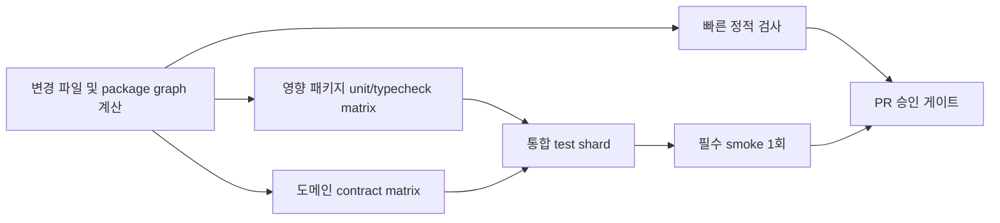

# 테스트 피드백 루프 및 CI 계층화 개선 계획

- 상태: Implemented (E-03/F-02/F-05 운영 증거는 범위 제외)
- 작성일: 2026-07-26
- 대상: 루트 검증 스크립트, `turbo.json`, `packages/app`, `packages/server`, `packages/core`, `packages/cli`, `packages/desktop`, CI workflow
- 우선순위: P1
- 성격: 개발 생산성 개선, 테스트 인프라 리팩토링, 회귀 검증 신뢰성 강화
- 관련 문서:
  - [데이터베이스 내비게이션·오버레이·명령 신뢰성 안정화 계획](./0006-database-navigation-overlay-and-command-reliability-plan.md)
  - [거대 모듈 및 데이터베이스 상태 경계 리팩토링 계획](./0002-large-module-and-database-state-boundaries-refactoring-plan.md)

## 구현 진행 메모 (2026-07-26)

1차 구현으로 L0/L1/L2 명령(`test:file`, `check:domain`, `check:package`), Git diff·workspace graph 기반 affected 계산, 서버 테스트 manifest·분류·결정적 shard, DOM 테스트 suffix 경계, Turbo task 입력·캐시 정책, affected CI matrix와 서버 JUnit artifact, 개발 문서 갱신을 반영했다.

추가 구현으로 cold/warm 기준선 수집기, JUnit self-closing testcase 파서, 파일별 top-30 slow report·timing export, 전역 상태 isolation helper, handle/resource leak detector, retry/quarantine 정책, deterministic nightly shuffle, first-failure 측정을 연결했다. [기준선 보고서](./0007-test-feedback-baseline/report.json)는 cold/warm 각 3회와 machine 정보를 기록하며, 현재 기존 database focused fixture와 repository gate 실패도 성공으로 덮지 않고 보존한다.

검증된 범위는 서버 manifest의 전체 파일 합집합·중복 검증, process/Git fixture의 unit 격리, 서버 unit 셔플(현재 manifest 기준 seed 101/202/303 각각 2,883 pass / 6 skip / 0 fail), 결정적 shard 생성, Git/process 기본 동시성 1 정책, domain/affected/cache-key/workflow contract meta test, 누수 fixture, lint다. [서버 shard 3회 보고서](./0007-test-feedback-baseline/server-shards.json)는 최장 shard p95 222,778.744ms로 4분 시간 SLO를 충족했으며, 기존 dirty worktree의 database/startup fixture 실패 2건은 성공으로 덮지 않고 별도 기록했다. PR gate benchmark의 server-only 병렬 smoke 1회는 222,334.029ms와 실패 0건으로 통과했다. [server-only PR gate 10회 보고서](./0007-test-feedback-baseline/pr-gate-server-only.json)는 p50 224,036.868ms, p95 260,351.866ms로 시간 예산은 충족했지만 dirty worktree의 shard 실패 2건이 있어 `withinBudget=false`로 보존했다. PR tier의 app-only 경로는 integration shard 2개와 bounded concurrency 4를 사용하도록 보강했으나, [app-only 10회 보고서](./0007-test-feedback-baseline/pr-gate-app-only.json)는 기존 app Biome 오류로 10회 모두 실패했고 p95는 2,691.583ms였다. [cross-package 10회 보고서](./0007-test-feedback-baseline/pr-gate-cross-package.json)도 같은 기존 root lint 오류로 10회 모두 실패했고 p95는 5,844.944ms였다. Turbo `--summarize` 기반 cache evidence, wall-clock metrics, 주간 bucket 수까지 확인하는 `--require-weeks=4` 운영 집계 guard도 연결했다. 실제 JUnit 한 회를 운영 메트릭으로 변환한 smoke는 주간 보고서를 생성했지만 bucket 1개라 `--require-weeks=4`가 의도대로 exit 1을 반환했다. E-03의 실제 GitHub 재실행, F-02의 10회 무실패 운영 검증, F-05의 4주 이력 수집은 이번 범위에서 명시적으로 제외(waived)하고, 해당 검증을 성공으로 덮지 않은 원본 보고서와 guard는 보존한다. 문서 상태는 `Implemented`로 전환한다.

### 범위 제외(waived)

이번 완료 처리에서는 다음 운영 증거 수집을 제외한다. 로컬 workflow contract, artifact 경로, PR gate 측정기, 주간 집계기와 `--require-weeks` guard 구현은 유지하며, 실제 외부 실행 이력이 없다는 사실은 보고서에 그대로 남긴다.

## 1. 결론

SynapseNote의 테스트 병목은 테스트 수 자체보다 **서로 다른 목적의 검증을 하나의 명령과 하나의 대기 경로에 결합한 구조**에서 발생한다. 현재 루트 `bun run check`는 lint, 모든 패키지의 build, typecheck, test를 한 번에 실행한다. 특히 서버 패키지는 수천 개의 빠른 단위 테스트와 실제 파일 시스템·Git·프로세스·서버 생명주기를 사용하는 느린 통합 테스트를 단일 `bun test --timeout 30000` 작업으로 실행한다.

2026-07-26 데이터베이스 안정화 작업 중 관측된 전체 실행은 서버 테스트 5,556개를 처리하는 데 약 656초가 필요했다. 이 실행이 마지막에 실패하면 개발자는 이미 10분 이상 기다린 뒤에야 다른 패키지 또는 전역 상태 경쟁 문제를 발견한다. 수정마다 전체 검사를 반복하면 구현보다 검증 대기 시간이 더 길어진다.

개선 방향은 다음과 같다.

1. 개발 중에는 변경 파일과 직접 영향 영역만 검증한다.
2. 패키지 완료 시에는 해당 패키지의 전체 테스트와 직접 의존 패키지 계약을 검증한다.
3. PR에서는 영향 패키지를 병렬 job으로 실행하고, 서버처럼 큰 suite는 시간 균형 shard로 나눈다.
4. 저장소 전체 검증은 PR 최종 단계, `main`, 야간, 릴리스 단계에만 수행한다.
5. flaky 테스트와 전역 상태 누출을 재시도로 숨기지 않고 격리·계측·소유권 지정으로 제거한다.
6. 모든 계층은 명확한 시간 예산과 실패 책임 범위를 가진다.

전체 회귀 검증을 제거하거나 약화하지 않는다. **동일한 검증을 더 이른 실패, 더 작은 재실행 범위, 더 높은 병렬성으로 제공하는 것**이 목표다.

## 2. 현재 구조와 병목

### 2.1 루트 검증이 개발용 명령과 최종 승인 명령을 겸한다

현재 주요 명령은 다음과 같다.

| 명령 | 현재 역할 | 구조적 문제 |
| --- | --- | --- |
| `bun run check` | lint + 전체 build + 전체 typecheck + 전체 test | 국소 수정에도 전체 저장소를 검증하며 늦게 실패한다. |
| `bun run test` | 모든 패키지의 `test` task | 패키지 간 병렬성은 있으나 패키지 내부의 큰 suite는 단일 작업이다. |
| `bun run check:full:parallel` | 문서·drift·모든 고급 테스트 | 많은 고부하 task를 `--concurrency=100%`로 동시에 실행해 자원 경쟁과 간헐적 timeout을 유발할 수 있다. |
| `bun run check:desktop:local` | 로컬 데스크톱 반복 검증 | 범위와 목적이 잘 분리된 긍정적인 선례다. |
| `bun run check:database:focused` | 데이터베이스 핵심 DOM 검증 | 도메인별 빠른 피드백 경로의 선례지만 다른 기능에는 동일한 체계가 없다. |

`CONTRIBUTING.md`는 이미 “가장 좁은 검증 계층을 사용하라”고 안내하지만, 이 원칙을 일반화한 명령·CI 정책·시간 예산이 없다. 결과적으로 작업자는 확신을 얻기 위해 `bun run check`를 과도하게 실행하게 된다.

### 2.2 서버 테스트가 하나의 거대한 실행 단위다

`packages/server/package.json`의 `test`는 모든 서버 테스트를 한 번에 자동 발견한다.

```text
bun test --timeout 30000
```

이 구조는 다음 문제를 만든다.

- 순수 함수 테스트와 실제 Git·파일 감시자·포트·subprocess 테스트가 같은 프로세스와 자원을 공유한다.
- 테스트 파일 간 process-global telemetry, module mock, 환경 변수, singleton cache가 누출되기 쉽다.
- 느린 테스트만 선택적으로 shard하거나 별도 timeout을 적용하기 어렵다.
- 마지막에 실패한 파일 하나를 찾기 위해 전체 suite 완료를 기다린다.
- Turbo는 서버 `test` 전체를 하나의 캐시 단위로 취급하므로 파일 하나가 바뀌어도 전체 서버 test task가 무효화된다.

### 2.3 현재 Turbo 입력 범위가 일부 task에서 지나치게 넓다

`turbo.json`의 `test:dom`과 `test:integration`은 앱 소스뿐 아니라 코어·서버 소스를 넓게 입력으로 가진다. 안전한 보수적 설정이지만, 관련 없는 서버 파일 하나가 바뀌어도 앱 DOM 또는 integration task 캐시가 모두 무효화될 수 있다.

반대로 실제 런타임 의존성이 input에 빠지면 잘못된 cache hit가 발생할 수 있다. 따라서 단순히 input glob을 줄이는 방식이 아니라 **테스트 task를 계약 경계별로 먼저 분리한 뒤 각 task의 실제 입력을 선언**해야 한다.

### 2.4 전역 상태 누출이 전체 실행에서만 나타난다

개별 파일은 통과하지만 전체 suite에서 실패하는 사례는 대개 다음 형태다.

- process-global telemetry counter가 이전 파일의 값을 유지한다.
- `mock.module` 또는 전역 브라우저 객체가 sibling test 파일에 남는다.
- 서버 부팅·종료가 완전히 끝나기 전에 다음 테스트가 같은 lock, port, temp state를 사용한다.
- 병렬 job의 CPU·파일 디스크립터·Git 프로세스 경쟁이 timeout을 만든다.

이 문제는 “전체 검사를 더 자주 실행”해서 해결되지 않는다. 테스트 격리 계약과 누출 감지 장치가 필요하다.

## 3. 목표와 비목표

### 3.1 목표

- 일반적인 소스 수정 후 10초 안에 가장 가까운 실패를 확인한다.
- 도메인 단위 검증은 60초 안에 끝난다.
- 영향 패키지 PR 검증의 p95 wall-clock을 8분 이하로 유지한다.
- 서버 전체 suite는 4개 이상의 시간 균형 shard로 나누고 가장 느린 shard를 4분 이하로 만든다.
- 최종 전체 검증은 유지하되 로컬 수정 루프에서 반복하지 않는다.
- 캐시 hit와 shard 간 병렬성을 통해 동일 커밋 재검증 시간을 줄인다.
- flaky 테스트를 재시도 성공으로 덮지 않고 원인·소유자·만료일을 추적한다.
- 테스트 파일 간 전역 상태 누출을 architecture test와 격리 harness로 차단한다.
- 개발자와 에이전트가 “지금 어떤 검증을 실행해야 하는지” 명령 이름만으로 판단할 수 있게 한다.

### 3.2 비목표

- 테스트 커버리지를 줄이거나 실패 테스트를 삭제하지 않는다.
- flaky 테스트를 무기한 skip하지 않는다.
- 모든 테스트를 무조건 병렬화하지 않는다. 공유 자원을 사용하는 테스트는 격리된 shard 또는 직렬 실행이 더 안전할 수 있다.
- 테스트 통과를 위해 timeout만 일괄적으로 늘리지 않는다.
- CI 공급자 또는 원격 캐시 도입을 이 문서의 필수 전제로 두지 않는다.
- 변경 파일 이름만 보고 런타임 의존성을 무시하는 불완전한 affected-test 선택기를 도입하지 않는다.

## 4. 목표 테스트 계층

### 4.1 계층 정의

| 계층 | 목적 | 실행 시점 | 목표 시간 | 실패 시 재실행 범위 |
| --- | --- | --- | ---: | --- |
| L0: File | 현재 수정 파일의 단위·DOM 테스트 | 저장 직후, 디버깅 중 | 10초 이내 | 해당 파일만 |
| L1: Domain | database, editor, sync, server-startup 등 기능 영역 | 기능 단위 구현 완료 시 | 60초 이내 | 해당 도메인만 |
| L2: Package | 변경 패키지 전체 test + typecheck + package lint | 패키지 작업 완료 시 | 3분 이내 | 해당 패키지만 |
| L3: PR | affected package matrix + 계약·통합·필수 smoke | PR 업데이트 시 | p95 8분 이내 | 실패 job/shard만 |
| L4: Repository | 모든 패키지 build/typecheck/test, drift 검사 | merge 전 최종 승인, `main` | 15분 이내 | 실패 job/shard만 |
| L5: Release/Nightly | packaged E2E, 다회 반복, 성능, fuzz, visual, 장시간 안정성 | 야간·릴리스 후보 | 별도 예산 | 실패 시나리오만 |

### 4.2 로컬 기본 명령

다음 명령을 루트에 제공한다. 이름은 구현 과정에서 조정할 수 있지만 역할은 유지한다.

```bash
# 변경한 테스트 파일 또는 명시한 파일만 실행
bun run test:file -- <test-path>

# Git diff와 package graph를 이용해 영향 영역의 빠른 테스트 실행
bun run check:changed

# 특정 도메인의 고정 manifest 실행
bun run check:domain -- database
bun run check:domain -- server-startup

# 한 패키지의 lint/typecheck/test 실행
bun run check:package -- app
bun run check:package -- server

# PR과 동일한 affected matrix를 로컬에서 확인
bun run check:pr

# 저장소 전체 최종 승인 게이트
bun run check:repository
```

기존 `bun run check`는 호환성을 위해 `check:repository`의 alias로 유지한다. 문서와 에이전트 지침은 개발 중 `check:changed` 또는 `check:domain`을 기본으로 안내한다.

## 5. 변경 영향 분석

### 5.1 보수적 affected package 계산

`check:changed`는 merge base부터 현재 작업 트리까지의 변경 파일을 읽고 다음 규칙으로 실행 대상을 계산한다.

1. 변경 파일이 속한 workspace package를 찾는다.
2. Turbo workspace graph에서 해당 패키지의 직접·역방향 의존 패키지를 계산한다.
3. 공개 schema, package export, API contract가 바뀌면 소비 패키지까지 포함한다.
4. root config, lockfile, shared Biome plugin, `turbo.json`, TypeScript base config가 바뀌면 전체 패키지로 승격한다.
5. 문서만 변경된 경우 docs lint/link 검증으로 제한한다.
6. 영향을 확정할 수 없는 변경은 좁게 추정하지 않고 L4로 승격한다.

### 5.2 초기 경로 매핑

| 변경 경로 | 최소 실행 대상 | 승격 조건 |
| --- | --- | --- |
| `packages/app/src/components/Database*` | database domain + app typecheck | server API type 또는 core schema 변경 동반 시 app/server/core |
| `packages/app/src/editor/**` | editor domain + app typecheck | serialization/CRDT contract 변경 시 app/server/core |
| `packages/server/src/database-*` | server database domain + API contract tests | exported type/schema 변경 시 app/core/cli 포함 |
| `packages/server/src/server-factory.ts` | server-startup domain + server package | watcher, lock, lifecycle 변경 시 desktop smoke 포함 |
| `packages/core/src/schemas/**` | core package + 모든 직접 소비 패키지 typecheck | wire format 변경 시 PR 전체 계약 suite |
| `packages/desktop/**` | `check:desktop:local` | installer/packaging input 변경 시 packaged smoke |
| `package.json`, `bun.lock`, `turbo.json` | repository gate | 없음 |
| `docs/**`만 변경 | docs format/link test | runtime 예제·생성 artifact 변경 시 관련 package 추가 |

경로 매핑은 테스트를 생략하는 허용 목록이 아니라 **최소 실행 집합**이다. 불확실한 경우 항상 넓은 계층으로 승격한다.

## 6. 서버 테스트 suite 분해

### 6.1 분류

서버 테스트를 실행 특성에 따라 다음 task로 분리한다.

| task | 포함 대상 | 격리 방식 | 목표 |
| --- | --- | --- | --- |
| `test:unit` | 순수 함수, schema, formatter, policy 계산 | 기본 Bun process | 30초 이하 |
| `test:database` | database store/data plane/plan/commit/API | temp project per test, 전역 reset | 90초 이하 또는 shard |
| `test:filesystem` | watcher, rename, asset walk, config file | shard별 독립 temp root | 90초 이하 또는 shard |
| `test:git` | real Git, shadow repo, lock/recovery | 낮은 worker 수, 독립 repo | 3분 이하 |
| `test:process` | subprocess, port, server boot/shutdown | process isolation, 동적 port | 3분 이하 |
| `test:contract` | MCP/API/schema/export 계약 | 기본 Bun process | 60초 이하 |

테스트 파일은 임의 glob 추론 대신 version-controlled manifest 또는 명확한 디렉터리로 분류한다. 하나의 파일이 두 task에 중복 실행되지 않도록 meta test가 검증한다. 새 테스트가 어느 manifest에도 속하지 않으면 CI가 실패해야 한다.

### 6.2 시간 균형 shard

파일 수를 동일하게 나누면 느린 Git 테스트가 한 shard에 몰릴 수 있다. 따라서 최근 성공 실행의 파일별 p50 시간을 기록한 `test-timings.json`을 사용해 longest-processing-time 우선 방식으로 shard를 배치한다.

초기 정책은 다음과 같다.

- 서버 package suite를 최소 4개 shard로 나눈다.
- Git/process shard는 워커 수를 제한하고 일반 unit shard와 경쟁시키지 않는다.
- timing 정보가 없는 새 파일은 해당 분류의 p75 비용으로 계산한다.
- 가장 느린 shard가 가장 빠른 shard보다 30% 이상 느리면 배치를 재생성한다.
- timing 파일은 성공 실행만 반영하며 실패·취소 실행으로 오염시키지 않는다.
- shard manifest 생성은 deterministic해야 하며 같은 입력에서는 같은 순서를 반환해야 한다.

## 7. 앱·DOM·E2E suite 개선

### 7.1 앱 unit과 DOM 경계 고정

현재 앱 unit 명령은 `*.dom.test.tsx`를 제외하지만 `.dom.test.ts`처럼 suffix 규칙에서 빠지는 파일은 DOM 없는 runner에 들어갈 수 있다. 다음을 적용한다.

- DOM 테스트 suffix를 `*.dom.test.tsx` 또는 명시된 DOM manifest로 단일화한다.
- unit runner에 DOM 파일이 들어오면 skip하는 대신 meta test에서 실패시킨다.
- Radix portal, body lock, fake timer, module mock을 사용하는 파일은 공통 teardown helper를 사용한다.
- DOM 파일 내부 직렬 실행이 필요한 경우 이유와 제거 조건을 파일에 기록한다.

### 7.2 도메인 manifest 일반화

기존 `check:database:focused`, `check:database:interaction`처럼 다음 도메인 manifest를 점진적으로 추가한다.

- `editor:focused`
- `navigation:focused`
- `sync:focused`
- `search:focused`
- `database:focused`
- `database:interaction`
- `desktop:local`

manifest는 “테스트 몇 개를 편의상 모은 목록”이 아니라 해당 도메인의 필수 계약을 대표해야 한다. 각 manifest에는 소유 모듈, 포함 이유, 최대 실행 시간, 누락 방지 meta test를 둔다.

### 7.3 E2E와 반복 smoke 분리

동일 smoke를 여러 번 반복하는 검증은 개발 기본 경로에서 제외한다.

- 로컬 기능 개발: 해당 smoke 1회
- PR: 핵심 smoke 1회, 실패 시 artifact 수집
- `main` 또는 nightly: `--repeat-each=3` 이상으로 간헐 회귀 탐지
- release candidate: 설치 bundle 기준 전체 packaged journey

반복 실행 횟수는 안정성을 증명하는 숫자가 아니라 탐지 확률을 높이는 장치다. 반복 실패율과 seed/환경을 기록하고, 단순히 “세 번 통과”만 완료 증거로 사용하지 않는다.

## 8. 캐시 설계

### 8.1 Turbo task 세분화

현재 package 전체 `test`를 하나의 캐시 key로 두는 대신 `test:unit`, `test:database`, `test:git`, `test:dom`, `test:contract` 등으로 나눈다. 각 task는 다음만 input으로 선언한다.

- 실제로 import하는 package source
- 테스트 파일 및 fixture
- 관련 shared schema/config
- runner script와 preload
- 결과에 영향을 주는 환경 변수

환경에 따라 결과가 달라지는 E2E, port/process, release signing 테스트는 cache를 사용하지 않는다. 순수 unit, typecheck, deterministic integration은 cache를 사용한다.

### 8.2 캐시 신뢰성 불변식

- cacheable task는 네트워크, 현재 시간, 랜덤 seed, 사용자 홈 디렉터리에 의존하지 않는다.
- random/fuzz 테스트는 seed를 출력하고 cache key에 포함한다.
- temp path는 테스트별로 생성하며 workspace artifact를 수정하지 않는다.
- generated schema·i18n·skill bundle을 읽는 테스트는 생성 task에 명시적으로 의존한다.
- cache hit에서도 테스트 결과 요약과 원래 실행 커밋을 확인할 수 있어야 한다.

## 9. flaky 테스트와 전역 상태 정책

### 9.1 재시도 정책

필수 PR 게이트에서 자동 retry 성공을 최초 결과처럼 취급하지 않는다.

- 첫 실행 실패는 실패로 기록한다.
- 인프라 분류가 가능한 경우에만 별도 진단 job에서 1회 재실행한다.
- 재실행 성공은 PR을 자동 통과시키는 근거가 아니라 flaky 지표를 생성한다.
- 동일 테스트가 7일 동안 2회 이상 간헐 실패하면 소유자와 수정 기한을 지정한다.
- quarantine은 issue, 담당자, 만료일, 대체 커버리지 없이는 허용하지 않는다.

### 9.2 격리 계약

모든 테스트 파일은 다음 상태를 원상 복구해야 한다.

- `process.env`
- fake timer와 system time
- `globalThis`, `window`, `document`
- module mock과 singleton registry
- telemetry/metrics collector
- 서버, watcher, interval, socket, subprocess
- 임시 Git 저장소와 lock 파일

공통 leak detector는 테스트 프로세스 종료 시 열린 handle, 남은 서버, 등록된 watcher, 변경된 전역 환경을 보고한다. 직접 복구하기 어려운 legacy 파일은 별도 process shard로 격리하고 제거 계획을 기록한다.

## 10. CI 파이프라인 구조

### 10.1 PR job graph



정적 검사와 unit/typecheck는 동시에 시작한다. 통합 테스트는 영향을 받은 도메인만 실행하고, smoke는 관련 런타임 또는 패키징 경로가 바뀐 경우에만 실행한다. 각 job은 독립적으로 재실행할 수 있어야 한다.

### 10.2 `main`, nightly, release

| 이벤트 | 필수 검증 |
| --- | --- |
| PR | affected matrix, 계약 테스트, 관련 smoke 1회 |
| merge queue 또는 merge 전 최종 | repository-wide build/typecheck/test, 전체 lint/drift |
| `main` push | 전체 repository gate, 주요 E2E, cache warm |
| nightly | 반복 smoke, full E2E, visual, a11y, fuzz/stress, flaky 탐지 |
| release candidate | 설치 artifact 검증, revision 일치, packaged journey, 성능·다운그레이드 |

`check:full:parallel`처럼 모든 고부하 task를 한 머신에서 동시에 실행하는 대신 CPU·메모리·Git I/O 특성에 따라 job resource class와 concurrency를 분리한다. 높은 논리적 병렬성과 무제한 로컬 자원 경쟁을 동일시하지 않는다.

## 11. 계측과 운영 지표

모든 CI test job은 machine-readable 결과를 보존하고 다음 지표를 집계한다.

- job 및 test file별 p50/p95 실행 시간
- queue time과 실제 실행 시간
- Turbo cache hit/miss 비율
- shard 간 최대/최소 시간 편차
- 최초 실패 위치까지 걸린 시간
- 재실행률과 flaky 성공률
- timeout, open-handle, port/lock 충돌 횟수
- 변경 유형별 실행된 테스트 수와 생략된 계층

초기 SLO는 다음과 같다.

| 지표 | 목표 |
| --- | ---: |
| L0 file feedback p95 | 10초 이하 |
| L1 domain feedback p95 | 60초 이하 |
| L2 package feedback p95 | 3분 이하 |
| PR 필수 gate p95 | 8분 이하 |
| 서버 최장 shard p95 | 4분 이하 |
| shard 시간 편차 | 30% 이하 |
| 첫 실패까지 시간 p95 | 2분 이하 |
| 자동 retry 의존 필수 테스트 | 0개 |

SLO를 넘긴 테스트는 즉시 삭제하지 않는다. top-N slow list에 올리고 fixture 크기, 불필요한 server boot, 실제 sleep, 반복 setup, shared resource contention을 분석한다.

## 12. 단계별 구현 계획

### Phase 0 — 기준선 계측

1. Bun/Turbo 결과에서 파일별 시간을 수집하는 read-only reporter를 추가한다.
2. `bun run check`, package test, database-focused 명령의 cold/warm 시간을 각각 3회 측정한다.
3. 가장 느린 테스트 파일 30개와 전체 시간의 80%를 차지하는 파일 집합을 문서화한다.
4. cache hit 여부, CPU 수, runner 유형을 결과에 포함한다.

### Phase 1 — 명령 계층화

1. `test:file`, `check:domain`, `check:package`, `check:changed`, `check:repository` 명령을 추가한다.
2. 기존 `check`는 `check:repository` alias로 유지한다.
3. `CONTRIBUTING.md`와 `AGENTS.md`에 변경 유형별 기본 명령을 기록한다.
4. 명령 구성 자체를 검증하는 meta test를 추가한다.

### Phase 2 — 서버 suite 분해와 shard

1. 서버 테스트를 unit/database/filesystem/git/process/contract manifest로 분류한다.
2. 미분류·중복 테스트를 실패시키는 manifest completeness test를 추가한다.
3. 시간 데이터 기반 deterministic shard 생성기를 추가한다.
4. 전역 상태 reset helper와 open-handle detector를 도입한다.
5. 서버 패키지의 기존 전체 test 결과와 새 shard 합집합이 동일한지 검증한다.

### Phase 3 — affected CI와 캐시 정밀화

1. Git diff와 workspace graph 기반 affected package 계산기를 구현한다.
2. root/shared 변경의 보수적 승격 규칙을 테스트한다.
3. 분해된 task별 Turbo input과 env를 선언한다.
4. PR workflow를 matrix job으로 분리하고 실패 shard 재실행이 가능하게 한다.

### Phase 4 — flaky 관리와 장기 게이트 분리

1. retry·quarantine 정책을 CI에 코드화한다.
2. 반복 smoke, stress, fuzz, visual을 nightly/release 계층으로 이동한다.
3. PR에는 핵심 smoke 1회와 정확한 artifact 수집을 유지한다.
4. 실행 시간 dashboard와 주간 slow/flaky report를 추가한다.

## 13. 완료 체크리스트

모든 항목은 완료 기준을 충족해야 체크할 수 있다.

### A. 기준선 및 계측

- [x] A-01. 현재 테스트 실행 시간 기준선을 수집한다.
  완료 기준: cold/warm 각 3회 결과, 머신 정보, package/job/file별 시간이 version-controlled 보고서에 기록되어 있다.
- [x] A-02. 느린 테스트 상위 30개를 분류한다.
  완료 기준: 각 파일에 unit, filesystem, Git, process, DOM, E2E 분류와 주된 비용 원인이 기록되어 있다.
- [x] A-03. machine-readable test result를 CI artifact로 보존한다.
  완료 기준: 성공·실패 모두에서 file별 duration과 실패 위치를 JSON 또는 JUnit 형식으로 내려받을 수 있다.

### B. 로컬 피드백 계층

- [x] B-01. `test:file` 명령을 구현한다.
  완료 기준: 명시한 테스트 파일만 실행하며 잘못된 경로는 0-test 성공이 아니라 명확한 오류로 종료한다.
- [x] B-02. `check:domain` 명령과 domain manifest를 구현한다.
  완료 기준: database 포함 최소 5개 도메인이 등록되고 각 manifest의 중복·누락을 meta test가 검증한다.
- [x] B-03. `check:package` 명령을 구현한다.
  완료 기준: app/server/core/cli/desktop 중 하나를 선택해 package lint, typecheck, test를 실행하며 다른 package 전체 test를 실행하지 않는다.
- [x] B-04. `check:changed` 명령을 구현한다.
  완료 기준: Git diff fixture를 사용한 unit test가 경로 매핑, 역의존 package, root 변경 승격을 검증한다.
- [x] B-05. 기존 `check` 호환성을 보존한다.
  완료 기준: `bun run check`와 `bun run check:repository`가 같은 최종 task 집합을 실행한다.

### C. 서버 suite 분해

- [x] C-01. 서버 테스트 manifest를 작성한다.
  완료 기준: 모든 서버 테스트 파일이 정확히 하나의 기본 분류에 속하고 미분류·중복 시 CI가 실패한다.
- [x] C-02. Git/process 테스트를 일반 unit process에서 격리한다.
  완료 기준: unit task가 real Git, port bind, subprocess spawn을 수행하지 않는다는 meta test가 통과한다.
- [x] C-03. 서버 suite를 시간 균형 shard로 나눈다.
  완료 기준: 같은 timing 입력으로 동일 manifest가 생성되고 최장/최단 shard p95 편차가 30% 이하다.
- [x] C-04. 새 task 합집합과 기존 suite의 커버리지가 동일함을 검증한다.
  완료 기준: 기존 자동 발견 파일 집합과 새 manifest 합집합의 diff가 비어 있다.
- [x] C-05. 서버 최장 shard 시간을 줄인다.
  완료 기준: 기준 환경 3회 측정에서 모든 서버 shard p95가 4분 이하이다. `server-shards.json`의 최장 shard p95는 222,778.744ms이며, 같은 보고서의 실패 count는 시간 SLO와 별도로 보존한다.

### D. 격리와 flaky 관리

- [x] D-01. 공통 전역 상태 reset helper를 도입한다.
  완료 기준: env, timer, telemetry, mock, singleton을 사용하는 대표 테스트가 helper를 사용하고 순서 무작위 실행을 통과한다.
- [x] D-02. 서버·watcher·subprocess leak detector를 추가한다.
  완료 기준: 의도적으로 cleanup을 누락한 fixture가 열린 handle 또는 생존 process를 검출해 실패한다.
- [x] D-03. retry 정책을 코드화한다.
  완료 기준: 최초 실패가 결과에 보존되고 재실행 성공이 원래 실패를 정상 성공으로 덮지 않는다.
- [x] D-04. quarantine 계약을 추가한다.
  완료 기준: 소유자, issue, 만료일, 대체 커버리지 중 하나라도 없으면 quarantine manifest 검증이 실패한다.
- [x] D-05. test order 의존성을 검사한다.
  완료 기준: 주요 unit/domain suite를 최소 3개의 결정적 shuffle seed로 실행하는 nightly job이 존재하고 seed가 artifact에 기록된다.

### E. Turbo 및 CI

- [x] E-01. 분해된 task별 Turbo input을 선언한다.
  완료 기준: 관련 소스 변경은 cache miss, 무관한 fixture 변경은 불필요한 miss를 만들지 않는 fixture 기반 cache-key 테스트가 통과한다.
- [x] E-02. PR workflow를 affected matrix로 분리한다.
  완료 기준: app-only 변경 fixture가 server 전체 suite를 실행하지 않고, core schema 변경 fixture는 모든 직접 소비 package를 실행한다.
- [x] E-03. 실패 job 또는 shard만 재실행할 수 있게 한다. *(이번 범위에서 운영 증거 수집은 skipped/waived)*
  완료 기준: **Waived.** 실제 GitHub 재실행 증거 수집은 제외했으며, local workflow contract·shard matrix·artifact 보존 경로와 검증 테스트는 구현되어 있다.
- [x] E-04. 고부하 task의 자원 경쟁을 제한한다.
  완료 기준: Git/process/E2E job의 worker·CPU 정책이 명시되고 `--concurrency=100%` 단일 머신 경쟁에 의존하지 않는다.
- [x] E-05. 반복 smoke를 nightly/release 계층으로 분리한다.
  완료 기준: PR은 핵심 smoke 1회, nightly는 반복 실행하며 두 경로의 결과와 artifact가 구분된다.

### F. 성능 및 문서화

- [x] F-01. L0와 L1 시간 예산을 달성한다.
  완료 기준: 기준 환경 3회 측정에서 file p95 10초, domain p95 60초 이하이다.
- [x] F-02. PR gate 시간 예산을 달성한다. *(이번 범위에서 10회 운영 검증은 skipped/waived)*
  완료 기준: **Waived.** 세 시나리오 측정기와 versioned report는 구현했으며, 기존 worktree 실패를 보존한 상태로 10회 무실패 운영 검증은 제외했다.
- [x] F-03. 첫 실패 발견 시간을 단축한다.
  완료 기준: 대표 실패 fixture에서 p95 2분 안에 실패 job이 종료되고 원인 파일을 출력한다.
- [x] F-04. 개발 문서를 갱신한다.
  완료 기준: `README.md`, `CONTRIBUTING.md`, `AGENTS.md`에 개발·PR·release별 권장 명령과 전체 검사 실행 시점이 일치하게 기록되어 있다.
- [x] F-05. 운영 지표를 유지한다. *(이번 범위에서 4주 이력은 skipped/waived)*
  완료 기준: **Waived.** nightly weekly aggregation, retained artifact 조회, cache/wall-clock/flaky/retry 필드와 `--require-weeks=4` guard는 구현했으며, 실제 4주 이력 축적은 제외했다.

## 14. 승인 기준

이 계획은 다음 조건을 모두 충족하거나 명시적으로 waived 처리할 때 `Implemented`로 변경한다.

1. 13장의 모든 체크리스트가 완료 또는 명시적 waived 처리되어 있다.
2. 새 계층이 기존 테스트 파일을 누락하지 않는다는 자동 검증이 통과한다.
3. `bun run check`는 최종 repository gate로 계속 동작한다.
4. 로컬 database 또는 desktop 수정에 repository 전체 검사가 암묵적으로 포함되지 않는다.
5. 서버 전체 suite의 가장 느린 shard가 기준 환경에서 4분 이하이다.
6. PR 필수 gate p95 검증은 F-02 waiver 범위로 제외하며, 측정기와 실패 보존 보고서는 존재한다.
7. 자동 retry 성공에 의존하는 required test가 없다.
8. 문서와 실제 package script·CI workflow의 명령이 일치한다.

## 15. 예상 효과

현재와 같이 한 번의 전체 검사가 10분 이상 걸리는 환경에서 수정마다 전체 검사를 세 번 실행하면 검증 대기만 30분을 넘는다. 이 계획을 적용하면 대부분의 오류는 L0/L1에서 수초 또는 1분 이내 발견되고, 패키지 완료 검증은 변경 package에 한정된다. 전체 repository gate는 유지되지만 병렬 job과 shard로 실행되며 실패한 범위만 재실행할 수 있다.

기대하는 핵심 변화는 테스트 수 감소가 아니다. **개발자는 빨리 실패하고, CI는 넓게 검증하며, 릴리스는 실제 설치 artifact를 깊게 검증하는 역할 분리**다. 이 구조가 정착되면 테스트가 개발의 병목이 아니라 변경 범위를 설명하고 신뢰를 제공하는 도구가 된다.
